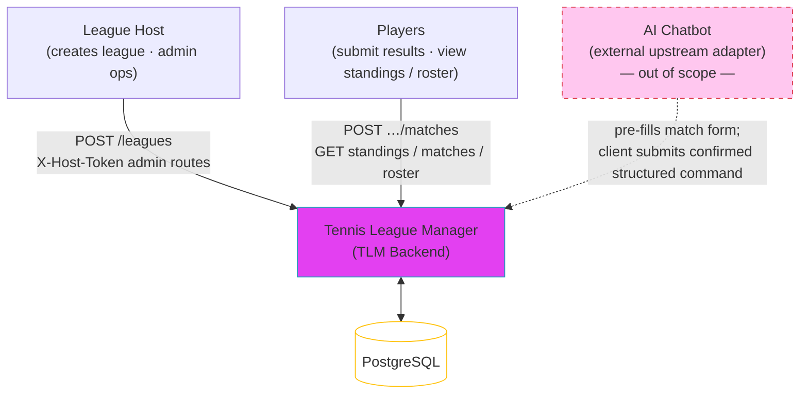

# System Scope

## Product / Service Name
- Tennis League Manager (TLM)

## One-sentence Product Summary
- A lightweight backend service that lets a host run a recreational tennis doubles league — players and teams are auto-registered on first match submission, scores are recorded, and standings are always visible.

## System Context Overview

## Primary Users
- League host (organizer who creates the league, and holds full admin rights over all data in that league via a dedicated admin interface)
- Players (participants whose match results are submitted as confirmed structured commands; they are auto-registered on first submission)

## Main Business Goal
- Give a small recreational tennis group a dead-simple way to track doubles match results and maintain an up-to-date standings table, with no login system and no complex manual registration.

## In Scope
- League creation with a unique title (case-insensitive) and optional description (host receives a hostToken and a leagueId on creation)
- Match result submission: the client calls the backend with a confirmed structured command after the player reviews and confirms a match form pre-filled by the external AI chatbot
- Implicit player and team creation on first match submission: if any player nickname in the submitted match is new to the league, the system registers all new players and their team(s) atomically alongside the match record
- Rejection of a match submission if a player is already recorded as a member of a different team in the same league (a player can belong to at most one team per league)
- Case-insensitive player nickname matching within a league (enforced by the backend)
- Standings view (win/loss based, derived from match records; tied teams share the same rank with no tiebreaker in V1)
- Match history view (list of all recorded results in a league)
- League roster view (list of all auto-registered players and teams in a league)
- Separate admin router/interface for host operations (requires hostToken), separate from player-facing routes
- Host has full admin rights over league data: can edit player nicknames, reassign teams, edit match scores, and delete matches. Teams may be deleted only if they have no associated matches; existing matches must be removed first.

## Out of Scope
- Explicit player self-registration (players are created implicitly on first match submission)
- Explicit team registration (teams are created implicitly when a new player pair submits their first match)
- User authentication or password-based login
- Match scheduling or calendar management
- Notifications (email, SMS, push)
- Payment or membership fees
- Multi-channel communication
- Advanced tiebreaker calculations (e.g. sets won/lost ratio, head-to-head) in V1
- Tournament bracket or playoff format
- Multiple seasons per league in V1
- AI chatbot implementation, including: prompt design, free-text parsing, fuzzy player-name matching UX, confirmation-form interaction flow, session handling, and natural-language rendering of errors or responses

## External Systems / Dependencies Expected
- AI chatbot (independent external upstream adapter): collects player free-text match descriptions, resolves player names, and pre-fills a confirmation form for the player to review; the client calls the backend API with the confirmed structured command once the player confirms — all chatbot-side logic is out of scope for this backend
- PostgreSQL database for persistence

## Major Assumptions
- A leagueId grants player-level access (submit match results, view standings/roster); possession of the leagueId is sufficient proof of league membership
- A hostToken grants full admin rights over the league; it is a secret known only to the organizer
- The admin interface is a separate set of API routes (e.g. /admin/...) gated by hostToken; it is kept distinct from the player-facing routes
- One league = one ongoing season; no concept of resetting or archiving seasons within the same league in V1
- Teams are identified by the two player nicknames (no separate team name); a player can be in at most one team per league
- Player identity is enforced by the backend using case-insensitive nickname matching within a league
- The backend receives only confirmed structured match submissions; it does not perform conversational repair, re-prompting, or free-text parsing
- The backend returns structured error codes; rendering those codes into natural language for the player is the responsibility of the external AI chatbot
- When a match is submitted and some or all players are new, all new players and their team(s) are auto-registered atomically alongside the match record
- Standings are always computed on the fly from match records (not cached or materialized in V1)
- Tied teams in standings share the same rank; no tiebreaker is applied in V1
