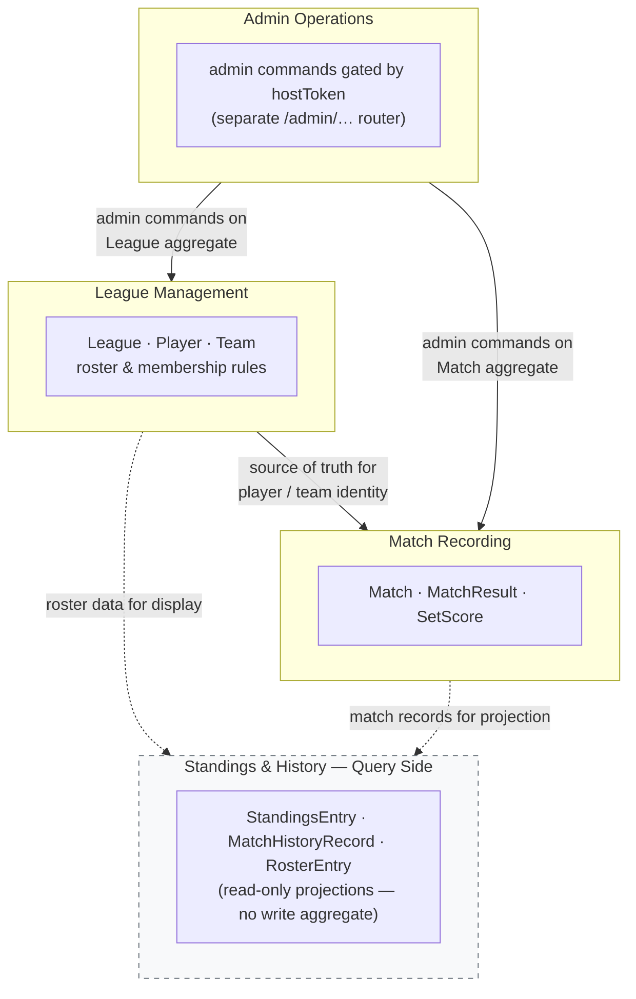

# Bounded Contexts

## Context List

### Context: League Management

- Purpose: Owns the lifecycle of a league from creation through ongoing operation. Holds league identity, access credentials, and the roster of registered players and teams.
- Owns these concepts: League, LeagueId, HostToken, Player, Team, player-to-team membership within a league
- Does not own: match result records, standings computation, score data
- Main upstream/downstream relationships: upstream source of truth for the Match Recording context (confirms player/team existence or performs implicit registration before a match is accepted)
- Notes: League creation produces a leagueId (shared with players) and a hostToken (kept secret by the host). Player and team registration are implicit — they are triggered as a side effect of the first confirmed match submission, not as an explicit signup flow.

### Context: Match Recording

- Purpose: Accepts, validates, and persists confirmed structured match submissions. Enforces that only valid players and teams within the league may appear in a match result.
- Owns these concepts: Match, MatchResult, SetScore, player references within a match
- Does not own: player identity, team composition rules, standings projection
- Main upstream/downstream relationships: downstream from League Management (the SubmitMatchResult use case loads the League aggregate through its repository to validate player/team membership and invoke League domain behavior for implicit registration when new players are present); upstream to Standings & History (match records are the raw data for standings)
- Notes: The backend receives a confirmed structured command from an external upstream adapter. It does not re-prompt or perform conversational repair. Validation failures return structured error codes.

### Context: Standings & History (Query Side)

- Purpose: Provides read-only projections of league state: standings table, match history list, and roster view.
- Owns these concepts: StandingsEntry, MatchHistoryRecord, RosterEntry (all read models, not write aggregates)
- Does not own: match records as mutable state, player/team write operations
- Main upstream/downstream relationships: downstream from League Management and Match Recording; no write operations
- Notes: Standings are computed on the fly from match records in V1. No materialized view or cache. This context is purely query-side and has no aggregate of its own.

### Context: Admin Operations

- Purpose: Provides the host with full administrative control over league data. Gated by hostToken.
- Owns these concepts: admin commands over Player, Team, Match (edit names, reassign or delete teams, edit scores, delete matches)
- Does not own: the business rules for implicit registration (those belong entirely to League Management)
- Main upstream/downstream relationships: calls into League Management and Match Recording aggregates via admin-only application commands; separate router path (/admin/...)
- Notes: Admin routes share the same underlying aggregates as the player-facing routes but are accessed through a separate application command set, with hostToken as the authorization check. A team may only be deleted after all of its associated match records have been removed; the backend enforces this as a hard precondition.

---

## Bounded Context Map

---

## Shared Language / Glossary

- Term: League
  - Meaning in this system: A single ongoing season run by one host. Identified by leagueId (shared with players) and protected by hostToken (host only). One league = one active season in V1.

- Term: Player
  - Meaning in this system: A participant within a league identified by a unique nickname (case-insensitive within the league). Does not need to use their actual name. Created implicitly on first confirmed match submission.

- Term: Team
  - Meaning in this system: A pair of two players in a league. Identified by the two player nicknames — no separate team name. Created implicitly on first confirmed match submission involving a new player pair.

- Term: Match
  - Meaning in this system: A recorded doubles match result between two teams in a league. Consists of set scores received as a confirmed structured command from the external upstream adapter.

- Term: LeagueId
  - Meaning in this system: A shared identifier that grants player-level access to a league (submit results, view standings/roster). Possession of the leagueId is sufficient proof of membership.

- Term: HostToken
  - Meaning in this system: A secret token that grants full admin rights over a league. Known only to the organizer.

- Term: Implicit Registration
  - Meaning in this system: The act of creating new Player and Team records automatically when a confirmed match submission contains player nicknames not yet known to the league. Performed by the SubmitMatchResult application use case, which invokes League domain behavior through the League aggregate and persists both the updated League state and the new Match record atomically.

- Term: Standings
  - Meaning in this system: A win/loss ranking of teams derived on the fly from match records. Tied teams share the same rank with no tiebreaker in V1.

- Term: Confirmed Structured Command
  - Meaning in this system: A structured backend API call made by the client after the player has reviewed and confirmed a match form that the AI chatbot pre-filled on their behalf. The backend treats this submission as final and does not re-prompt.

---

## Boundary Notes

- The AI chatbot is an independent external upstream adapter. It is not a backend bounded context. Its concerns (free-text parsing, fuzzy name matching, confirmation form UX, natural-language error rendering) are entirely outside this backend DDD scope.
- The AI chatbot pre-fills a match confirmation form for the player. The client — not the AI chatbot directly — calls the backend API once the player confirms the form.
- Backend business logic begins at the point a confirmed structured command arrives at the API boundary.

---

## Resolved Boundary Decisions

- Implicit player/team registration belongs to League Management (it owns all roster state). When a match submission triggers registration, the SubmitMatchResult application use case loads the League aggregate through its repository, invokes League domain behavior to register any new players/teams, creates the Match aggregate, and persists both through their repositories in a single transaction. No domain service is responsible for cross-aggregate persistence or transaction coordination.
- Admin operations on match scores are delegated to the Match Recording aggregate via admin-only commands, keeping the aggregate as the single consistency boundary for match state.
- Standings & History is modeled as a separate read-side context to keep the write aggregates clean, even though it shares the same database in V1.
