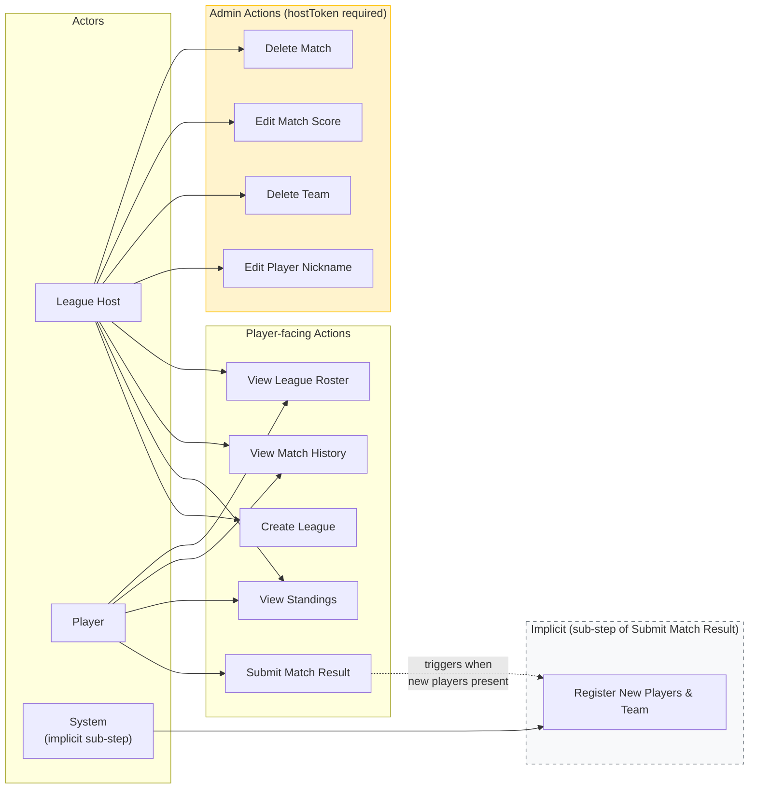

# Business Actions

## Actor–Action Overview

---

## Action: Create League

- Triggered by: Host submitting a new league creation request
- Actor: League Host
- Goal: Establish a new league and receive the credentials needed to manage it and share it with players
- Input: title (required, unique per system case-insensitively), description (optional)
- Output: leagueId (shared with players), hostToken (kept secret by host)
- Happy path: League created with unique title; leagueId and hostToken returned to the host
- Failure cases:
  - Title is blank or missing
  - Title already in use by another league (case-insensitive unique constraint)
- Related context: League Management

---

## Action: Submit Match Result

- Triggered by: Client calls the backend with a confirmed structured match command after the player reviews and confirms a form pre-filled by the external AI chatbot
- Actor: Player (identity verified by leagueId)
- Goal: Persist the confirmed match result, implicitly registering any new players/teams in the same atomic operation
- Input: leagueId, team1 player nicknames (two), team2 player nicknames (two), set scores (confirmed structured command)
- Output: match record persisted; any new players/teams registered in the same operation
- Happy path: All four player nicknames are known to the league → the use case loads the League aggregate through its repository, validates the submission against League domain rules, creates the Match aggregate, and persists both in one transaction. If any nicknames are new → the use case invokes League domain behavior to register the missing players/teams first, then creates and persists the Match in the same transaction.
- Failure cases:
  - leagueId does not exist
  - A player nickname appears on both teams (invalid match structure)
  - A player is already a member of a different team in the same league (team conflict invariant)
  - Set scores are structurally invalid
- Notes: The backend treats this submission as final. It does not re-prompt or perform conversational repair. Structured error codes are returned; rendering them into natural language is the responsibility of the external adapter.
- Related context: Match Recording, League Management (implicit registration performed by the SubmitMatchResult use case via League aggregate domain behavior)

---

## Action: Register New Players and Team Implicitly

- Triggered by: Match submission containing one or more player nicknames not yet known to the league
- Actor: System (sub-step within the SubmitMatchResult application use case, not a standalone player action)
- Goal: Auto-register any new players and the new team formed by a new player pair, atomically alongside the match
- Input: leagueId, new player nicknames, the team pair they form
- Output: new Player records created, new Team record created if the pair is new
- Happy path: The SubmitMatchResult use case loads the League aggregate through LeagueRepository, invokes League aggregate methods to register new players and teams (enforcing all roster invariants in memory), then saves the updated League aggregate and the new Match aggregate through their respective repositories within a single transaction
- Failure cases:
  - A new player nickname conflicts with an existing player already in a different team in the same league (team conflict invariant still applies after registration)
- Related context: League Management

---

## Action: View Standings

- Triggered by: Player or host requesting the current standings for a league
- Actor: Player (identity verified by leagueId) or League Host (hostToken)
- Goal: See the current win/loss ranking of all teams in the league
- Input: leagueId
- Output: ordered list of teams with win count, loss count, and rank (tied teams share rank)
- Happy path: The GetStandings use case loads match records through MatchRepository and league/team data through LeagueRepository, passes the prepared data to StandingsCalculator (a pure domain service), and returns the computed ranked standings
- Failure cases:
  - leagueId does not exist
- Related context: Standings & History (Query Side)

---

## Action: View Match History

- Triggered by: Player or host requesting the list of recorded matches in a league
- Actor: Player (identity verified by leagueId) or League Host (hostToken)
- Goal: See all recorded match results in the league
- Input: leagueId
- Output: chronological list of matches with team names and set scores
- Happy path: All match records for the league returned
- Failure cases:
  - leagueId does not exist
- Related context: Standings & History (Query Side)

---

## Action: View League Roster

- Triggered by: Player or host requesting the list of registered players and teams
- Actor: Player (identity verified by leagueId) or League Host (hostToken)
- Goal: See all auto-registered players and teams in a league
- Input: leagueId
- Output: list of players (with nicknames) and list of teams (with player nickname pairs)
- Happy path: All players and teams for the league returned
- Failure cases:
  - leagueId does not exist
- Related context: Standings & History (Query Side), League Management

---

## Action: Edit Player Nickname (Admin)

- Triggered by: Host correcting or updating a player's nickname
- Actor: League Host (hostToken)
- Goal: Update a player's nickname within a league
- Input: hostToken, leagueId, playerId, new nickname
- Output: player nickname updated
- Happy path: Player nickname updated; case-insensitive uniqueness still holds
- Failure cases:
  - hostToken invalid or does not match the league
  - New nickname already in use by another player in the same league (case-insensitive)
  - playerId does not exist in the league
- Related context: Admin Operations → League Management

---

## Action: Delete Team (Admin)

- Triggered by: Host removing a team entirely
- Actor: League Host (hostToken)
- Goal: Permanently delete a team once all its associated matches have been removed
- Input: hostToken, leagueId, teamId
- Output: team deleted; standings recomputed from remaining records
- Happy path: Team has no associated matches → team is removed; league roster no longer includes the deleted team
- Failure cases:
  - hostToken invalid or does not match the league
  - teamId does not exist in the league
  - Team still has one or more associated match records — host must delete those matches first
- Notes: Team deletion is a hard precondition check, not a cascading auto-delete. The backend rejects a delete request if any match records reference the team. The host must explicitly remove all associated matches before deleting the team. Team composition cannot be updated in V1; teams are created implicitly via match submission and can only be deleted.
- Related context: Admin Operations → League Management, Match Recording

---

## Action: Edit Match Score (Admin)

- Triggered by: Host correcting an erroneously recorded match score
- Actor: League Host (hostToken)
- Goal: Update the set scores of a previously recorded match
- Input: hostToken, leagueId, matchId, corrected set scores
- Output: match score updated
- Happy path: Match scores updated; standings will reflect the corrected data on next computation
- Failure cases:
  - hostToken invalid or does not match the league
  - matchId does not exist in the league
  - Corrected set scores are structurally invalid
- Related context: Admin Operations → Match Recording

---

## Action: Delete Match (Admin)

- Triggered by: Host removing an incorrectly submitted or duplicate match record
- Actor: League Host (hostToken)
- Goal: Permanently remove a match record from the league
- Input: hostToken, leagueId, matchId
- Output: match record deleted; standings recompute from remaining records
- Happy path: Match deleted; league history and standings no longer include the removed match
- Failure cases:
  - hostToken invalid or does not match the league
  - matchId does not exist in the league
- Related context: Admin Operations → Match Recording
