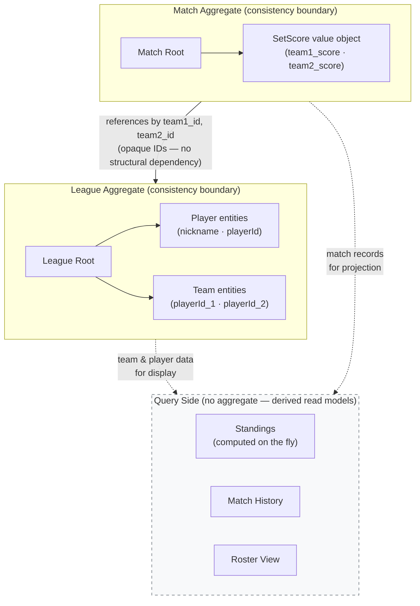

# Candidate Aggregates

## Aggregate Boundary Overview

---

## Aggregate: League

- Aggregate root: League
- Main responsibility: Own the full lifecycle of a league — its identity and access credentials, its roster of players, and the team compositions formed by those players. Enforce all membership and roster invariants.
- Invariants owned:
  - League title uniqueness (system-wide, case-insensitive)
  - Player nickname uniqueness within a league (case-insensitive)
  - One team per player per league (a player may belong to at most one team)
  - Team has exactly two distinct players
  - Players and teams are created only through match submission (no standalone creation endpoint)
- State changed atomically: league title, player roster (add / edit nickname), team roster (create / delete), player-to-team membership
- References to other aggregates by: none (owns all roster state internally; Match references Team by ID from the outside)
- Why this should be one aggregate: The three roster invariants (nickname uniqueness, one-team-per-player, two-distinct-players-per-team) are tightly coupled — all three must be checked together whenever a player or team is added or modified. Splitting players and teams into separate aggregates would force cross-aggregate transactions for every implicit registration.
- Why this should NOT absorb neighboring concepts: Match result records belong to Match Recording, not League. Pulling match data into this aggregate would bloat it with write concerns unrelated to roster management and make the capacity for large leagues unmanageable.
- Open questions:
  - For very large leagues (hundreds of teams), loading all players and teams into memory on every match submission could become expensive. For V1 with small recreational groups, this is acceptable. Revisit if league sizes grow significantly.
- Resolved decisions:
  - hostToken is stored as plaintext. No hashing required; security concern is not a priority for this system.

---

## Aggregate: Match

- Aggregate root: Match
- Main responsibility: Own a single confirmed doubles match result — the two opposing team references, the set scores, and the match-level structural invariants.
- Invariants owned:
  - Match involves two distinct teams (team1_id ≠ team2_id)
  - Set scores are non-negative integers
- State changed atomically: set scores (on admin edit), match record existence (on admin delete)
- References to other aggregates by: team1_id and team2_id (opaque references to Team entities inside the League aggregate; the Match does not hold player lists directly after creation)
- Why this should be one aggregate: A match result is a single consistent unit — its two team slots and set scores must be stored together; partial saves produce nonsensical records. Admin score edits apply to the whole match at once.
- Why this should NOT absorb neighboring concepts: Player and team identity belong to League. Standings computation is a read-side projection, not a write-side concern of Match. Pulling those into Match would entangle its consistency boundary with roster management.
- Resolved decisions:
  - Match stores team IDs only. Player nicknames are always resolved on read from the current League state. Admin nickname edits will retroactively affect historical display — this is acceptable.
  - Deleted matches are hard-deleted. No soft-delete / archive required.

---

## Aggregate: (None — Query Side Only)

- Standings, match history, and roster views are **not aggregates**. They are read models derived on the fly from League and Match state.
- There is no Standings aggregate root. No standings record is persisted or mutated.
- Admin Operations is not a separate aggregate; it is a set of admin-only application commands that operate on the League and Match aggregates through a separate router with hostToken authorization.

---

## Decision Questions Answered

| Question | Answer |
|---|---|
| What must change together in one transaction? | On match submission: implicit player/team registration (League) + match record creation (Match) — the SubmitMatchResult use case loads both aggregates through their repositories, invokes their domain behavior, and saves both in one transaction |
| What can be eventually consistent? | Standings reads (always computed on the fly; no write-side consistency concern) |
| What is the external entry point? | League root for all roster mutations; Match root for all result mutations |
| Which child objects should not be edited independently? | Player and Team entities inside League; SetScore value objects inside Match |
