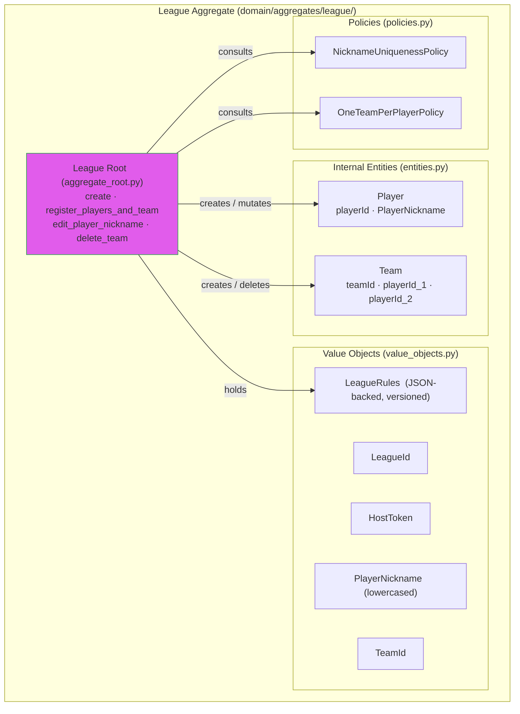

# Aggregate Design: League

## League Aggregate Structure

---

## Aggregate Root
- Name: League
- Purpose: Own the full lifecycle of a league — its identity, access credentials, and the roster of players and teams. Enforce all membership and roster invariants atomically.
- Identity field: leagueId (UUID)

---

## Invariants Enforced by Root
- League title uniqueness: system-wide, case-insensitive (pre-checked at application layer via repository; aggregate trusts the check was done before `create` is called)
- Player nickname uniqueness within a league: case-insensitive, enforced on `register_players_and_team` and `edit_player_nickname`
- One team per player per league: **when** `LeagueRules.one_team_per_player` is true (default), a player may belong to at most one team; enforced on `register_players_and_team` via `OneTeamPerPlayerPolicy`. When false (future), this invariant is not enforced—read models that assume a single team per player must be revised before use in production.
- Team has exactly two distinct players: enforced on team creation inside `register_players_and_team`
- Players and teams are created only through match submission: no standalone player/team creation endpoint; the only path is `register_players_and_team` called by the SubmitMatchResult use case
- **Match pair idempotency** is **not** enforced inside the League aggregate: it is a cross-aggregate check in `SubmitMatchResultUseCase` using `League.rules` and `MatchRepository` (see [16_league_rules_and_match_policies.md](../16_league_rules_and_match_policies.md))

---

## Public Behaviors on Root

### `create(title: str, description: str | None, host_token: str, rules: LeagueRules | None = ...) -> League`
- Purpose: Initialize a new league with an empty roster, access credentials, and **per-league rules** (defaults applied when the use case does not supply a custom `LeagueRules`).
- Inputs: title (required), description (optional), host_token (opaque string generated by the use case), optional rules (value object; typically built from API input or product defaults)
- State changes: sets leagueId (new UUID), hostToken, title (stored as-is; normalized comparison done at use-case level), description, **rules** (`LeagueRules`), initializes empty player list and team list
- Invariants checked: none inside the aggregate — title uniqueness is pre-checked by the application use case via LeagueRepository before this method is called
- Notes: Returns the newly created League aggregate instance. Rules are **immutable after creation** in the current product version (no PATCH league rules).

### `register_players_and_team(p1_nickname: str, p2_nickname: str) -> (list[Player], Team)`
- Purpose: Atomically register any combination of new/existing players and, if the player pair is new, create their team. Called by the SubmitMatchResult use case when a match submission contains players not yet known to the league.
- Inputs: two player nicknames (raw strings; normalization applied inside)
- State changes: adds new Player records for any nickname not already present; adds a new Team record linking the two resolved player IDs if the pair has not been registered before
- Invariants checked:
  - Player nickname uniqueness (case-insensitive): each nickname, after normalization, must not already belong to a different logical player than the one being resolved
  - One team per player: **if** `self.rules.one_team_per_player` is true, neither player may already be a member of a different team
  - Two distinct players: p1 and p2 must normalize to different nicknames
- Returns: the list of newly created Player objects and the Team object (new or existing if the pair already played)
- Notes: If both players already exist and already share a team, this is a no-op for registration and returns the existing player/team references. If both players exist but belong to different teams, the one-team-per-player invariant is violated and an error is raised.

### `edit_player_nickname(player_id: UUID, new_nickname: str) -> Player`
- Purpose: Allow the host (admin) to correct or update a player's nickname.
- Inputs: playerId (must exist in this league), new_nickname (raw string)
- State changes: updates the target Player's nickname (stored normalized)
- Invariants checked: new nickname, after normalization, must not already be in use by a different player in this league
- Returns: the updated Player entity

### `delete_team(team_id: UUID) -> None`
- Purpose: Remove a team record from the league roster.
- Inputs: teamId (must exist in this league)
- State changes: removes the Team record from the team roster; the player records for those players remain in the league (players are not deleted when their team is deleted)
- Invariants checked: none inside the aggregate — the precondition that the team has no associated match records is enforced at the application layer before this method is called
- Notes: In V1, teams cannot be reassigned or have their composition updated. Delete is the only mutation available on an existing team. Players whose team is deleted become "teamless" in the roster; they may form part of a new team implicitly if a future match submission pairs them with a new partner.

---

## Internal Entities

### Entity: Player
- Identity: playerId (UUID, generated on first implicit registration)
- Purpose: Represent a participant in the league, identified by a unique normalized nickname
- Lifecycle: created by `register_players_and_team`; nickname may be updated by `edit_player_nickname`; never deleted individually (only indirectly if the league is deleted)
- Owned by root because: player nickname uniqueness and one-team-per-player membership must be checked atomically within the League consistency boundary
- Behavior: exposes normalized nickname for comparison; does not hold team reference directly (membership is tracked via Team entity)

### Entity: Team
- Identity: teamId (UUID, generated on implicit registration)
- Purpose: Represent a doubles pair of two players in the league
- Lifecycle: created by `register_players_and_team`; can be deleted by `delete_team`; composition is immutable in V1
- Owned by root because: the two-distinct-players-per-team and one-team-per-player invariants are coupled — both must be enforced together during team creation
- Behavior: exposes player_id_1 and player_id_2 for membership checks; no mutable behavior on the entity itself after creation

---

## Value Objects

### Value Object: LeagueId
- Fields: value (UUID)
- Why not a primitive: semantically distinct from other UUIDs; prevents accidental assignment across aggregate boundaries
- Validation / normalization: must be a valid UUID; generated on aggregate creation
- Immutability notes: immutable after creation

### Value Object: HostToken
- Fields: value (string)
- Why not a primitive: semantically distinct; marks the secret used for host authorization
- Validation / normalization: generated as a random opaque string on aggregate creation; stored plaintext in V1
- Immutability notes: immutable after creation

### Value Object: PlayerNickname
- Fields: value (string, stored lowercased)
- Why not a primitive: encapsulates the case-insensitive normalization rule; all comparisons are done on the normalized form
- Validation / normalization: lowercased on construction; must be non-empty
- Immutability notes: immutable once constructed; a new PlayerNickname value object is created when a nickname is edited

### Value Object: TeamId
- Fields: value (UUID)
- Why not a primitive: semantically distinct from LeagueId and PlayerId; prevents accidental cross-type assignment
- Validation / normalization: must be a valid UUID; generated on team creation
- Immutability notes: immutable after creation

### Value Object: LeagueRules
- Fields: versioned configuration (see [16_league_rules_and_match_policies.md](../16_league_rules_and_match_policies.md)); persisted as JSONB on the league row
- Why not ad-hoc dicts in the aggregate root: validation, defaults, and forward-compatible parsing live in one place
- Validation / normalization: reject unknown `version`; coerce and validate known keys; ignore unknown keys for forward compatibility
- Immutability notes: immutable value object; replaced only if a future product version allows rule updates

---

## Policies

### Policy: NicknameUniquenessPolicy
- Purpose: Determine whether a proposed nickname is already in use by a different player within this league
- Inputs: proposed nickname (raw string), current player list in the League aggregate
- Output / decision: allowed (nickname is new or belongs to the same player being edited) or rejected (nickname already used by a different player)

### Policy: OneTeamPerPlayerPolicy
- Purpose: Determine whether a player can join a new team without violating the one-team-per-player rule
- Inputs: player ID, current team list in the League aggregate
- Output / decision: allowed (player has no existing team) or rejected (player is already a member of a different team)

---

## Domain Events (optional)

"Optional" means: the backend is fully correct without an event bus. These events do not need to be raised, collected, or dispatched for the system to function in V1. No use case depends on them for its primary outcome.

They become necessary only when a consumer concern exists — for example: an audit log, a standings cache, a webhook, or a notification. If no such concern exists yet, AI agents should define the event data classes in `domain/events.py` (so the model is complete and the payloads are documented) but should NOT wire an event bus, create handler classes, or add `pull_domain_events()` calls in use cases until a real consumer is introduced.

**Decision rule for AI agents:**
- No consumer concern identified → define event classes only; skip bus wiring
- Consumer concern identified → define event classes + implement handler + wire in `dependencies.py`

| Event | Emitted by | Payload |
|---|---|---|
| LeagueCreated | `League.create` | leagueId, title, rules snapshot (optional in payload) |
| PlayersAndTeamRegistered | `League.register_players_and_team` — only when new records are created | leagueId, new player IDs, team ID |
| PlayerNicknameEdited | `League.edit_player_nickname` | leagueId, playerId, old nickname, new nickname |
| TeamDeleted | `League.delete_team` | leagueId, teamId |

---

## External References
- None — League does not reference any other aggregate by ID. Match references Team by teamId (an opaque reference into this aggregate).

---

## Notes / Open Questions
- **League rules:** Full specification: [16_league_rules_and_match_policies.md](../16_league_rules_and_match_policies.md).
- For large leagues (hundreds of teams), loading the full player and team roster into memory on every match submission may become expensive. In V1, with small recreational groups, this is acceptable.
- Players whose team is deleted become teamless in the roster. In V1, no action is taken on those players automatically. A future version may need a cleanup or reassignment flow.
- hostToken is stored plaintext. No hashing or rotation mechanism is provided in V1.
