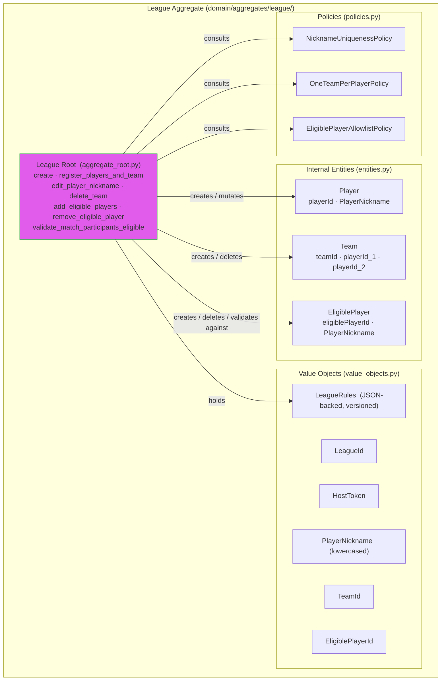

# Aggregate Design: League

## League Aggregate Structure

---

## Aggregate Root
- Name: League
- Purpose: Own the full lifecycle of a league — its identity, access credentials, and the roster of players and teams. Enforce all membership and roster invariants atomically.
- Identity field: leagueId (UUID)

---

## Invariants Enforced by Root
- League title uniqueness: system-wide, case-insensitive (pre-checked at application layer via repository; aggregate trusts the check was done before `create` is called)
- Player nickname uniqueness within a league: case-insensitive, enforced on `register_players_and_team` and `edit_player_nickname`
- One team per player per league: conditional on `LeagueRules.one_team_per_player`. When `true` (the default for new leagues), a player may belong to at most one team; enforced on `register_players_and_team` via `OneTeamPerPlayerPolicy`. When `false` (legal under v3), the policy is skipped and a player may belong to multiple teams; the by-player read models (`GetStandingsByPlayerUseCase`, `GetMatchHistoryByPlayerUseCase`) aggregate across every team the player belongs to. See [18_configurable_ranking_v3.md](../18_configurable_ranking_v3.md).
- Team has exactly two distinct players: enforced on team creation inside `register_players_and_team`
- Players and teams are created only through match submission: no standalone player/team creation endpoint; the only path is `register_players_and_team` called by the SubmitMatchResult use case
- **Match pair idempotency** is **not** enforced inside the League aggregate: it is a cross-aggregate check in `SubmitMatchResultUseCase` using `League.rules` and `MatchRepository` (see [16_league_rules_and_match_policies.md](../16_league_rules_and_match_policies.md))

---

## Public Behaviors on Root

### `create(title: str, description: str | None, host_token: str, rules: LeagueRules | None = ...) -> League`
- Purpose: Initialize a new league with an empty roster, access credentials, and **per-league rules** (defaults applied when the use case does not supply a custom `LeagueRules`).
- Inputs: title (required), description (optional), host_token (opaque string generated by the use case), optional rules (value object; typically built from API input or product defaults)
- State changes: sets leagueId (new UUID), hostToken, title (stored as-is; normalized comparison done at use-case level), description, **rules** (`LeagueRules`), initializes empty player list and team list
- Invariants checked: none inside the aggregate — title uniqueness is pre-checked by the application use case via LeagueRepository before this method is called
- Notes: Returns the newly created League aggregate instance. Rules are **immutable after creation** in the current product version (no PATCH league rules).

### `register_players_and_team(p1_nickname: str, p2_nickname: str) -> (list[Player], Team)`
- Purpose: Atomically register any combination of new/existing players and, if the player pair is new, create their team. Called by the SubmitMatchResult use case when a match submission contains players not yet known to the league.
- Inputs: two player nicknames (raw strings; normalization applied inside)
- State changes: adds new Player records for any nickname not already present; adds a new Team record linking the two resolved player IDs if the pair has not been registered before
- Invariants checked:
  - Player nickname uniqueness (case-insensitive): each nickname, after normalization, must not already belong to a different logical player than the one being resolved
  - One team per player: **if** `self.rules.one_team_per_player` is true (the default for new leagues), neither player may already be a member of a different team. When the flag is `false` (legal under v3), this check is skipped and a player may join a second team partnered with a different player.
  - Two distinct players: p1 and p2 must normalize to different nicknames
- Returns: the list of newly created Player objects and the Team object (new or existing if the pair already played)
- Notes: If both players already exist and already share a team, this is a no-op for registration and returns the existing player/team references. If both players exist but belong to different teams, the one-team-per-player invariant is violated and an error is raised.

### `edit_player_nickname(player_id: UUID, new_nickname: str) -> Player`
- Purpose: Allow the host (admin) to correct or update a player's nickname.
- Inputs: playerId (must exist in this league), new_nickname (raw string)
- State changes: updates the target Player's nickname (stored normalized)
- Invariants checked: new nickname, after normalization, must not already be in use by a different player in this league
- Returns: the updated Player entity

### `delete_team(team_id: UUID) -> None`
- Purpose: Remove a team record from the league roster.
- Inputs: teamId (must exist in this league)
- State changes: removes the Team record from the team roster; the player records for those players remain in the league (players are not deleted when their team is deleted)
- Invariants checked: none inside the aggregate — the precondition that the team has no associated match records is enforced at the application layer before this method is called
- Notes: In V1, teams cannot be reassigned or have their composition updated. Delete is the only mutation available on an existing team. Players whose team is deleted become "teamless" in the roster; they may form part of a new team implicitly if a future match submission pairs them with a new partner.

### `add_eligible_players(nicknames: list[str]) -> list[EligiblePlayer]`
- Purpose: Atomically extend the host-managed eligible-players allowlist with one or more nicknames. Used by the host (admin) to pre-declare who is allowed to participate. Full feature specification: [20_eligible_players.md](../20_eligible_players.md).
- Inputs: list of raw nicknames (normalization applied inside via `PlayerNickname`).
- State changes: appends one new `EligiblePlayer` per input nickname.
- Invariants checked: each input nickname (after normalization) must be unique against existing eligible nicknames AND against other entries in the same batch; otherwise raises `EligiblePlayerNicknameAlreadyExistsError` and no entries are added.
- Returns: the list of newly created `EligiblePlayer` objects, in input order.
- Callers:
  - `AddEligiblePlayersUseCase` — post-create host action via `POST /admin/leagues/{league_id}/eligible-players`.
  - `CreateLeagueUseCase` — when the optional `eligible_players` field is supplied on `POST /leagues`, the use case calls this method on the freshly-built aggregate **before** the single `save`, so the seeded entries persist in the same DB transaction as the league row (see [20_eligible_players.md](../20_eligible_players.md) → "Modified use case: `CreateLeagueUseCase`").
- Notes: independent of the roster — adding `"alex"` here does NOT create a `Player` row, and does not require an existing `Player` row. The method itself does not consult `LeagueRules.require_eligible_players`; both callers may populate the allowlist regardless of whether the rule will be enforced on match submission.

### `remove_eligible_player(eligible_player_id: str) -> None`
- Purpose: Remove a single entry from the eligible-players allowlist.
- Inputs: `eligible_player_id` (must exist in this league).
- State changes: removes the entry from `eligible_players` and appends the id to `pending_deleted_eligible_player_ids` so the repository can DELETE the row on next save (mirrors the existing `delete_team` pattern).
- Invariants checked: id must resolve to an entry in this league; otherwise raises `EligiblePlayerNotFoundError`.
- Notes: removing an eligible nickname does NOT delete any `Player` row; the two are decoupled by design.

### `validate_match_participants_eligible(nicknames: Iterable[str]) -> None`
- Purpose: Cross-check the four match-submission nicknames against the eligible list. Called by `SubmitMatchResultUseCase` immediately after `get_by_id_with_lock`.
- Inputs: iterable of raw nicknames (normalized inside).
- State changes: none (read-only).
- Invariants checked: when `self.rules.require_eligible_players` is `False`, this is a no-op; when `True`, delegates the diff to `EligiblePlayerAllowlistPolicy` and raises `IneligiblePlayerError` listing every input nickname not present in the eligible list.
- Notes: the rule flag is the only switch — when disabled, the eligible list is informational and never blocks match recording. The rule-flag gate lives on the aggregate (not inside the policy) so future call sites — e.g. `edit_player_nickname` — can decide independently whether to consult the same policy. See [20_eligible_players.md](../20_eligible_players.md) and `harness_notes/01_when_to_extract_a_policy.md`.

---

## Internal Entities

### Entity: Player
- Identity: playerId (UUID, generated on first implicit registration)
- Purpose: Represent a participant in the league, identified by a unique normalized nickname
- Lifecycle: created by `register_players_and_team`; nickname may be updated by `edit_player_nickname`; never deleted individually (only indirectly if the league is deleted)
- Owned by root because: player nickname uniqueness and one-team-per-player membership must be checked atomically within the League consistency boundary
- Behavior: exposes normalized nickname for comparison; does not hold team reference directly (membership is tracked via Team entity)

### Entity: Team
- Identity: teamId (UUID, generated on implicit registration)
- Purpose: Represent a doubles pair of two players in the league
- Lifecycle: created by `register_players_and_team`; can be deleted by `delete_team`; composition is immutable in V1
- Owned by root because: the two-distinct-players-per-team and one-team-per-player invariants are coupled — both must be enforced together during team creation
- Behavior: exposes player_id_1 and player_id_2 for membership checks; no mutable behavior on the entity itself after creation

### Entity: EligiblePlayer
- Identity: eligiblePlayerId (UUID, generated on `add_eligible_players`)
- Purpose: Represent a host-curated, pre-declared "this nickname is allowed to play in this league" record. Distinct from `Player` (which marks past participation). Full specification: [20_eligible_players.md](../20_eligible_players.md).
- Lifecycle: created by `add_eligible_players`; deleted by `remove_eligible_player`; never mutated in place (a nickname change is a remove-then-add).
- Owned by root because: nickname uniqueness within the eligible list and the cross-check against match-submission nicknames are both per-league invariants enforced atomically with the existing roster invariants under the same host-token authority.
- Behavior: holds a normalized `PlayerNickname`; carries no roster reference (decoupled from `Player`/`Team`).

---

## Value Objects

### Value Object: LeagueId
- Fields: value (UUID)
- Why not a primitive: semantically distinct from other UUIDs; prevents accidental assignment across aggregate boundaries
- Validation / normalization: must be a valid UUID; generated on aggregate creation
- Immutability notes: immutable after creation

### Value Object: HostToken
- Fields: value (string)
- Why not a primitive: semantically distinct; marks the secret used for host authorization
- Validation / normalization: generated as a random opaque string on aggregate creation; stored plaintext in V1
- Immutability notes: immutable after creation

### Value Object: PlayerNickname
- Fields: value (string, stored lowercased)
- Why not a primitive: encapsulates the case-insensitive normalization rule; all comparisons are done on the normalized form
- Validation / normalization: lowercased on construction; must be non-empty
- Immutability notes: immutable once constructed; a new PlayerNickname value object is created when a nickname is edited

### Value Object: TeamId
- Fields: value (UUID)
- Why not a primitive: semantically distinct from LeagueId and PlayerId; prevents accidental cross-type assignment
- Validation / normalization: must be a valid UUID; generated on team creation
- Immutability notes: immutable after creation

### Value Object: EligiblePlayerId
- Fields: value (UUID)
- Why not a primitive: semantically distinct from PlayerId — an eligible-player record is independent of the roster `Player` lifecycle, so the type system should prevent accidental cross-assignment
- Validation / normalization: must be a valid UUID; generated on `add_eligible_players`
- Immutability notes: immutable after creation

### Value Object: LeagueRules
- Fields (v4):
  - `version: int` — schema version; current is `4`. v1, v2, and v3 inputs are accepted on read and upgraded transparently to v4 (v1 inputs additionally have the v2 ranking defaults injected before the v3 + v4 upgrades).
  - `match_pair_idempotency: "none" | "once_per_league"` — see [16_league_rules_and_match_policies.md](../16_league_rules_and_match_policies.md).
  - `one_team_per_player: bool` — `true` or `false`. Default `true` for new leagues. Constrained by the v3 cross-rule below. See [16_league_rules_and_match_policies.md](../16_league_rules_and_match_policies.md).
  - `ranking_subject: "team" | "player"` — see [17_configurable_ranking.md](../17_configurable_ranking.md) for the v2 introduction and [18_configurable_ranking_v3.md](../18_configurable_ranking_v3.md) for the v3 cross-rule. Default `"team"`.
  - `tie_breakers: tuple[Metric, ...]` — non-empty, no duplicates. Each entry one of `matches_won`, `match_diff`, `games_won`, `games_lost`, `games_diff`, `win_pct`. Default `("matches_won",)`.
  - `require_eligible_players: bool` (v4+) — `false` by default. When `true`, `SubmitMatchResultUseCase` calls `League.validate_match_participants_eligible` and rejects submissions whose nicknames are not in `eligible_players`. Full specification: [20_eligible_players.md](../20_eligible_players.md).
- Persisted as JSONB on the league row (see [12_persistence_strategy.md](../12_persistence_strategy.md)).
- Why not ad-hoc dicts in the aggregate root: validation, defaults, and forward-compatible parsing live in one place.
- Validation / normalization: reject unknown `version` (only `1`, `2`, `3`, `4` accepted on input); coerce and validate known keys; ignore unknown keys for forward compatibility. v3 cross-rule: `ranking_subject = "player"` requires `one_team_per_player = false`; equivalently, `(ranking_subject = "player", one_team_per_player = true)` is rejected with `InvalidLeagueRulesError`. See [18_configurable_ranking_v3.md](../18_configurable_ranking_v3.md).
- Immutability notes: immutable value object; replaced only if a future product version allows rule updates. There is no PATCH endpoint for `require_eligible_players` in this iteration — the flag is fixed at league creation.

---

## Policies

### Policy: NicknameUniquenessPolicy
- Purpose: Determine whether a proposed nickname is already in use by a different player within this league
- Inputs: proposed nickname (raw string), current player list in the League aggregate
- Output / decision: allowed (nickname is new or belongs to the same player being edited) or rejected (nickname already used by a different player)

### Policy: OneTeamPerPlayerPolicy
- Purpose: Determine whether a player can join a new team without violating the one-team-per-player rule
- Inputs: player ID, current team list in the League aggregate
- Output / decision: allowed (player has no existing team) or rejected (player is already a member of a different team)

### Policy: EligiblePlayerAllowlistPolicy
- Purpose: Compute the set of candidate nicknames that are not present in this league's eligible-player allowlist.
- Inputs: iterable of `PlayerNickname` value objects (already normalized), current `eligible_players` list in the League aggregate.
- Output / decision: a `list[str]` of missing normalized nicknames (de-duplicated, in input order of first appearance). An empty list means every candidate is eligible.
- Why the output is a diff, not a `bool`: every current and anticipated caller needs the missing list to construct a structured error payload (`IneligiblePlayerError(missing_nicknames=...)`); a `bool` would force a second pass to recompute the diff.
- Where the rule-flag gate lives: NOT inside the policy — `LeagueRules.require_eligible_players` is consulted by each call site (today only `validate_match_participants_eligible`; expected next: `edit_player_nickname`). Mirrors the `OneTeamPerPlayerPolicy` ↔ `LeagueRules.one_team_per_player` separation.
- Reuse plan: today this policy has a single call site (match submission). `edit_player_nickname` is the named next call site, and `register_players_and_team` is a likely third. The policy was extracted preemptively because the second call site is committed; see `harness_notes/01_when_to_extract_a_policy.md` for the decision rule.

---

## Domain Events (optional)

"Optional" means: the backend is fully correct without an event bus. These events do not need to be raised, collected, or dispatched for the system to function in V1. No use case depends on them for its primary outcome.

They become necessary only when a consumer concern exists — for example: an audit log, a standings cache, a webhook, or a notification. If no such concern exists yet, AI agents should define the event data classes in `domain/events.py` (so the model is complete and the payloads are documented) but should NOT wire an event bus, create handler classes, or add `pull_domain_events()` calls in use cases until a real consumer is introduced.

**Decision rule for AI agents:**
- No consumer concern identified → define event classes only; skip bus wiring
- Consumer concern identified → define event classes + implement handler + wire in `dependencies.py`

| Event | Emitted by | Payload |
|---|---|---|
| LeagueCreated | `League.create` | leagueId, title, rules snapshot (optional in payload) |
| PlayersAndTeamRegistered | `League.register_players_and_team` — only when new records are created | leagueId, new player IDs, team ID |
| PlayerNicknameEdited | `League.edit_player_nickname` | leagueId, playerId, old nickname, new nickname |
| TeamDeleted | `League.delete_team` | leagueId, teamId |
| EligiblePlayersAdded | `League.add_eligible_players` | leagueId, list of (eligiblePlayerId, nickname) |
| EligiblePlayerRemoved | `League.remove_eligible_player` | leagueId, eligiblePlayerId, nickname |

---

## External References
- None — League does not reference any other aggregate by ID. Match references Team by teamId (an opaque reference into this aggregate).

---

## Notes / Open Questions
- **League rules:** Full specification: [16_league_rules_and_match_policies.md](../16_league_rules_and_match_policies.md).
- For large leagues (hundreds of teams), loading the full player and team roster into memory on every match submission may become expensive. In V1, with small recreational groups, this is acceptable.
- Players whose team is deleted become teamless in the roster. In V1, no action is taken on those players automatically. A future version may need a cleanup or reassignment flow.
- hostToken is stored plaintext. No hashing or rotation mechanism is provided in V1.
