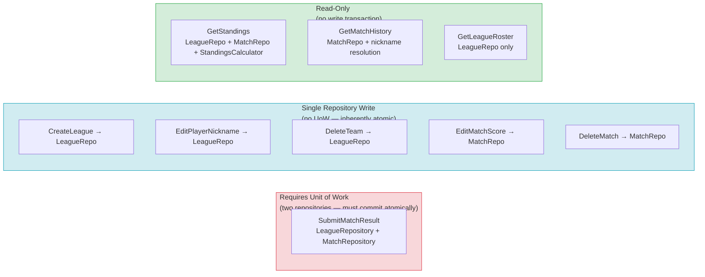

# Unit of Work and Transaction Boundaries

## Transaction Category Overview

---

## Transactional Action: SubmitMatchResult

- Business action: Submit Match Result (including implicit player/team registration when new players are present)
- Why atomicity is required: The League aggregate save (which persists any newly registered players and teams) and the Match aggregate save (which persists the new match record) must succeed or fail together. A partial commit — players/teams registered but no match saved, or a match saved but players not registered — would leave the league roster and match history in an irrecoverably inconsistent state.
- Aggregate(s) involved: League, Match
- Repository interfaces involved: LeagueRepository, MatchRepository
- Unit of Work needed?: Yes
- Unit of Work name: SubmitMatchResultUnitOfWork
- Repositories participating in same transaction: LeagueRepository, MatchRepository
- Commit scope: LeagueRepository.save(league) — persists updated roster with any new players/teams — and MatchRepository.save(match) — persists the new match record — within a single DB transaction
- Rollback trigger: any domain error (invariant violation, team conflict), save error, or DB constraint violation; entire transaction is rolled back
- Notes: When all players are already known and the team already exists, the League save is still issued but results in no-ops (upsert with no changes). The transaction boundary is the same regardless of whether implicit registration occurred.

---

## Single-Repository Write Actions (No Unit of Work Required)

### CreateLeague
- Business action: Create League
- Why no Unit of Work is needed: Only one repository is written to (LeagueRepository). A single repository save is inherently atomic.
- Repository written: LeagueRepository
- Notes: hostToken UUID is generated in the use case before calling League.create(); no cross-aggregate persistence involved.

### EditPlayerNickname
- Business action: Edit Player Nickname (Admin)
- Why no Unit of Work is needed: Only LeagueRepository is written to. The nickname update is a single aggregate mutation.
- Repository written: LeagueRepository

### DeleteTeam
- Business action: Delete Team (Admin)
- Why no Unit of Work is needed: MatchRepository.has_matches_for_team is a read-only precondition check; no write occurs on MatchRepository. Only LeagueRepository is written to.
- Repository written: LeagueRepository
- Notes: The read from MatchRepository (precondition check) and the write to LeagueRepository are sequential, not transactional. The precondition must be verified before the domain mutation begins; if the check passes and a concurrent insert creates a match for that team before the delete commits, the DB foreign key constraint on the matches table acts as the final safety net.

### EditMatchScore
- Business action: Edit Match Score (Admin)
- Why no Unit of Work is needed: Only MatchRepository is written to. Single aggregate mutation.
- Repository written: MatchRepository

### DeleteMatch
- Business action: Delete Match (Admin)
- Why no Unit of Work is needed: Only MatchRepository is written to (hard delete). No other aggregate state changes.
- Repository written: MatchRepository

---

## Read-Only / Calculation Actions (No Write Transaction Required)

### GetStandings
- Business action: View Standings
- Why no write transaction is needed: Pure read — loads existing match and league data, computes standings in memory, returns a projection. No state is mutated.
- Aggregate(s) or read inputs loaded: all Match records for the league (via MatchRepository), League aggregate with Players and Teams (via LeagueRepository)
- Repository / query interfaces involved: MatchRepository.get_all_by_league, LeagueRepository.get_by_id
- Domain service used?: Yes — StandingsCalculator receives the loaded match list, team list, and player list and returns a ranked list of StandingsEntry
- Notes: Both repository calls are read-only. They may be executed in a single read transaction or independently; no write lock is needed.

### GetMatchHistory
- Business action: View Match History
- Why no write transaction is needed: Read-only projection of match records ordered chronologically.
- Aggregate(s) or read inputs loaded: all Match records for the league
- Repository / query interfaces involved: MatchRepository.get_all_by_league
- Domain service used?: No
- Notes: Returns a chronological list; no domain computation required beyond loading and ordering by created_at (infrastructure-managed DB column).

### GetLeagueRoster
- Business action: View League Roster
- Why no write transaction is needed: Read-only projection of the current league player and team roster.
- Aggregate(s) or read inputs loaded: League aggregate with Players and Teams
- Repository / query interfaces involved: LeagueRepository.get_by_id
- Domain service used?: No
- Notes: Returns the player list and team list as-is from the loaded League aggregate.
