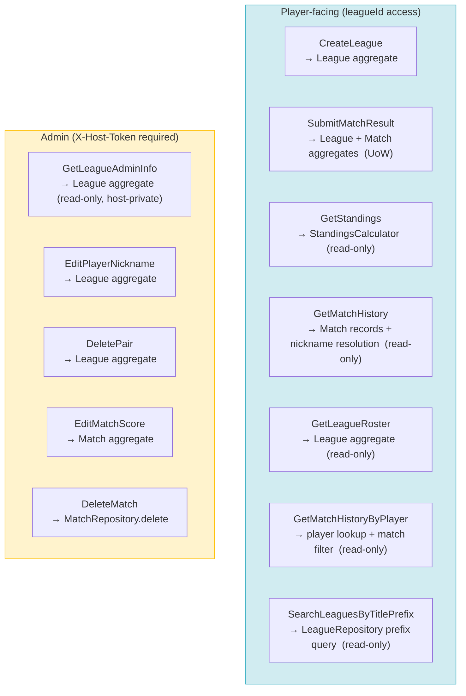

# Application Use Cases

## Use Case Map

---

## Use Case: CreateLeagueUseCase

- Business action: Create League (optionally pre-registered with a starting roster in the same transaction)
- Inputs: CreateLeagueCommand(title: str, host_email: str, description: str | None, league_timezone: str = "America/Los_Angeles", rules: LeagueRules | None, initial_players: list[str] = []) — `host_email` is **mandatory** and pre-validated as an RFC-compliant email by Pydantic `EmailStr` at the API edge; the use case forwards the raw string to `League.create`, where the `HostEmail` value object strips + lowercases it and enforces non-blankness. `league_timezone` is validated by the `LeagueTimezone` value object and is stored on the league row, not in `rules`. When `rules` is omitted, the use case supplies **product defaults** for new leagues (documented in code; see [16_league_rules_and_match_policies.md](16_league_rules_and_match_policies.md)). `initial_players` defaults to an empty list; when non-empty, the entries are pre-registered on the new league's roster before the single `save` call so the league row and every player row reach the database in one transaction. See [20_roster_pre_registration.md](20_roster_pre_registration.md) → "Modified use case: `CreateLeagueUseCase`" for the rationale and error semantics.
- Output: CreateLeagueResult(league_id: str, host_token: str)
- State-changing or calculation-only?: State-changing
- Unit of Work needed?: No — single repository save (the repository's `save` writes the league row, players, and pairs through the same `AsyncSession`, so atomicity is provided by the request-scoped session commit)
- Aggregate(s) loaded: none (new aggregate created)
- Aggregate(s) loaded through which repository?: N/A
- Domain service used?: No
- Repository calls: LeagueRepository.get_by_normalized_title (uniqueness pre-check), LeagueRepository.save
- Port calls: none
- Persistence required?: Yes
- Transaction notes: single `save`; both the league row and any seeded `players` rows flow through the same session and commit together — partial state is impossible
- Steps:
  1. Normalize title to lowercase
  2. Call LeagueRepository.get_by_normalized_title(normalized_title) — raise LeagueTitleAlreadyExistsError if a league already exists with that normalized title
  3. Generate host_token as str(uuid.uuid4())
  4. Resolve `LeagueRules` from command.rules or product defaults
  5. Call League.create(title, description, host_token, host_email, league_timezone, rules) — constructs new aggregate with empty roster, host contact email, persisted timezone, and persisted rules
  6. If `command.initial_players` is non-empty, call `league.add_players(command.initial_players)` — pre-registers the players on the aggregate; raises `NicknameAlreadyInUseError` (mapped to 409) if any input nickname duplicates another inside the same batch, in which case no `save` is performed and the league is not persisted
  7. Save via LeagueRepository.save(league) — persists the league plus any seeded player rows in the same DB transaction
  8. Return league_id and host_token
- Domain rules enforced where: League.create (title must be non-empty; `HostEmail` non-blank after strip; `LeagueTimezone` valid IANA timezone); title uniqueness pre-check at application layer via repository; `host_email` format validation at the API edge via Pydantic `EmailStr`; LeagueRules validation on construction; League.add_players (in-batch nickname uniqueness; at create time the roster starts empty so against-existing collisions are impossible)
- Errors: LeagueTitleAlreadyExistsError, NicknameAlreadyInUseError (only when `initial_players` contains in-batch duplicates), ValidationError (blank title, missing or malformed `host_email`, blank `initial_players` entry), invalid rules payload

---

## Use Case: SearchLeaguesByTitlePrefixUseCase

- Business action: List leagues whose normalized title starts with a given prefix (public discovery)
- Inputs: `SearchLeaguesByTitlePrefixQuery(title_prefix: str, limit: int)` — `title_prefix` must be non-empty after strip; `limit` is clamped to at most 100 (application layer)
- Output: `list[LeagueListItem]` where each item is `(league_id: str, title: str)` — no host token or aggregate load
- State-changing or calculation-only?: Read-only
- Unit of Work needed?: No
- Aggregate(s) loaded: none (projection query only)
- Repository calls: `LeagueRepository.search_by_title_prefix(normalized_prefix, limit)`
- Persistence required?: Yes (read query on `leagues.title_normalized`)
- Steps:
  1. Normalize `title_prefix` with strip + lowercase (same convention as `title_normalized` on save)
  2. Reject empty normalized prefix (HTTP 422 at API boundary)
  3. Clamp `limit` to default 50 / max 100 per API contract
  4. Call repository prefix search with SQL `LIKE` and escaped wildcards
  5. Return ordered list of league id + display title
- Errors: none from domain — validation only at API layer for blank prefix

---

## Use Case: SubmitMatchResultUseCase

- Business action: Submit Match Result (includes implicit player/pair registration for any new nicknames)
- Inputs: SubmitMatchResultCommand(league_id: str, pair1_nicknames: tuple[str, str], pair2_nicknames: tuple[str, str], pair1_score: str, pair2_score: str)
- Output: SubmitMatchResultResult(match_id: str)
- State-changing or calculation-only?: State-changing
- Unit of Work needed?: Yes — SubmitMatchResultUnitOfWork (LeagueRepository + MatchRepository must be atomic)
- Aggregate(s) loaded: League
- Aggregate(s) loaded through which repository?: LeagueRepository
- Domain service used?: No
- Repository calls: LeagueRepository.get_by_id_with_lock, LeagueRepository.save, MatchRepository (existence check when rules require idempotency), MatchRepository.save
- Port calls: none
- Persistence required?: Yes
- Transaction notes: LeagueRepository.save and MatchRepository.save must commit together; rollback on any domain error or DB failure
- Steps:
  1. Normalize all four nicknames to lowercase
  2. Verify pair1_nicknames[0] ≠ pair1_nicknames[1] (normalized) — raise SamePlayerWithinSinglePairError if equal (a player cannot be paired with themselves on pair1)
  3. Verify pair2_nicknames[0] ≠ pair2_nicknames[1] (normalized) — raise SamePlayerWithinSinglePairError if equal (a player cannot be paired with themselves on pair2)
  4. Verify no nickname appears in both pair1_nicknames and pair2_nicknames — raise SamePlayerOnBothPairsError if any overlap detected
  5. Construct SetScore(pair1_score, pair2_score) value object — raise InvalidSetScoreError if either score fails non-negative integer validation
  6. Enter SubmitMatchResultUnitOfWork
  7. Load League via LeagueRepository.get_by_id_with_lock(league_id) — raise LeagueNotFoundError if missing
  8. Call league.register_players_and_pair(pair1_nicknames[0], pair1_nicknames[1]) → pair1 — raises PairConflictError if either player already belongs to a different pair (when league rules require one pair per player)
  9. Call league.register_players_and_pair(pair2_nicknames[0], pair2_nicknames[1]) → pair2 — same as step 8
  10. If league.rules.pair_matchup_idempotency is `once_per_league`, call MatchRepository.exists_match_for_pair_matchup(league_id, pair1.pair_id, pair2.pair_id) — raise DuplicatePairMatchupMatchError (or equivalent) if true
  11. If league.rules.pair_matchup_idempotency is `once_per_day`, compute the current calendar day in `league.league_timezone`, convert local midnight bounds to UTC `[start, end)`, then call MatchRepository.exists_match_for_pair_matchup_between(league_id, pair1.pair_id, pair2.pair_id, start, end) — raise DuplicatePairMatchupMatchError if true
  12. Call Match.create(league_id, pair1.pair_id, pair2.pair_id, set_score) — raises SamePairOnBothSidesError if pair1_id == pair2_id
  13. LeagueRepository.save(league) — persists any newly registered players and pairs
  14. MatchRepository.save(match) — persists the new match record
  15. Commit UoW
  16. Return match_id
- Domain rules enforced where:
  - Application layer: within-pair distinct-player check (steps 2–3), cross-pair distinct-player check (step 4) — all structural validations before any aggregate is loaded
  - SetScore constructor: non-negative integer validation (step 5)
  - League.register_players_and_pair: nickname uniqueness within league, one-pair-per-player when enabled by league rules
  - Match.create: pair1_id ≠ pair2_id
  - Application layer: pair matchup idempotency when `once_per_league` or `once_per_day`
- Errors: LeagueNotFoundError, SamePlayerWithinSinglePairError, SamePlayerOnBothPairsError, InvalidSetScoreError, PairConflictError, SamePairOnBothSidesError, DuplicatePairMatchupMatchError (409 when idempotency violated)

---

## Use Case: GetStandingsUseCase

- Business action: View Standings
- Inputs: GetStandingsQuery(league_id: str)
- Output: list[StandingsEntry(pair_id, player1_nickname, player2_nickname, wins, losses, rank)]
- State-changing or calculation-only?: Calculation-only
- Unit of Work needed?: No
- Aggregate(s) loaded: League (for pairs and players), all Match records for the league
- Aggregate(s) loaded through which repository?: LeagueRepository, MatchRepository
- Domain service used?: Yes — StandingsCalculator
- Repository calls: LeagueRepository.get_by_id, MatchRepository.get_all_by_league
- Port calls: none
- Persistence required?: No
- Transaction notes: read-only; no write lock needed
- Steps:
  1. Load League via LeagueRepository.get_by_id(league_id) — raise LeagueNotFoundError if missing
  2. Load all matches via MatchRepository.get_all_by_league(league_id)
  3. Call StandingsCalculator.compute(matches, league.pairs, league.players) → list[StandingsEntry]
  4. Return standings list
- Domain rules enforced where: StandingsCalculator (ranking and draw-handling logic)
- Errors: LeagueNotFoundError

---

## Use Case: GetMatchHistoryUseCase

- Business action: View Match History
- Inputs: GetMatchHistoryQuery(league_id: str)
- Output: list[MatchHistoryRecord(match_id, pair1_player_nicknames, pair2_player_nicknames, pair1_score, pair2_score, created_at)] sorted by created_at descending
- State-changing or calculation-only?: Calculation-only
- Unit of Work needed?: No
- Aggregate(s) loaded: League (for pair-to-player nickname resolution), all Match records for the league
- Aggregate(s) loaded through which repository?: LeagueRepository, MatchRepository
- Domain service used?: No
- Repository calls: LeagueRepository.get_by_id, MatchRepository.get_all_by_league
- Port calls: none
- Persistence required?: No
- Transaction notes: read-only
- Steps:
  1. Load League via LeagueRepository.get_by_id(league_id) — raise LeagueNotFoundError if missing
  2. Load all matches via MatchRepository.get_all_by_league(league_id)
  3. For each match, resolve pair1_id and pair2_id to player nicknames using league.pairs and league.players
  4. Return MatchHistoryRecord list sorted by created_at descending
- Domain rules enforced where: none — pure projection
- Errors: LeagueNotFoundError
- Notes: Match stores only pair_id references; player nicknames are resolved at read time from the current League state. Admin nickname edits retroactively affect historical display — this is an accepted trade-off in V1.

---

## Use Case: GetLeagueRosterUseCase

- Business action: View League Roster
- Inputs: GetLeagueRosterQuery(league_id: str)
- Output: RosterView(title: str, league_timezone: str, rules: dict (LeagueRules.to_dict()), players: list[PlayerEntry(player_id, nickname, rating, pairs_count, matches_count)], pairs: list[PairEntry(pair_id, player1_nickname, player2_nickname)])
- State-changing or calculation-only?: Calculation-only
- Unit of Work needed?: No
- Aggregate(s) loaded: League
- Aggregate(s) loaded through which repository?: LeagueRepository
- Domain service used?: No
- Repository calls: LeagueRepository.get_by_id
- Port calls: none
- Persistence required?: No
- Transaction notes: read-only
- Steps:
  1. Load League via LeagueRepository.get_by_id(league_id) — raise LeagueNotFoundError if missing
  2. Return player list and pair list from loaded aggregate
- Domain rules enforced where: none — pure projection
- Errors: LeagueNotFoundError

---

## Use Case: GetMatchHistoryByPlayerUseCase

- Business action: Get Match History By Player Name
- Inputs: GetMatchHistoryByPlayerQuery(league_id: str, player_name: str)
- Output: list[MatchHistoryRecord(match_id, pair1_player_nicknames, pair2_player_nicknames, pair1_score, pair2_score, created_at)] sorted by created_at descending
- State-changing or calculation-only?: Calculation-only
- Unit of Work needed?: No
- Aggregate(s) loaded: League (for player lookup, pair resolution, and nickname mapping), all Match records for the league
- Aggregate(s) loaded through which repository?: LeagueRepository, MatchRepository
- Domain service used?: No
- Repository calls: LeagueRepository.get_by_id, MatchRepository.get_all_by_league
- Port calls: none
- Persistence required?: No
- Transaction notes: read-only
- Steps:
  1. Load League via LeagueRepository.get_by_id(league_id) — raise LeagueNotFoundError if missing
  2. Normalize player_name via PlayerNickname(player_name) — applies lowercase + strip
  3. Find player by normalized nickname in league.players — raise PlayerNotFoundError if not found
  4. Find the player's pair in league.pairs by matching player_id_1 or player_id_2 — return empty list if no pair found (player's pair was deleted)
  5. Load all matches via MatchRepository.get_all_by_league(league_id) — filter to those where pair1_id or pair2_id equals the player's pair_id
  6. For each filtered match, resolve pair player nicknames using league.pairs and league.players
  7. Return MatchHistoryRecord list sorted by created_at descending
- Domain rules enforced where: none — pure projection; player existence enforced at application layer
- Errors: LeagueNotFoundError, PlayerNotFoundError
- Notes: Reuses the MatchHistoryRecord output type from GetMatchHistoryUseCase. An empty result (no matches) is a valid response when the player's pair exists but has not yet played any matches.

---

## Use Case: GetLeagueAdminInfoUseCase (Admin)

- Business action: Read host-only league metadata for the admin UI
- Inputs: GetLeagueAdminInfoQuery(host_token: str, league_id: str)
- Output: LeagueAdminInfoView(host_email: str) — V1 only; response type and route are intentionally general
- State-changing or calculation-only?: Calculation-only
- Unit of Work needed?: No
- Aggregate(s) loaded: League
- Repository calls: LeagueRepository.get_by_id
- Steps:
  1. Load League — raise LeagueNotFoundError if missing
  2. Verify host_token — raise UnauthorizedError if mismatch
  3. Project host-private fields into LeagueAdminInfoView
- Errors: LeagueNotFoundError, UnauthorizedError
- Notes: **Growth direction:** before adding fields, read [13_api_contracts.md](13_api_contracts.md) → "Get League Admin Info (Admin)" → "Growth direction". Only host-private aggregate fields belong here; do not duplicate roster/standings/match history from player-facing read use cases.

---

## Use Case: EditPlayerNicknameUseCase (Admin)

- Business action: Edit Player Nickname / Rating
- Inputs: EditPlayerNicknameCommand(host_token: str, league_id: str, player_id: str, new_nickname: str | None, rating: float | None, rating_supplied: bool)
- Output: UpdatedPlayerResult(player_id, new_nickname, rating)
- State-changing or calculation-only?: State-changing
- Unit of Work needed?: No — single repository save
- Aggregate(s) loaded: League
- Aggregate(s) loaded through which repository?: LeagueRepository
- Domain service used?: No
- Repository calls: LeagueRepository.get_by_id, LeagueRepository.save
- Port calls: none
- Persistence required?: Yes
- Transaction notes: single save; inherently atomic
- Steps:
  1. Load League via LeagueRepository.get_by_id_with_lock(league_id) — raise LeagueNotFoundError if missing
  2. Verify host_token matches league.host_token.value — raise UnauthorizedError if not
  3. Require at least one mutable field: `new_nickname` or `rating_supplied`.
  4. If `new_nickname` is supplied, call league.edit_player_nickname(player_id, new_nickname) — enforces nickname uniqueness and player existence.
  5. If `rating_supplied` is true, call league.update_player_rating(player_id, rating) — `rating=None` clears the optional rating.
  6. LeagueRepository.save(league)
  7. Return updated player info
- Domain rules enforced where: League.edit_player_nickname (nickname uniqueness within league, player existence); League.update_player_rating (player existence, non-negative finite rating when present)
- Errors: LeagueNotFoundError, UnauthorizedError, PlayerNotFoundError, NicknameAlreadyInUseError, InvalidPlayerRatingError

---

## Use Case: DeletePairUseCase (Admin)

- Business action: Delete Pair
- Inputs: DeletePairCommand(host_token: str, league_id: str, pair_id: str)
- Output: confirmation (pair deleted)
- State-changing or calculation-only?: State-changing
- Unit of Work needed?: No — only LeagueRepository is written to; MatchRepository is read-only (precondition check)
- Aggregate(s) loaded: League
- Aggregate(s) loaded through which repository?: LeagueRepository
- Domain service used?: No
- Repository calls: LeagueRepository.get_by_id, MatchRepository.has_matches_for_pair, LeagueRepository.save
- Port calls: none
- Persistence required?: Yes
- Transaction notes: single save to LeagueRepository; DB foreign key constraint on the matches table acts as a final safety net for any concurrent match insert
- Steps:
  1. Load League via LeagueRepository.get_by_id_with_lock(league_id) — raise LeagueNotFoundError if missing
  2. Verify host_token matches league.host_token.value — raise UnauthorizedError if not
  3. Verify pair_id exists in league.pairs — raise PairNotFoundError if missing
  4. Call MatchRepository.has_matches_for_pair(pair_id, league_id) — raise PairHasMatchesError if True (host must delete associated matches first)
  5. Call league.delete_pair(pair_id) — removes pair from roster and records pending deletion
  6. LeagueRepository.save(league) — persists the pair deletion
- Domain rules enforced where: Application layer (precondition check in step 4); League.delete_pair (pair identity check)
- Errors: LeagueNotFoundError, UnauthorizedError, PairNotFoundError, PairHasMatchesError

---

## Use Case: EditMatchScoreUseCase (Admin)

- Business action: Edit Match Score
- Inputs: EditMatchScoreCommand(host_token: str, league_id: str, match_id: str, pair1_score: str, pair2_score: str)
- Output: UpdatedMatchResult(match_id, pair1_score, pair2_score)
- State-changing or calculation-only?: State-changing
- Unit of Work needed?: No — single repository save
- Aggregate(s) loaded: League (for hostToken verification), Match
- Aggregate(s) loaded through which repository?: LeagueRepository, MatchRepository
- Domain service used?: No
- Repository calls: LeagueRepository.get_by_id, MatchRepository.get_by_id, MatchRepository.save
- Port calls: none
- Persistence required?: Yes
- Transaction notes: single save to MatchRepository; League is loaded read-only for auth check
- Steps:
  1. Load League via LeagueRepository.get_by_id(league_id) — raise LeagueNotFoundError if missing
  2. Verify host_token matches league.host_token.value — raise UnauthorizedError if not
  3. Construct SetScore(pair1_score, pair2_score) value object — raise InvalidSetScoreError if invalid
  4. Load Match via MatchRepository.get_by_id(match_id, league_id) — raise MatchNotFoundError if missing
  5. Call match.edit_score(new_set_score)
  6. MatchRepository.save(match)
  7. Return updated match info
- Domain rules enforced where: SetScore constructor (non-negative integer validation); Match.edit_score
- Errors: LeagueNotFoundError, UnauthorizedError, InvalidSetScoreError, MatchNotFoundError

---

## Use Case: DeleteMatchUseCase (Admin + Player, dual-mode)

- Business action: Delete Match
- Inputs: DeleteMatchCommand(host_token: str | None, league_id: str, match_id: str)
- Output: confirmation (match deleted)
- State-changing or calculation-only?: State-changing
- Unit of Work needed?: No — single repository delete
- Aggregate(s) loaded: League (for hostToken verification), Match (for existence and `created_at` check)
- Aggregate(s) loaded through which repository?: LeagueRepository, MatchRepository
- Domain service used?: No
- Repository calls: LeagueRepository.get_by_id, MatchRepository.get_by_id, MatchRepository.delete
- Port calls: none
- Persistence required?: Yes
- Transaction notes: single hard delete on MatchRepository; League loaded read-only for auth check
- Steps:
  1. Load League via LeagueRepository.get_by_id(league_id) — raise LeagueNotFoundError if missing
  2. If `host_token` is provided (admin call): verify it matches league.host_token.value — raise UnauthorizedError if not. Skip the window check below.
  3. Load Match via MatchRepository.get_by_id(match_id, league_id) — raise MatchNotFoundError if missing
  4. If `host_token` is None (player call): enforce `now - match.created_at <= window_seconds` — raise MatchDeleteWindowExpiredError otherwise (with `match_id`, `window_seconds`, `age_seconds` payload). `created_at == None` fails closed.
  5. MatchRepository.delete(match_id, league_id) — hard delete; no domain method needed (deletion has no domain invariants beyond existence + window check)
- Domain rules enforced where: Application layer (existence, auth, and time-window checks); no domain-level delete method on Match aggregate. Window threshold injected at construction (`window_seconds`, default 600s / 10 min) so deployment knobs and tests can both override without monkeypatching `datetime.now`.
- Errors: LeagueNotFoundError, UnauthorizedError, MatchNotFoundError, MatchDeleteWindowExpiredError
- Mirrors `EditMatchScoreUseCase`'s dual-mode shape: same `host_token: str | None` trust model, same injected-window pattern, same exception structure (`Match*WindowExpiredError(match_id, window_seconds, age_seconds)`). Player-window default is tighter (600s vs 3600s for edits) because deletes are irreversible.
