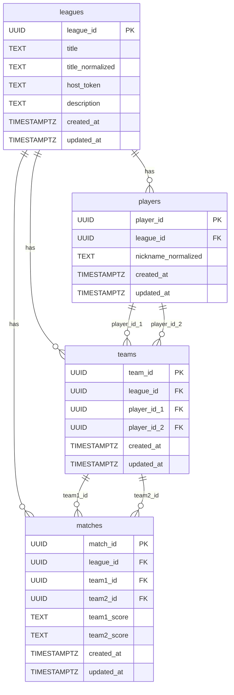

# Persistence Strategy

## Database Choice

- PostgreSQL
- ORM: SQLAlchemy (async) with asyncpg driver
- Migrations: Alembic
- Rationale: PostgreSQL provides row-level locking (SELECT ... FOR UPDATE), strong unique constraint enforcement, and UUID column support — all required by this system's correctness guarantees. SQLAlchemy async with asyncpg is the standard pairing for FastAPI Python backends.

---

## Schema Diagram

---

## Aggregate Persistence Mapping

### Aggregate: League (root + Player entities + Team entities)

- Tables: `leagues`, `players`, `teams`

**`leagues` table**
- league_id (UUID, PK)
- title (TEXT, NOT NULL) — stored as submitted; display value
- title_normalized (TEXT, NOT NULL, UNIQUE) — lowercase; used for uniqueness checks and `get_by_normalized_title`
- host_token (TEXT, NOT NULL) — plaintext UUID generated at use case level
- description (TEXT, nullable)
- created_at (TIMESTAMPTZ, server default NOW())
- updated_at (TIMESTAMPTZ, updated on change)

**`players` table**
- player_id (UUID, PK)
- league_id (UUID, NOT NULL, FK → leagues.league_id ON DELETE CASCADE)
- nickname_normalized (TEXT, NOT NULL) — always stored lowercase; enforces case-insensitive uniqueness at DB level
- created_at (TIMESTAMPTZ, server default NOW())
- updated_at (TIMESTAMPTZ, updated on change)
- UNIQUE constraint on (league_id, nickname_normalized)

**`teams` table**
- team_id (UUID, PK)
- league_id (UUID, NOT NULL, FK → leagues.league_id ON DELETE CASCADE)
- player_id_1 (UUID, NOT NULL, FK → players.player_id)
- player_id_2 (UUID, NOT NULL, FK → players.player_id)
- created_at (TIMESTAMPTZ, server default NOW())
- updated_at (TIMESTAMPTZ, updated on change)
- UNIQUE constraint on (league_id, player_id_1, player_id_2)
- Notes: player_id_1 and player_id_2 are stored in the order they were registered. The unique constraint uses both orderings implicitly only if the application always stores them in a canonical order (lower UUID first). Enforce canonical ordering at the aggregate root level on team creation.

**Value object mapping (League aggregate)**
- `PlayerNickname` → `nickname_normalized TEXT` — reconstructed through the PlayerNickname validator on load (which enforces lowercase and non-empty); never stored as raw input
- `LeagueId`, `PlayerId`, `TeamId` → PostgreSQL `UUID` type
- `HostToken` → `host_token TEXT` (plaintext UUID string)

**Concurrency / locking strategy**
- `LeagueRepository.get_by_id_with_lock` issues `SELECT ... FOR UPDATE` on the `leagues` row
- Used by all mutating use cases: SubmitMatchResult, EditPlayerNickname, DeleteTeam
- Prevents concurrent match submissions from racing through in-memory uniqueness checks and producing duplicate player or team records
- The DB UNIQUE constraint on `(league_id, nickname_normalized)` serves as the final hard safety net; the application-layer lock provides a clean, predictable failure path before the DB constraint is ever reached
- `LeagueRepository.get_by_id` (no lock) is used for all read-only queries (GetStandings, GetMatchHistory, GetLeagueRoster)

**Index notes**
- UNIQUE index on `leagues.title_normalized` — enforces system-wide league title uniqueness
- UNIQUE index on `(players.league_id, players.nickname_normalized)` — enforces per-league player nickname uniqueness at DB level
- UNIQUE index on `(teams.league_id, teams.player_id_1, teams.player_id_2)` — prevents duplicate team registration
- Index on `(players.league_id)` — used when loading all players for a league
- Index on `(teams.league_id)` — used when loading all teams for a league

---

### Aggregate: Match

- Table: `matches`

**`matches` table**
- match_id (UUID, PK)
- league_id (UUID, NOT NULL, FK → leagues.league_id)
- team1_id (UUID, NOT NULL, FK → teams.team_id)
- team2_id (UUID, NOT NULL, FK → teams.team_id)
- team1_score (TEXT, NOT NULL) — stored as the raw validated string from SetScore value object
- team2_score (TEXT, NOT NULL) — stored as the raw validated string from SetScore value object
- created_at (TIMESTAMPTZ, server default NOW()) — used for match history ordering (see Design Decision in `05_aggregate_designs/match.md`)
- updated_at (TIMESTAMPTZ, updated on change)

**Value object mapping (Match aggregate)**
- `SetScore` → two columns: `team1_score TEXT`, `team2_score TEXT`; reconstructed through the SetScore validator on load
- `MatchId`, `LeagueId`, `TeamId` → PostgreSQL `UUID` type

**Concurrency / locking strategy**
- No row-level locking on `matches` — admin operations (EditMatchScore, DeleteMatch) are low-concurrency and protected by the application-layer auth check and match existence check
- No locking needed for read queries

**Index notes**
- Index on `(league_id, created_at DESC)` — used by `get_all_by_league` for match history ordering
- Index on `team1_id` — used by `has_matches_for_team`
- Index on `team2_id` — used by `has_matches_for_team`

---

## Repository Implementation Notes

- All concrete repository implementations live in `infrastructure/persistence/repositories/`
- `LeagueRepository` implementation loads the full aggregate graph (League root + all Player entities + all Team entities) via joined queries in a single round-trip where possible
- `LeagueRepository.save()` upserts the leagues row, upserts all player rows, upserts all team rows, and hard-deletes any team rows recorded in the aggregate's `pending_deleted_team_ids` collection
- `MatchRepository.delete()` issues a hard DELETE; no soft-delete mechanism in V1
- Domain classes never import SQLAlchemy types; all ORM-to-domain translation is the responsibility of mapper modules

---

## Mapper Notes

- All mapper modules live in `infrastructure/persistence/mappers/`
- Separate mapper modules: `league_mapper.py`, `player_mapper.py`, `team_mapper.py`, `match_mapper.py`
- `PlayerNickname` value object must be constructed through its validator on load — never assign the raw DB string directly to the domain field
- `SetScore` value object must be reconstructed through its validator on load from the two score columns
- All UUID columns map to the appropriate typed value object wrappers (`LeagueId`, `PlayerId`, `TeamId`, `MatchId`, `HostToken`) — raw UUID strings are never passed around naked inside the domain layer

---

## Unit of Work Implementation Notes

- Concrete UoW classes live in `infrastructure/persistence/unit_of_work/`
- Abstract UoW interface lives in `application/unit_of_work/submit_match_result_uow.py` and exposes `league_repo: LeagueRepository` and `match_repo: MatchRepository`
- Concrete class (`infrastructure/persistence/unit_of_work/submit_match_result_uow.py`) wires both repository implementations to a single shared `AsyncSession` so both saves participate in the same DB transaction
- `commit()` calls `await session.commit()`; `rollback()` calls `await session.rollback()`
- Session lifecycle (open / close) is managed by the concrete UoW via async context manager (`__aenter__` / `__aexit__`)
- The use case calls `commit()` explicitly on success; the UoW `__aexit__` rolls back automatically if an unhandled exception propagates

---

## Updated Repository Interface Note

The `LeagueRepository` interface (documented in `07_ports_and_repositories.md`) requires one additional method to support the locking strategy:

- `get_by_id_with_lock(league_id: LeagueId) -> League | None` — loads the full League aggregate under a `SELECT ... FOR UPDATE` row lock; used by all mutating use cases (SubmitMatchResult, EditPlayerNickname, DeleteTeam)
- `get_by_id` (existing) remains the no-lock path for all read-only use cases
