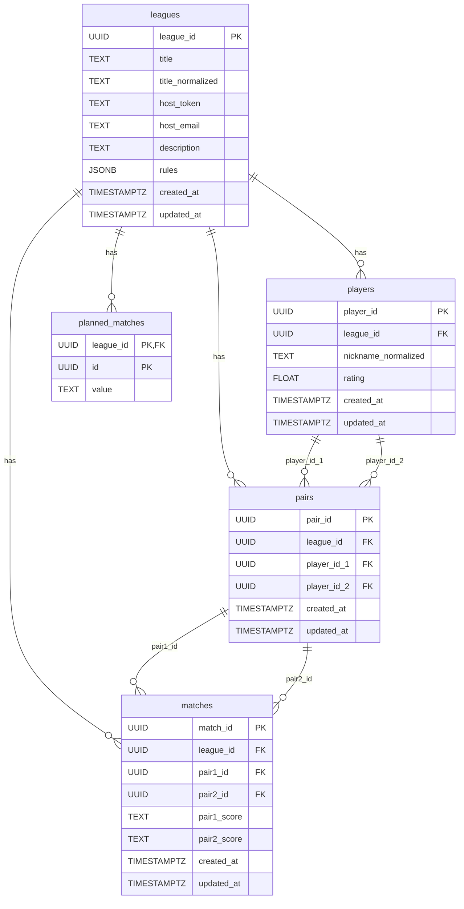

# Persistence Strategy

## Database Choice

- PostgreSQL
- ORM: SQLAlchemy (async) with asyncpg driver
- Migrations: Alembic
- Rationale: PostgreSQL provides row-level locking (SELECT ... FOR UPDATE), strong unique constraint enforcement, and UUID column support — all required by this system's correctness guarantees. SQLAlchemy async with asyncpg is the standard pairing for FastAPI Python backends.

---

## Schema Diagram

```mermaid
erDiagram
    leagues {
        UUID league_id PK
        TEXT title
        TEXT title_normalized
        TEXT host_token
        TEXT host_email
        TEXT description
        JSONB rules
        TIMESTAMPTZ created_at
        TIMESTAMPTZ updated_at
    }
    players {
        UUID player_id PK
        UUID league_id FK
        TEXT nickname_normalized
        FLOAT rating
        TIMESTAMPTZ created_at
        TIMESTAMPTZ updated_at
    }
    pairs {
        UUID pair_id PK
        UUID league_id FK
        UUID player_id_1 FK
        UUID player_id_2 FK
        TIMESTAMPTZ created_at
        TIMESTAMPTZ updated_at
    }
    matches {
        UUID match_id PK
        UUID league_id FK
        UUID pair1_id FK
        UUID pair2_id FK
        TEXT pair1_score
        TEXT pair2_score
        TIMESTAMPTZ created_at
        TIMESTAMPTZ updated_at
    }
    planned_matches {
        UUID league_id PK,FK
        UUID id PK
        TEXT value
    }
    leagues ||--o{ players : "has"
    leagues ||--o{ pairs : "has"
    leagues ||--o{ matches : "has"
    leagues ||--o{ planned_matches : "has"
    players ||--o{ pairs : "player_id_1"
    players ||--o{ pairs : "player_id_2"
    pairs ||--o{ matches : "pair1_id"
    pairs ||--o{ matches : "pair2_id"
```

---

## Aggregate Persistence Mapping

### Aggregate: League (root + Player entities + Pair entities)

- Tables: `leagues`, `players`, `pairs`

**`leagues` table**
- league_id (UUID, PK)
- title (TEXT, NOT NULL) — stored as submitted; display value
- title_normalized (TEXT, NOT NULL, UNIQUE) — lowercase; used for uniqueness checks and `get_by_normalized_title`
- host_token (TEXT, NOT NULL) — plaintext UUID generated at use case level
- host_email (TEXT, NOT NULL) — host contact email; stripped + lowercased on the way in via the `HostEmail` value object. Format is RFC-validated at the API edge by Pydantic `EmailStr` (the column itself stores any TEXT, but every insert from the application goes through `HostEmail` first). Added in alembic `008`, which backfills existing rows with `glhf0825@gmail.com` before tightening to `NOT NULL`. Never exposed on any read endpoint (private contact info).
- league_timezone (TEXT, NOT NULL) — IANA timezone used for league-local calendar-day boundaries under `pair_matchup_idempotency = "once_per_day"`. Added in alembic `009`; existing/omitted values default to `America/Los_Angeles`.
- description (TEXT, nullable)
- rules (JSONB, NOT NULL) — versioned per-league configuration (`LeagueRules`); see [16_league_rules_and_match_policies.md](16_league_rules_and_match_policies.md); backfilled on migration for existing rows
- created_at (TIMESTAMPTZ, server default NOW())
- updated_at (TIMESTAMPTZ, updated on change)

**`players` table**
- player_id (UUID, PK)
- league_id (UUID, NOT NULL, FK → leagues.league_id ON DELETE CASCADE)
- nickname_normalized (TEXT, NOT NULL) — always stored lowercase; enforces case-insensitive uniqueness at DB level
- rating (FLOAT, nullable) — optional host-curated player rating. `NULL` means unrated; auto-registered players default to `NULL` until an admin sets a value.
- created_at (TIMESTAMPTZ, server default NOW())
- updated_at (TIMESTAMPTZ, updated on change)
- UNIQUE constraint on (league_id, nickname_normalized)

**`pairs` table**
- pair_id (UUID, PK)
- league_id (UUID, NOT NULL, FK → leagues.league_id ON DELETE CASCADE)
- player_id_1 (UUID, NOT NULL, FK → players.player_id)
- player_id_2 (UUID, NOT NULL, FK → players.player_id)
- created_at (TIMESTAMPTZ, server default NOW())
- updated_at (TIMESTAMPTZ, updated on change)
- UNIQUE constraint on (league_id, player_id_1, player_id_2)
- Notes: player_id_1 and player_id_2 are stored in the order they were registered. The unique constraint uses both orderings implicitly only if the application always stores them in a canonical order (lower UUID first). Enforce canonical ordering at the aggregate root level on pair creation.

**Value object mapping (League aggregate)**
- `PlayerNickname` → `player_aliases.alias_normalized TEXT` (since migration `012`) — new writes trim, validate, and lowercase; loads use `from_persisted` to retain legacy names verbatim without applying new-write constraints.
- `Player.rating` → `rating FLOAT NULL` — copied through as nullable numeric metadata; domain validation rejects negative or non-finite values before save.
- `LeagueId`, `PlayerId`, `PairId` → PostgreSQL `UUID` type
- `HostToken` → `host_token TEXT` (plaintext UUID string)

### Aggregate: PlannedMatch

Migration `015` adds `planned_matches` with exactly three non-null columns:
`league_id UUID`, `id UUID`, and `value TEXT`. The composite primary key is
`(league_id, id)`; `league_id` references `leagues.league_id ON DELETE CASCADE`.
There are no timestamps, generated IDs, participant columns, or format columns.

`SqlAlchemyPlannedMatchRepository` uses PostgreSQL `ON CONFLICT (league_id, id)
DO UPDATE SET value = excluded.value`. It never commits. A dedicated upload Unit
of Work checks league existence and commits the entire batch before returning.
Rows are written in UUID order to give overlapping requests a consistent lock
order; upload responses retain request order. GET orders by UUID in SQL.
The primary-key index also covers league-scoped listing. No `League` aggregate
save, nickname resolution, or player/match repository writes occur.
- `HostEmail` → `host_email TEXT` — reconstructed through the `HostEmail` validator on load (strip + lowercase + non-blank)
- `LeagueRules` → `rules JSONB` — parse/validate on load; serialize on save

**Concurrency / locking strategy**
- `LeagueRepository.get_by_id_with_lock` issues `SELECT ... FOR UPDATE` on the `leagues` row
- Used by all mutating use cases: SubmitMatchResult, EditPlayerNickname, DeletePair
- Prevents concurrent match submissions from racing through in-memory uniqueness checks and producing duplicate player or pair records
- The DB UNIQUE constraint on `(league_id, nickname_normalized)` serves as the final hard safety net; the application-layer lock provides a clean, predictable failure path before the DB constraint is ever reached
- `LeagueRepository.get_by_id` (no lock) is used for all read-only queries (GetStandings, GetMatchHistory, GetLeagueRoster)

**Index notes**
- UNIQUE index on `leagues.title_normalized` — enforces system-wide league title uniqueness; also supports prefix discovery via `WHERE title_normalized LIKE :prefix || '%'` (with literal escape for user-supplied `%` / `_` / `\`) — no extra migration required for V1 search
- UNIQUE index on `(players.league_id, players.nickname_normalized)` — enforces per-league player nickname uniqueness at DB level
- UNIQUE index on `(pairs.league_id, pairs.player_id_1, pairs.player_id_2)` — prevents duplicate pair registration
- Index on `(players.league_id)` — used when loading all players for a league
- Index on `(pairs.league_id)` — used when loading all pairs for a league

---

### Aggregate: Match

- Table: `matches`

**`matches` table**
- match_id (UUID, PK)
- league_id (UUID, NOT NULL, FK → leagues.league_id)
- pair1_id (UUID, NOT NULL, FK → pairs.pair_id)
- pair2_id (UUID, NOT NULL, FK → pairs.pair_id)
- pair1_score (TEXT, NOT NULL) — stored as the raw validated string from SetScore value object
- pair2_score (TEXT, NOT NULL) — stored as the raw validated string from SetScore value object
- created_at (TIMESTAMPTZ, server default NOW()) — used for match history ordering (see Design Decision in `05_aggregate_designs/match.md`)
- updated_at (TIMESTAMPTZ, updated on change)

**Value object mapping (Match aggregate)**
- `SetScore` → two columns: `pair1_score TEXT`, `pair2_score TEXT`; reconstructed through the SetScore validator on load
- `MatchId`, `LeagueId`, `PairId` → PostgreSQL `UUID` type

**Concurrency / locking strategy**
- No row-level locking on `matches` — admin operations (EditMatchScore, DeleteMatch) are low-concurrency and protected by the application-layer auth check and match existence check
- No locking needed for read queries

**Index notes**
- Index on `(league_id, created_at DESC)` — used by `get_all_by_league` for match history ordering
- Index on `pair1_id` — used by `has_matches_for_pair`
- Index on `pair2_id` — used by `has_matches_for_pair`

---

## Repository Implementation Notes

- All concrete repository implementations live in `infrastructure/persistence/repositories/`
- `LeagueRepository` implementation loads the full aggregate graph (League root + all Player entities + all Pair entities) via joined queries in a single round-trip where possible
- `LeagueRepository.save()` upserts the leagues row, upserts all player rows, upserts all pair rows, and hard-deletes any pair rows recorded in the aggregate's `pending_deleted_pair_ids` collection
- `MatchRepository.delete()` issues a hard DELETE; no soft-delete mechanism in V1
- Domain classes never import SQLAlchemy types; all ORM-to-domain translation is the responsibility of mapper modules

---

## Mapper Notes

- All mapper modules live in `infrastructure/persistence/mappers/`
- Separate mapper modules: `league_mapper.py`, `player_mapper.py`, `pair_mapper.py`, `match_mapper.py`
- `PlayerNickname` value object must be constructed through its validator on load — never assign the raw DB string directly to the domain field
- `SetScore` value object must be reconstructed through its validator on load from the two score columns
- All UUID columns map to the appropriate typed value object wrappers (`LeagueId`, `PlayerId`, `PairId`, `MatchId`, `HostToken`) — raw UUID strings are never passed around naked inside the domain layer
- `host_email TEXT` maps to the `HostEmail` value object; the mapper sets `host_email=HostEmail(value=orm.host_email)` on load and `host_email=domain.host_email.value` on save (mirroring the `HostToken` pattern, but normalised by the VO rather than opaque)

---

## Unit of Work Implementation Notes

- Concrete UoW classes live in `infrastructure/persistence/unit_of_work/`
- Abstract UoW interface lives in `application/unit_of_work/submit_match_result_uow.py` and exposes `league_repo: LeagueRepository` and `match_repo: MatchRepository`
- Concrete class (`infrastructure/persistence/unit_of_work/submit_match_result_uow.py`) wires both repository implementations to a single shared `AsyncSession` so both saves participate in the same DB transaction
- `commit()` calls `await session.commit()`; `rollback()` calls `await session.rollback()`
- Session lifecycle (open / close) is managed by the concrete UoW via async context manager (`__aenter__` / `__aexit__`)
- The use case calls `commit()` explicitly on success; the UoW `__aexit__` rolls back automatically if an unhandled exception propagates

---

## Updated Repository Interface Note

The `LeagueRepository` interface (documented in `07_ports_and_repositories.md`) requires one additional method to support the locking strategy:

- `get_by_id_with_lock(league_id: LeagueId) -> League | None` — loads the full League aggregate under a `SELECT ... FOR UPDATE` row lock; used by all mutating use cases (SubmitMatchResult, EditPlayerNickname, DeletePair)
- `get_by_id` (existing) remains the no-lock path for all read-only use cases
