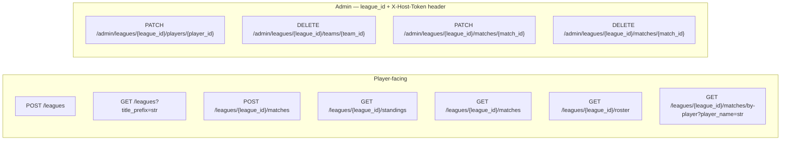

# API Contracts

## Auth Model

- **Player-facing endpoints:** `league_id` in the URL path is the only access check. Possession of a valid `league_id` is sufficient proof of league membership.
- **Admin endpoints:** Both `league_id` (URL path) and `X-Host-Token` HTTP header are required. The use case loads the League by `league_id` and verifies the token matches that league's stored `host_token`. Returns 401 if the header is missing or the token does not match the league.
- **League creation:** Public — no credentials required; `league_id` and `host_token` are returned in the response.
- **League discovery (title prefix search):** Public — no credentials required; returns only `league_id` and display `title` (no `host_token` or other sensitive fields).

## Endpoint Overview



## Error Code → HTTP Status Mapping

| Domain Error | HTTP Status |
|---|---|
| LeagueNotFoundError | 404 |
| PlayerNotFoundError | 404 |
| TeamNotFoundError | 404 |
| MatchNotFoundError | 404 |
| UnauthorizedError (hostToken mismatch or missing) | 401 |
| LeagueTitleAlreadyExistsError | 409 |
| TeamConflictError | 409 |
| NicknameAlreadyInUseError | 409 |
| TeamHasMatchesError | 409 |
| SameTeamOnBothSidesError | 409 |
| DuplicateTeamPairMatchError (match pair idempotency) | 409 |
| SamePlayerWithinSingleTeamError | 422 |
| SamePlayerOnBothTeamsError | 422 |
| InvalidSetScoreError | 422 |

---

## Endpoint: Create League

- Method: POST
- Path: `/leagues`
- Purpose: Create a new league and receive access credentials
- Request shape: `{ "title": "str", "description": "str | null", "rules": { ... } | null }` — **`rules` optional**. When omitted, the server applies **product defaults** for new leagues. When present, must be a valid v1 rules object (see [16_league_rules_and_match_policies.md](16_league_rules_and_match_policies.md)). Rules are **not** mutable after creation in this API version.
- Example `rules` (v1): `{ "version": 1, "match_pair_idempotency": "once_per_league", "one_team_per_player": true }`
- Response shape: `{ "league_id": "uuid", "host_token": "uuid" }`
- Use case called: CreateLeagueUseCase
- Error responses: 409 LeagueTitleAlreadyExistsError, 422 validation (blank title or invalid rules)
- Auth notes: Public — no credentials required

---

## Endpoint: Search leagues by title prefix

- Method: GET
- Path: `/leagues`
- Purpose: Discover existing leagues whose stored normalized title starts with a given prefix (for linking players to the correct league). **Cursor-based pagination is not supported** in this API version; results are capped by `limit` only.
- Query parameters:
  - `title_prefix` (required): Non-empty after trim. The server normalizes it the same way as league titles in storage: **strip** whitespace, then **lowercase** (matches `leagues.title_normalized`).
  - `limit` (optional): Maximum number of rows to return. Default **50**, maximum **100**; values above the cap are clamped to **100**.
- Matching: Prefix match on `title_normalized` using SQL `LIKE` with an explicit escape character so characters `%`, `_`, and `\` in the user prefix are treated literally, not as pattern wildcards.
- Response shape:
  ```json
  {
    "leagues": [
      { "league_id": "uuid", "title": "str" }
    ]
  }
  ```
  Rows are sorted ascending by normalized title for stable ordering. **`host_token` and `description` are never returned** from this endpoint.
- Use case called: SearchLeaguesByTitlePrefixUseCase
- Error responses: 422 if `title_prefix` is missing or empty after trim
- Auth notes: Public — no credentials required

---

## Endpoint: Submit Match Result

- Method: POST
- Path: `/leagues/{league_id}/matches`
- Purpose: Record a confirmed doubles match result; implicitly registers any new players and teams
- Request shape:
  ```json
  {
    "team1_nicknames": ["str", "str"],
    "team2_nicknames": ["str", "str"],
    "team1_score": "str",
    "team2_score": "str"
  }
  ```
- Response shape: `{ "match_id": "uuid" }`
- Use case called: SubmitMatchResultUseCase
- Error responses:
  - 404 LeagueNotFoundError
  - 422 SamePlayerWithinSingleTeamError (same player listed twice on one team)
  - 422 SamePlayerOnBothTeamsError (same player appears on both teams)
  - 422 InvalidSetScoreError (non-integer or negative score)
  - 409 TeamConflictError (a player is already on a different team in this league)
  - 409 SameTeamOnBothSidesError (both teams resolve to the same existing team)
  - 409 DuplicateTeamPairMatchError (league rules require at most one match per team pair and a match already exists for this pair)
- Auth notes: `league_id` in URL path — possession is sufficient

---

## Endpoint: Get Standings

- Method: GET
- Path: `/leagues/{league_id}/standings`
- Purpose: Get the current win/loss standings for all teams in the league
- Request shape: —
- Response shape:
  ```json
  {
    "standings": [
      {
        "rank": 1,
        "team_id": "uuid",
        "player1_nickname": "str",
        "player2_nickname": "str",
        "wins": 3,
        "losses": 1
      }
    ]
  }
  ```
- Use case called: GetStandingsUseCase
- Error responses: 404 LeagueNotFoundError
- Auth notes: `league_id` in URL path — possession is sufficient

---

## Endpoint: Get Match History

- Method: GET
- Path: `/leagues/{league_id}/matches`
- Purpose: Get the chronological list of all recorded match results in the league
- Request shape: —
- Response shape:
  ```json
  {
    "matches": [
      {
        "match_id": "uuid",
        "team1_player1_nickname": "str",
        "team1_player2_nickname": "str",
        "team2_player1_nickname": "str",
        "team2_player2_nickname": "str",
        "team1_score": "str",
        "team2_score": "str",
        "created_at": "ISO 8601 datetime (UTC)"
      }
    ]
  }
  ```
- Use case called: GetMatchHistoryUseCase
- Error responses: 404 LeagueNotFoundError
- Auth notes: `league_id` in URL path — possession is sufficient
- Notes: Sorted by `created_at` descending (most recent first). Player nicknames reflect current state — admin nickname edits retroactively affect display.

---

## Endpoint: Get League Roster

- Method: GET
- Path: `/leagues/{league_id}/roster`
- Purpose: Get the list of all registered players and teams in the league
- Request shape: —
- Response shape:
  ```json
  {
    "players": [
      { "player_id": "uuid", "nickname": "str" }
    ],
    "teams": [
      { "team_id": "uuid", "player1_nickname": "str", "player2_nickname": "str" }
    ]
  }
  ```
- Use case called: GetLeagueRosterUseCase
- Error responses: 404 LeagueNotFoundError
- Auth notes: `league_id` in URL path — possession is sufficient

---

## Endpoint: Get Matches By Player Name

- Method: GET
- Path: `/leagues/{league_id}/matches/by-player`
- Purpose: Get the match history for a specific player, identified by nickname; resolves the player's team and returns all matches involving that team
- Request shape: `?player_name=str` (query parameter, case-insensitive — normalized to lowercase)
- Response shape: same as Get Match History
  ```json
  {
    "matches": [
      {
        "match_id": "uuid",
        "team1_player1_nickname": "str",
        "team1_player2_nickname": "str",
        "team2_player1_nickname": "str",
        "team2_player2_nickname": "str",
        "team1_score": "str",
        "team2_score": "str",
        "created_at": "ISO 8601 datetime (UTC)"
      }
    ]
  }
  ```
- Use case called: GetMatchHistoryByPlayerUseCase
- Error responses:
  - 404 LeagueNotFoundError
  - 404 PlayerNotFoundError (no player with that nickname in this league)
- Auth notes: `league_id` in URL path — possession is sufficient
- Notes: Sorted by `created_at` descending. Returns an empty list if the player's team has been deleted. Nickname resolution at read time — admin nickname edits retroactively affect display.

---

## Endpoint: Edit Player Nickname (Admin)

- Method: PATCH
- Path: `/admin/leagues/{league_id}/players/{player_id}`
- Purpose: Correct or update a player's nickname within a league
- Request shape: `{ "new_nickname": "str" }`
- Response shape: `{ "player_id": "uuid", "new_nickname": "str" }`
- Use case called: EditPlayerNicknameUseCase
- Error responses:
  - 404 LeagueNotFoundError
  - 404 PlayerNotFoundError
  - 401 UnauthorizedError (missing or mismatched X-Host-Token)
  - 409 NicknameAlreadyInUseError
  - 422 validation (blank nickname)
- Auth notes: `league_id` (URL path) + `X-Host-Token` header must both be present and the token must match the league's `host_token`

---

## Endpoint: Delete Team (Admin)

- Method: DELETE
- Path: `/admin/leagues/{league_id}/teams/{team_id}`
- Purpose: Permanently remove a team from the league roster; only allowed when the team has no associated match records
- Request shape: —
- Response shape: 204 No Content
- Use case called: DeleteTeamUseCase
- Error responses:
  - 404 LeagueNotFoundError
  - 404 TeamNotFoundError
  - 401 UnauthorizedError
  - 409 TeamHasMatchesError (associated match records must be deleted first)
- Auth notes: `league_id` (URL path) + `X-Host-Token` header

---

## Endpoint: Edit Match Score (Admin)

- Method: PATCH
- Path: `/admin/leagues/{league_id}/matches/{match_id}`
- Purpose: Correct the set score of a previously recorded match
- Request shape: `{ "team1_score": "str", "team2_score": "str" }`
- Response shape: `{ "match_id": "uuid", "team1_score": "str", "team2_score": "str" }`
- Use case called: EditMatchScoreUseCase
- Error responses:
  - 404 LeagueNotFoundError
  - 404 MatchNotFoundError
  - 401 UnauthorizedError
  - 422 InvalidSetScoreError
- Auth notes: `league_id` (URL path) + `X-Host-Token` header

---

## Endpoint: Delete Match (Admin)

- Method: DELETE
- Path: `/admin/leagues/{league_id}/matches/{match_id}`
- Purpose: Permanently remove a match record from the league
- Request shape: —
- Response shape: 204 No Content
- Use case called: DeleteMatchUseCase
- Error responses:
  - 404 LeagueNotFoundError
  - 404 MatchNotFoundError
  - 401 UnauthorizedError
- Auth notes: `league_id` (URL path) + `X-Host-Token` header
