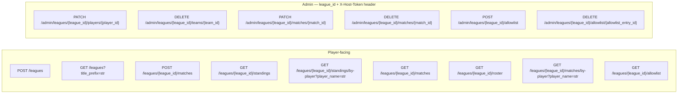

# API Contracts

## Auth Model

- **Player-facing endpoints:** `league_id` in the URL path is the only access check. Possession of a valid `league_id` is sufficient proof of league membership.
- **Admin endpoints:** Both `league_id` (URL path) and `X-Host-Token` HTTP header are required. The use case loads the League by `league_id` and verifies the token matches that league's stored `host_token`. Returns 401 if the header is missing or the token does not match the league.
- **League creation:** Public — no credentials required; `league_id` and `host_token` are returned in the response.
- **League discovery (title prefix search):** Public — no credentials required; returns only `league_id` and display `title` (no `host_token` or other sensitive fields).

## Endpoint Overview



## Error Code → HTTP Status Mapping

| Domain Error | HTTP Status |
|---|---|
| LeagueNotFoundError | 404 |
| PlayerNotFoundError | 404 |
| TeamNotFoundError | 404 |
| MatchNotFoundError | 404 |
| UnauthorizedError (hostToken mismatch or missing) | 401 |
| LeagueTitleAlreadyExistsError | 409 |
| TeamConflictError | 409 |
| NicknameAlreadyInUseError | 409 |
| TeamHasMatchesError | 409 |
| SameTeamOnBothSidesError | 409 |
| DuplicateTeamPairMatchError (match pair idempotency) | 409 |
| SamePlayerWithinSingleTeamError | 422 |
| SamePlayerOnBothTeamsError | 422 |
| InvalidSetScoreError | 422 |
| InvalidLeagueRulesError (invalid v1/v2/v3/v4/v5 rules body — including v3 ranking config violations such as the `(ranking_subject="player", one_team_per_player=true)` cross-rule rejection) | 422 |
| AllowlistEntryNotFoundError | 404 |
| AllowlistNicknameAlreadyExistsError | 409 |
| NotInAllowlistError (match submission contains nicknames not in the `allowlist`; only when `LeagueRules.require_allowlist = true`) | 422 |

---

## Endpoint: Create League

- Method: POST
- Path: `/leagues`
- Purpose: Create a new league and receive access credentials. Optionally seed the host-managed allowlist in the same transaction.
- Request shape: `{ "title": "str", "description": "str | null", "rules": { ... } | null, "allowlist": ["str", ...] }`
  - **`rules` optional.** When omitted, the server applies **product defaults** for new leagues. When present, must be a valid v1, v2, v3, v4, or v5 rules object (see [16_league_rules_and_match_policies.md](16_league_rules_and_match_policies.md), [17_configurable_ranking.md](17_configurable_ranking.md), [18_configurable_ranking_v3.md](18_configurable_ranking_v3.md), and [20_allowlist.md](20_allowlist.md)). v1, v2, v3, and v4 inputs are upgraded to v5 transparently (the v4 `require_eligible_players` key is mapped to `require_allowlist`). Rules are **not** mutable after creation in this API version.
  - **`allowlist` optional**, default `[]`. When non-empty, each entry must be a non-blank string; entries are inserted into the league's allowlist as part of the same DB transaction that creates the league row (see [20_allowlist.md](20_allowlist.md) → "Modified use case: `CreateLeagueUseCase`"). The list may be supplied independently of `rules.require_allowlist` — when the flag is `false`, the allowlist is still populated, just not enforced on match submission. In-batch or against-existing duplicates (after `PlayerNickname` normalization) reject the entire request with 409 and no league row is persisted.
- Example `rules` (v5): `{ "version": 5, "match_pair_idempotency": "once_per_league", "one_team_per_player": true, "ranking_subject": "team", "tie_breakers": ["matches_won", "games_diff"], "require_allowlist": false }`
- Example request with inline seeding:
  ```json
  {
    "title": "Summer Doubles 2026",
    "rules": { "version": 5, "match_pair_idempotency": "once_per_league", "one_team_per_player": true, "ranking_subject": "team", "tie_breakers": ["matches_won"], "require_allowlist": true },
    "allowlist": ["Alex", "Daniel", "Jason"]
  }
  ```
- Response shape: `{ "league_id": "uuid", "host_token": "uuid" }`
- Use case called: CreateLeagueUseCase
- Error responses:
  - 409 LeagueTitleAlreadyExistsError
  - 409 AllowlistNicknameAlreadyExistsError (in-batch duplicate inside `allowlist`; entire request rejected, league row not persisted)
  - 422 validation (blank title, blank `allowlist` entry, invalid rules, invalid ranking config, or the v3 cross-rule violation `(ranking_subject="player", one_team_per_player=true)`)
- Auth notes: Public — no credentials required

---

## Endpoint: Search leagues by title prefix

- Method: GET
- Path: `/leagues`
- Purpose: Discover existing leagues whose stored normalized title starts with a given prefix (for linking players to the correct league). **Cursor-based pagination is not supported** in this API version; results are capped by `limit` only.
- Query parameters:
  - `title_prefix` (required): Non-empty after trim. The server normalizes it the same way as league titles in storage: **strip** whitespace, then **lowercase** (matches `leagues.title_normalized`).
  - `limit` (optional): Maximum number of rows to return. Default **50**, maximum **100**; values above the cap are clamped to **100**.
- Matching: Prefix match on `title_normalized` using SQL `LIKE` with an explicit escape character so characters `%`, `_`, and `\` in the user prefix are treated literally, not as pattern wildcards.
- Response shape:
  ```json
  {
    "leagues": [
      { "league_id": "uuid", "title": "str" }
    ]
  }
  ```
  Rows are sorted ascending by normalized title for stable ordering. **`host_token` and `description` are never returned** from this endpoint.
- Use case called: SearchLeaguesByTitlePrefixUseCase
- Error responses: 422 if `title_prefix` is missing or empty after trim
- Auth notes: Public — no credentials required

---

## Endpoint: Submit Match Result

- Method: POST
- Path: `/leagues/{league_id}/matches`
- Purpose: Record a confirmed doubles match result; implicitly registers any new players and teams
- Request shape:
  ```json
  {
    "team1_nicknames": ["str", "str"],
    "team2_nicknames": ["str", "str"],
    "team1_score": "str",
    "team2_score": "str"
  }
  ```
- Response shape: `{ "match_id": "uuid" }`
- Use case called: SubmitMatchResultUseCase
- Error responses:
  - 404 LeagueNotFoundError
  - 422 SamePlayerWithinSingleTeamError (same player listed twice on one team)
  - 422 SamePlayerOnBothTeamsError (same player appears on both teams)
  - 422 InvalidSetScoreError (non-integer or negative score)
  - 422 NotInAllowlistError (only when `LeagueRules.require_allowlist = true`; body includes `missing_nicknames` array — see [20_allowlist.md](20_allowlist.md))
  - 409 TeamConflictError (a player is already on a different team in this league)
  - 409 SameTeamOnBothSidesError (both teams resolve to the same existing team)
  - 409 DuplicateTeamPairMatchError (league rules require at most one match per team pair and a match already exists for this pair)
- Auth notes: `league_id` in URL path — possession is sufficient

---

## Endpoint: Get Standings

- Method: GET
- Path: `/leagues/{league_id}/standings`
- Purpose: Get the current standings for the league, ranked according to the league's configured `ranking_subject` and ordered `tie_breakers` list (see [17_configurable_ranking.md](17_configurable_ranking.md))
- Request shape: —
- Response shape: **polymorphic on `subject_kind`**. Every row carries `subject_kind`, `rank`, `matches_played`, `wins`, `losses`, `games_won`, `games_lost`, `games_diff`, `win_pct`. Team variants additionally carry `team_id`, `player1_nickname`, `player2_nickname`. Player variants additionally carry `player_id`, `nickname`. The top-level `tie_breakers` field echoes the league's ordered ranking metrics (a copy of `LeagueRules.tie_breakers`) so clients can label the displayed metric column to match the league's primary tie-breaker — e.g. a league configured with `tie_breakers=["games_won", ...]` shows a "Games won" column rather than a generic "Games ±".
  ```json
  {
    "standings": [
      {
        "subject_kind": "team",
        "rank": 1,
        "team_id": "uuid",
        "player1_nickname": "str",
        "player2_nickname": "str",
        "matches_played": 4,
        "wins": 3,
        "losses": 1,
        "games_won": 18,
        "games_lost": 9,
        "games_diff": 9,
        "win_pct": 0.75
      },
      {
        "subject_kind": "player",
        "rank": 1,
        "player_id": "uuid",
        "nickname": "str",
        "matches_played": 4,
        "wins": 3,
        "losses": 1,
        "games_won": 18,
        "games_lost": 9,
        "games_diff": 9,
        "win_pct": 0.75
      }
    ],
    "tie_breakers": ["matches_won", "games_diff"]
  }
  ```
- Use case called: GetStandingsUseCase
- Error responses: 404 LeagueNotFoundError
- Auth notes: `league_id` in URL path — possession is sufficient
- Notes: For a single response, every row's `subject_kind` is identical (a league has one ranking subject). The discriminator is included on every row so individual rows are still self-describing for downstream consumers (chat handlers, render loops). Old clients reading only `team_id` / `player1_nickname` / `player2_nickname` / `wins` / `losses` will silently break for player-subject leagues — coordinate frontend + backend rollouts.

---

## Endpoint: Get Standings By Player

- Method: GET
- Path: `/leagues/{league_id}/standings/by-player`
- Purpose: Get the standings entry for the team or player identified by a nickname. Under `ranking_subject == "team"`, returns the row for the player's team. Under `ranking_subject == "player"`, returns that player's own row.
- Request shape: `?player_name=str` (query parameter, case-insensitive — normalized to lowercase)
- Response shape: identical polymorphic shape to `GET /leagues/{league_id}/standings`. Under `(team, OTPP=true)` and `(player, OTPP=false)`, the `standings` array has at most one element. Under `(team, OTPP=false)`, the array contains one element per team the resolved player belongs to. An empty array is returned if the player exists but has no team (e.g. all of their teams have been deleted).
- Use case called: GetStandingsByPlayerUseCase
- Error responses:
  - 404 LeagueNotFoundError
  - 404 PlayerNotFoundError (no player with that nickname in this league)
- Auth notes: `league_id` in URL path — possession is sufficient

---

## Endpoint: Get Match History

- Method: GET
- Path: `/leagues/{league_id}/matches`
- Purpose: Get the chronological list of all recorded match results in the league
- Request shape: —
- Response shape:
  ```json
  {
    "matches": [
      {
        "match_id": "uuid",
        "team1_player1_nickname": "str",
        "team1_player2_nickname": "str",
        "team2_player1_nickname": "str",
        "team2_player2_nickname": "str",
        "team1_score": "str",
        "team2_score": "str",
        "created_at": "ISO 8601 datetime (UTC)"
      }
    ]
  }
  ```
- Use case called: GetMatchHistoryUseCase
- Error responses: 404 LeagueNotFoundError
- Auth notes: `league_id` in URL path — possession is sufficient
- Notes: Sorted by `created_at` descending (most recent first). Player nicknames reflect current state — admin nickname edits retroactively affect display.

---

## Endpoint: Get League Roster

- Method: GET
- Path: `/leagues/{league_id}/roster`
- Purpose: Get the league title, the active `LeagueRules` configuration, and the list of all registered players and teams. Returning the rules alongside the roster lets the frontend gate UI on the league config (e.g. suppress the partner-conflict warning under `one_team_per_player = false`) without an extra round-trip on page load.
- Request shape: —
- Response shape:
  ```json
  {
    "title": "str",
    "rules": {
      "version": 5,
      "match_pair_idempotency": "none | once_per_league",
      "one_team_per_player": true,
      "ranking_subject": "team | player",
      "tie_breakers": ["matches_won"],
      "require_allowlist": false
    },
    "players": [
      { "player_id": "uuid", "nickname": "str" }
    ],
    "teams": [
      { "team_id": "uuid", "player1_nickname": "str", "player2_nickname": "str" }
    ]
  }
  ```
- Use case called: GetLeagueRosterUseCase
- Error responses: 404 LeagueNotFoundError
- Auth notes: `league_id` in URL path — possession is sufficient
- Notes: `rules` mirrors `LeagueRules.to_dict()`; v1/v2/v3 inputs are upgraded to v4 on read so the response `version` is always `4`.

---

## Endpoint: Get Matches By Player Name

- Method: GET
- Path: `/leagues/{league_id}/matches/by-player`
- Purpose: Get the match history for a specific player, identified by nickname. Under `one_team_per_player = true` resolves the player's single team and returns its matches. Under `one_team_per_player = false` returns the union of matches across every team the player belongs to (deduped by `match_id`).
- Request shape: `?player_name=str` (query parameter, case-insensitive — normalized to lowercase)
- Response shape: same as Get Match History
  ```json
  {
    "matches": [
      {
        "match_id": "uuid",
        "team1_player1_nickname": "str",
        "team1_player2_nickname": "str",
        "team2_player1_nickname": "str",
        "team2_player2_nickname": "str",
        "team1_score": "str",
        "team2_score": "str",
        "created_at": "ISO 8601 datetime (UTC)"
      }
    ]
  }
  ```
- Use case called: GetMatchHistoryByPlayerUseCase
- Error responses:
  - 404 LeagueNotFoundError
  - 404 PlayerNotFoundError (no player with that nickname in this league)
- Auth notes: `league_id` in URL path — possession is sufficient
- Notes: Sorted by `created_at` descending. Returns an empty list if the player has no team (e.g. all of their teams have been deleted). Under `one_team_per_player = false` matches from every team the player belongs to are unioned and deduped by `match_id`. Nickname resolution at read time — admin nickname edits retroactively affect display.

---

## Endpoint: Edit Player Nickname (Admin)

- Method: PATCH
- Path: `/admin/leagues/{league_id}/players/{player_id}`
- Purpose: Correct or update a player's nickname within a league
- Request shape: `{ "new_nickname": "str" }`
- Response shape: `{ "player_id": "uuid", "new_nickname": "str" }`
- Use case called: EditPlayerNicknameUseCase
- Error responses:
  - 404 LeagueNotFoundError
  - 404 PlayerNotFoundError
  - 401 UnauthorizedError (missing or mismatched X-Host-Token)
  - 409 NicknameAlreadyInUseError
  - 422 validation (blank nickname)
- Auth notes: `league_id` (URL path) + `X-Host-Token` header must both be present and the token must match the league's `host_token`

---

## Endpoint: Delete Team (Admin)

- Method: DELETE
- Path: `/admin/leagues/{league_id}/teams/{team_id}`
- Purpose: Permanently remove a team from the league roster; only allowed when the team has no associated match records
- Request shape: —
- Response shape: 204 No Content
- Use case called: DeleteTeamUseCase
- Error responses:
  - 404 LeagueNotFoundError
  - 404 TeamNotFoundError
  - 401 UnauthorizedError
  - 409 TeamHasMatchesError (associated match records must be deleted first)
- Auth notes: `league_id` (URL path) + `X-Host-Token` header

---

## Endpoint: Edit Match Score (Admin)

- Method: PATCH
- Path: `/admin/leagues/{league_id}/matches/{match_id}`
- Purpose: Correct the set score of a previously recorded match
- Request shape: `{ "team1_score": "str", "team2_score": "str" }`
- Response shape: `{ "match_id": "uuid", "team1_score": "str", "team2_score": "str" }`
- Use case called: EditMatchScoreUseCase
- Error responses:
  - 404 LeagueNotFoundError
  - 404 MatchNotFoundError
  - 401 UnauthorizedError
  - 422 InvalidSetScoreError
- Auth notes: `league_id` (URL path) + `X-Host-Token` header

---

## Endpoint: Delete Match (Admin)

- Method: DELETE
- Path: `/admin/leagues/{league_id}/matches/{match_id}`
- Purpose: Permanently remove a match record from the league
- Request shape: —
- Response shape: 204 No Content
- Use case called: DeleteMatchUseCase
- Error responses:
  - 404 LeagueNotFoundError
  - 404 MatchNotFoundError
  - 401 UnauthorizedError
- Auth notes: `league_id` (URL path) + `X-Host-Token` header

---

## Endpoint: Get Allowlist

- Method: GET
- Path: `/leagues/{league_id}/allowlist`
- Purpose: Get the host-managed allowlist of nicknames that may participate in this league. Distinct from the roster (`/roster`); see [20_allowlist.md](20_allowlist.md).
- Request shape: —
- Response shape:
  ```json
  {
    "allowlist": [
      { "allowlist_entry_id": "uuid", "nickname": "str" }
    ]
  }
  ```
- Use case called: GetAllowlistUseCase
- Error responses: 404 LeagueNotFoundError
- Auth notes: `league_id` in URL path — possession is sufficient. The allowlist is treated as league-discoverable data, not host-only.

---

## Endpoint: Add Allowlist Entries (Admin)

- Method: POST
- Path: `/admin/leagues/{league_id}/allowlist`
- Purpose: Atomically extend the allowlist with one or more nicknames. Bulk-batch shape supports the natural "host pre-populates the list" workflow; single-add is a one-element list.
- Request shape: `{ "nicknames": ["str", "str", ...] }` — non-empty list; each entry non-blank after trim.
- Response shape: 201 Created
  ```json
  {
    "allowlist": [
      { "allowlist_entry_id": "uuid", "nickname": "str" }
    ]
  }
  ```
- Use case called: AddAllowlistEntriesUseCase
- Error responses:
  - 404 LeagueNotFoundError
  - 401 UnauthorizedError
  - 409 AllowlistNicknameAlreadyExistsError (any input nickname duplicates an existing allowlist nickname OR another nickname inside the same batch — entire request rejected, no partial inserts)
  - 422 validation (empty list, blank nickname)
- Auth notes: `league_id` (URL path) + `X-Host-Token` header

---

## Endpoint: Remove Allowlist Entry (Admin)

- Method: DELETE
- Path: `/admin/leagues/{league_id}/allowlist/{allowlist_entry_id}`
- Purpose: Remove a single nickname from the allowlist. Does NOT delete any roster `Player` row.
- Request shape: —
- Response shape: 204 No Content
- Use case called: RemoveAllowlistEntryUseCase
- Error responses:
  - 404 LeagueNotFoundError
  - 404 AllowlistEntryNotFoundError
  - 401 UnauthorizedError
- Auth notes: `league_id` (URL path) + `X-Host-Token` header
