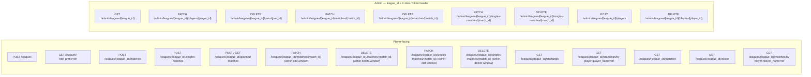

# API Contracts

## Auth Model

- **Player-facing endpoints:** `league_id` in the URL path is the only access check. Possession of a valid `league_id` is sufficient proof of league membership.
- **Admin endpoints:** Both `league_id` (URL path) and `X-Host-Token` HTTP header are required. The use case loads the League by `league_id` and verifies the token matches that league's stored `host_token`. Returns 401 if the header is missing or the token does not match the league.
- **League creation:** Public — no credentials required; `league_id` and `host_token` are returned in the response.
- **League discovery (title prefix search):** Public — no credentials required; returns only `league_id` and display `title` (no `host_token` or other sensitive fields).

## Endpoint Overview


```mermaid
flowchart LR
    subgraph player [Player-facing]
        P1["POST /leagues"]
        P1b["GET /leagues?title_prefix=str"]
        P2["POST /leagues/{league_id}/matches"]
        P2s["POST /leagues/{league_id}/singles-matches"]
        Plans["POST / GET /leagues/{league_id}/planned-matches"]
        P2b["PATCH /leagues/{league_id}/matches/{match_id} (within edit window)"]
        P2c["DELETE /leagues/{league_id}/matches/{match_id} (within delete window)"]
        P2sb["PATCH /leagues/{league_id}/singles-matches/{match_id} (within edit window)"]
        P2sc["DELETE /leagues/{league_id}/singles-matches/{match_id} (within delete window)"]
        P3["GET /leagues/{league_id}/standings"]
        P3b["GET /leagues/{league_id}/standings/by-player?player_name=str"]
        P4["GET /leagues/{league_id}/matches"]
        P5["GET /leagues/{league_id}/roster"]
        P6["GET /leagues/{league_id}/matches/by-player?player_name=str"]
    end
    subgraph admin ["Admin — league_id + X-Host-Token header"]
        A0["GET /admin/leagues/{league_id}"]
        A1["PATCH /admin/leagues/{league_id}/players/{player_id}"]
        A2["DELETE /admin/leagues/{league_id}/pairs/{pair_id}"]
        A3["PATCH /admin/leagues/{league_id}/matches/{match_id}"]
        A4["DELETE /admin/leagues/{league_id}/matches/{match_id}"]
        A3s["PATCH /admin/leagues/{league_id}/singles-matches/{match_id}"]
        A4s["DELETE /admin/leagues/{league_id}/singles-matches/{match_id}"]
        A5["POST /admin/leagues/{league_id}/players"]
        A6["DELETE /admin/leagues/{league_id}/players/{player_id}"]
    end
```

## Error Code → HTTP Status Mapping

| Domain Error | HTTP Status |
|---|---|
| LeagueNotFoundError | 404 |
| PlayerNotFoundError | 404 |
| PairNotFoundError | 404 |
| MatchNotFoundError | 404 |
| UnauthorizedError (hostToken mismatch or missing) | 401 |
| LeagueTitleAlreadyExistsError | 409 |
| PairConflictError | 409 |
| NicknameAlreadyInUseError | 409 |
| PairHasMatchesError | 409 |
| SamePairOnBothSidesError | 409 |
| DuplicatePairMatchupMatchError (pair matchup idempotency) | 409 |
| DuplicateSinglesMatchupMatchError (singles player matchup idempotency) | 409 |
| SamePlayerWithinSinglePairError | 422 |
| SamePlayerOnBothPairsError | 422 |
| SamePlayerOnBothSidesError (same player submitted on both sides of a singles match) | 422 |
| InvalidSetScoreError | 422 |
| InvalidPlayerNicknameError | 422 |
| InvalidPlannedMatchError | 422 |
| InvalidPlayerRatingError (admin supplied a negative or non-finite player rating) | 422 |
| InvalidLeagueRulesError (invalid v8 rules body, invalid `league_timezone`, or v3 ranking config violations such as the `(ranking_subject="player", one_pair_per_player=true)` cross-rule rejection) | 422 |
| PlayerHasParticipationError (DELETE on `/admin/.../players/{player_id}` rejected because the player belongs to a pair or appears on a match; body carries `pairs_count`, `matches_count`) | 409 |
| RosterMembershipRequiredError (match submission contains nicknames not on the roster; only when `LeagueRules.auto_register_players_on_match = false`; body carries `missing_nicknames`) | 422 |
| MatchEditWindowExpiredError (non-admin player tried to PATCH a match older than `PLAYER_SCORE_EDIT_WINDOW_SECONDS`; body carries `match_id`, `window_seconds`, `age_seconds`) | 422 |
| MatchDeleteWindowExpiredError (non-admin player tried to DELETE a match older than `PLAYER_MATCH_DELETE_WINDOW_SECONDS`; body carries `match_id`, `window_seconds`, `age_seconds`) | 422 |

---

## Endpoints: Planned Matches

- **POST `/leagues/{league_id}/planned-matches`** accepts a nonempty
  `{"matches": [{"id": "uuid", "value": "Alice Bob"}]}` batch and returns the
  accepted records in request order with **200**. Item fields other than `id` and
  `value` are rejected. IDs are parsed as UUIDs; duplicates are detected by UUID
  identity even if their string casing differs. UUIDs use canonical response strings.
- Upsert key: `(league_id, id)`. Existing IDs replace only their value; new IDs
  append records; omitted records remain. The complete request is transactional,
  including updates. Storage or commit failures roll back rather than returning
  partial success.
- **GET `/leagues/{league_id}/planned-matches`** returns **200** with the same
  record shape in ascending UUID order, or `{"matches": []}`. All plans are
  returned; no pagination, filters, or metadata are included.
- Both endpoints are public via the league link, use existing CORS/rate limiting,
  and require no `X-Host-Token`. Invalid request shapes, UUIDs, duplicate request
  IDs, and invalid values return **422**. A missing league returns **404**.
  Unexpected storage failures return **5xx**. Clients should use status codes,
  not depend on specific error messages.
- Grammar: singles `player1 player2`, doubles `player1,player2 player3,player4`.
  Exactly one ASCII space separates sides; each side contains one or two nonempty
  nicknames and both sides have equal size. Names contain no comma or ECMAScript
  whitespace. No quoting/escaping is supported. Values are stored verbatim:
  no trimming, lowercasing, or reordering.
- Unknown/repeated names and matchups are allowed regardless of roster, pair,
  or rematch rules. Plans never alter players, aliases, pairs, recorded matches,
  standings, or activity metadata. No delete or result-conversion endpoint exists.

## Shared Nickname Validation

Initial league players, roster additions (both payload shapes), new nicknames,
aliases, and singles/doubles submissions trim surrounding whitespace, require a
nonempty name without internal whitespace or commas, and retain existing lowercase
normalization. Invalid characters are rejected, never deleted to repair input.
List entries are validated individually; the API does not split a nickname string.

Whitespace is exactly U+0009–000D, U+0020, U+00A0, U+1680, U+2000–200A,
U+2028, U+2029, U+202F, U+205F, U+3000, and U+FEFF, matching JavaScript.
Examples: `Alice`, `민수`, `A-1`, `B_2`, `C.3`, and `  Alice  ` are valid;
`Alice Smith`, `Alice,Bob`, or internal tabs/newlines/NBSP are invalid.

Persisted names are not migrated or revalidated on load. Legacy names remain
queryable and aliases removable; existing player IDs still support renaming,
rating updates, and deletion under the usual participation restrictions.
Lookup prefers an exact stored name, then current and historical trimming.
Only newly supplied names on write paths receive the stricter grammar.

## Endpoint: Create League

- Method: POST
- Path: `/leagues`
- Purpose: Create a new league and receive access credentials. Optionally pre-register a starting roster of players in the same transaction.
- Request shape: `{ "title": "str", "host_email": "str (RFC-compliant email)", "description": "str | null", "league_timezone": "str", "rules": { ... } | null, "initial_players": ["str", ...] }`
  - **`host_email` required.** Mandatory contact email for the league host, validated at the API edge by Pydantic `EmailStr` (RFC-compliant). Stored on the `League` aggregate as the `HostEmail` value object (stripped + lowercased). **Immutable after creation in this API version** — no admin endpoint updates it. The value is **not returned on player-facing read endpoints**; it is exposed only via `GET /admin/leagues/{league_id}` when the caller presents a valid `X-Host-Token`. Reserved for future notification features (sending the player/admin page links, new-match notifications); no notifications are sent today.
  - **`league_timezone` optional**, default `"America/Los_Angeles"`. Must be a valid IANA timezone string; it is stored on `leagues.league_timezone` and used to compute the league-local calendar day for `pair_matchup_idempotency = "once_per_day"` on doubles and singles submissions.
  - **`rules` optional.** When omitted, the server applies **product defaults** for new leagues. When present, it must use the v8 pair-shaped rules object (see [16_league_rules_and_match_policies.md](16_league_rules_and_match_policies.md), [17_configurable_ranking.md](17_configurable_ranking.md), [18_configurable_ranking_v3.md](18_configurable_ranking_v3.md), and [20_roster_pre_registration.md](20_roster_pre_registration.md)). Rules are **not** mutable after creation in this API version.
  - **`initial_players` optional**, default `[]`. When non-empty, each entry must be a non-blank string; one `Player` row per entry is inserted in the same DB transaction that creates the league row (see [20_roster_pre_registration.md](20_roster_pre_registration.md) → "Modified use case: `CreateLeagueUseCase`"). The list may be supplied independently of `rules.auto_register_players_on_match` — strict-roster leagues will typically supply it; open leagues may also supply it as a seeding convenience. In-batch duplicates (after `PlayerNickname` normalization) reject the entire request with 409 and no league row or player rows are persisted.
- Example `rules` (v8): `{ "version": 8, "pair_matchup_idempotency": "once_per_day", "one_pair_per_player": true, "ranking_subject": "pair", "tie_breakers": ["matches_won", "games_diff"], "auto_register_players_on_match": true }`
- Example request with inline seeding:
  ```json
  {
    "title": "Summer Doubles 2026",
    "host_email": "host@example.com",
    "league_timezone": "America/Los_Angeles",
    "rules": { "version": 8, "pair_matchup_idempotency": "once_per_day", "one_pair_per_player": true, "ranking_subject": "pair", "tie_breakers": ["matches_won"], "auto_register_players_on_match": false },
    "initial_players": ["Alex", "Daniel", "Jason"]
  }
  ```
- Response shape: `{ "league_id": "uuid", "host_token": "uuid" }` — note `host_email` is **not** echoed.
- Use case called: CreateLeagueUseCase
- Error responses:
  - 409 LeagueTitleAlreadyExistsError
  - 409 NicknameAlreadyInUseError (in-batch duplicate inside `initial_players`; entire request rejected, league row not persisted)
  - 422 validation (blank title, missing or malformed `host_email`, blank `initial_players` entry, invalid rules, invalid ranking config, or the v3 cross-rule violation `(ranking_subject="player", one_pair_per_player=true)`)
- Auth notes: Public — no credentials required

---

## Endpoint: Search leagues by title prefix

- Method: GET
- Path: `/leagues`
- Purpose: Discover existing leagues whose stored normalized title starts with a given prefix (for linking players to the correct league). **Cursor-based pagination is not supported** in this API version; results are capped by `limit` only.
- Query parameters:
  - `title_prefix` (required): Non-empty after trim. The server normalizes it the same way as league titles in storage: **strip** whitespace, then **lowercase** (matches `leagues.title_normalized`).
  - `limit` (optional): Maximum number of rows to return. Default **50**, maximum **100**; values above the cap are clamped to **100**.
- Matching: Prefix match on `title_normalized` using SQL `LIKE` with an explicit escape character so characters `%`, `_`, and `\` in the user prefix are treated literally, not as pattern wildcards.
- Response shape:
  ```json
  {
    "leagues": [
      { "league_id": "uuid", "title": "str" }
    ]
  }
  ```
  Rows are sorted ascending by normalized title for stable ordering. **`host_token` and `description` are never returned** from this endpoint.
- Use case called: SearchLeaguesByTitlePrefixUseCase
- Error responses: 422 if `title_prefix` is missing or empty after trim
- Auth notes: Public — no credentials required

---

## Endpoint: Submit Match Result

- Method: POST
- Path: `/leagues/{league_id}/matches`
- Purpose: Record a confirmed doubles match result; implicitly registers any new players and pairs
- Request shape:
  ```json
  {
    "pair1_nicknames": ["str", "str"],
    "pair2_nicknames": ["str", "str"],
    "pair1_score": "str",
    "pair2_score": "str"
  }
  ```
- Response shape: `{ "match_id": "uuid" }`
- Use case called: SubmitMatchResultUseCase
- Error responses:
  - 404 LeagueNotFoundError
  - 422 SamePlayerWithinSinglePairError (same player listed twice on one pair)
  - 422 SamePlayerOnBothPairsError (same player appears on both pairs)
  - 422 InvalidSetScoreError (non-integer or negative score)
  - 422 RosterMembershipRequiredError (only when `LeagueRules.auto_register_players_on_match = false`; body includes `missing_nicknames` array — see [20_roster_pre_registration.md](20_roster_pre_registration.md))
  - 409 PairConflictError (a player is already on a different pair in this league)
  - 409 SamePairOnBothSidesError (both pairs resolve to the same existing pair)
  - 409 DuplicatePairMatchupMatchError (league rules reject another match for this unordered pair matchup: either globally under `once_per_league`, or within today in the league timezone under `once_per_day`)
- Auth notes: `league_id` in URL path — possession is sufficient

---

## Endpoint: Submit Singles Match Result

- Method: POST
- Path: `/leagues/{league_id}/singles-matches`
- Purpose: Record a confirmed singles match result; implicitly registers
  any new players without creating a pair.
- Request shape:
  ```json
  {
    "player1_nickname": "str",
    "player2_nickname": "str",
    "player1_score": "str",
    "player2_score": "str"
  }
  ```
- Response shape: `{ "match_id": "uuid", "created_at": "ISO 8601 datetime (UTC)" }`
- Use case called: SubmitSinglesMatchResultUseCase
- Error responses:
  - 404 LeagueNotFoundError
  - 422 SamePlayerOnBothSidesError
  - 422 InvalidSetScoreError
  - 422 RosterMembershipRequiredError (only when `LeagueRules.auto_register_players_on_match = false`)
  - 409 DuplicateSinglesMatchupMatchError (league rules reject another singles match for this unordered player matchup: either globally under `once_per_league`, or within today in the league timezone under `once_per_day`)
- Auth notes: `league_id` in URL path — possession is sufficient

---

## Endpoint: Get Standings

- Method: GET
- Path: `/leagues/{league_id}/standings`
- Purpose: Get the current standings for the league. By default this uses the league's configured `ranking_subject`; callers may request a read-only pair/player projection with `subject=pair|player`. Ordering still uses the league's configured `tie_breakers` list (see [17_configurable_ranking.md](17_configurable_ranking.md)).
- Request shape: optional query params `subject=pair|player`, `scope=doubles|singles|both`, `start_date=YYYY-MM-DD`, `end_date=YYYY-MM-DD`. `scope` defaults to `doubles`. `subject=pair` is valid only with `scope=doubles`; `scope=singles|both` returns player rows.
- Response shape: **polymorphic on `subject_kind`**. Every row carries `subject_kind`, `rank`, `matches_played`, `wins`, `losses`, `games_won`, `games_lost`, `games_diff`, `win_pct`. Pair variants additionally carry `pair_id`, `player1_nickname`, `player2_nickname`. Player variants additionally carry `player_id`, `nickname`. The top-level `tie_breakers` field echoes the league's ordered ranking metrics (a copy of `LeagueRules.tie_breakers`) so clients can label the displayed metric column to match the league's primary tie-breaker — e.g. a league configured with `tie_breakers=["games_won", ...]` shows a "Games won" column rather than a generic "Games ±".
  ```json
  {
    "standings": [
      {
        "subject_kind": "pair",
        "rank": 1,
        "pair_id": "uuid",
        "player1_nickname": "str",
        "player2_nickname": "str",
        "matches_played": 4,
        "wins": 3,
        "losses": 1,
        "games_won": 18,
        "games_lost": 9,
        "games_diff": 9,
        "win_pct": 0.75
      },
      {
        "subject_kind": "player",
        "rank": 1,
        "player_id": "uuid",
        "nickname": "str",
        "matches_played": 4,
        "wins": 3,
        "losses": 1,
        "games_won": 18,
        "games_lost": 9,
        "games_diff": 9,
        "win_pct": 0.75
      }
    ],
    "tie_breakers": ["matches_won", "games_diff"]
  }
  ```
- Use case called: GetStandingsUseCase
- Error responses: 404 LeagueNotFoundError; 422 invalid `subject`, invalid `scope`, invalid `(subject=pair, scope!=doubles)`, or invalid date range
- Auth notes: `league_id` in URL path — possession is sufficient
- Notes: For a single response, every row's `subject_kind` is identical because the request chooses one projection subject. The discriminator is included on every row so individual rows are still self-describing for downstream consumers (chat handlers, render loops). Old clients reading only `pair_id` / `player1_nickname` / `player2_nickname` / `wins` / `losses` will silently break for player-subject responses — coordinate frontend + backend rollouts.

---

## Endpoint: Get Standings By Player

- Method: GET
- Path: `/leagues/{league_id}/standings/by-player`
- Purpose: Get the standings entry for the pair or player identified by a nickname. Under `ranking_subject == "pair"`, returns the row for the player's pair. Under `ranking_subject == "player"`, returns that player's own row.
- Request shape: `?player_name=str&scope=doubles|singles|both` (`player_name` is case-insensitive; `scope` defaults to `doubles`). `scope=singles|both` always returns player rows.
- Response shape: identical polymorphic shape to `GET /leagues/{league_id}/standings`. Under `(pair, OTPP=true)` and `(player, OTPP=false)`, the `standings` array has at most one element. Under `(pair, OTPP=false)`, the array contains one element per pair the resolved player belongs to. An empty array is returned if the player exists but has no pair (e.g. all of their pairs have been deleted).
- Use case called: GetStandingsByPlayerUseCase
- Error responses:
  - 404 LeagueNotFoundError
  - 404 PlayerNotFoundError (no player with that nickname in this league)
- Auth notes: `league_id` in URL path — possession is sufficient

---

## Endpoint: Get Match History

- Method: GET
- Path: `/leagues/{league_id}/matches`
- Purpose: Get the chronological list of recorded match results in the league.
- Request shape: optional query param `scope=doubles|singles|both`; default `doubles` preserves the historical doubles-only response.
- Response shape:
  ```json
  {
    "matches": [
      {
        "match_id": "uuid",
        "match_format": "doubles",
        "pair1_player1_nickname": "str",
        "pair1_player2_nickname": "str",
        "pair2_player1_nickname": "str",
        "pair2_player2_nickname": "str",
        "pair1_score": "str",
        "pair2_score": "str",
        "created_at": "ISO 8601 datetime (UTC)"
      },
      {
        "match_id": "uuid",
        "match_format": "singles",
        "player1_nickname": "str",
        "player2_nickname": "str",
        "player1_score": "str",
        "player2_score": "str",
        "created_at": "ISO 8601 datetime (UTC)"
      }
    ]
  }
  ```
- Use case called: GetMatchHistoryUseCase
- Error responses: 404 LeagueNotFoundError
- Auth notes: `league_id` in URL path — possession is sufficient
- Notes: Sorted by `created_at` descending (most recent first). `scope=both` returns one newest-first timeline with `match_format` discriminating row shape. Player nicknames reflect current state — admin nickname edits retroactively affect display.

---

## Endpoint: Get League Roster

- Method: GET
- Path: `/leagues/{league_id}/roster`
- Purpose: Get the league title, the active `LeagueRules` configuration, and the list of all registered players and pairs. Returning the rules alongside the roster lets the frontend gate UI on the league config (e.g. suppress the partner-conflict warning under `one_pair_per_player = false`) without an extra round-trip on page load.
- Request shape: —
- Response shape:
  ```json
  {
    "title": "str",
    "league_timezone": "America/Los_Angeles",
    "latest_match_date": "YYYY-MM-DD | null",
    "latest_match_date_single": "YYYY-MM-DD | null",
    "latest_activity_date": "YYYY-MM-DD | null",
    "rules": {
      "version": 8,
      "pair_matchup_idempotency": "none | once_per_league | once_per_day",
      "one_pair_per_player": true,
      "ranking_subject": "pair | player",
      "tie_breakers": ["matches_won"],
      "auto_register_players_on_match": true
    },
    "players": [
      { "player_id": "uuid", "nickname": "str", "rating": 3.5 }
    ],
    "pairs": [
      { "pair_id": "uuid", "player1_nickname": "str", "player2_nickname": "str" }
    ],
    "player_score_edit_window_seconds": 3600,
    "player_match_delete_window_seconds": 600
  }
  ```
- Use case called: GetLeagueRosterUseCase
- Error responses: 404 LeagueNotFoundError
- Auth notes: `league_id` in URL path — possession is sufficient
- Notes: `rules` mirrors `LeagueRules.to_dict()`; responses use the current v8 pair-shaped rules contract. `league_timezone` is top-level league metadata, not a `rules` key. `latest_match_date` remains the latest doubles date; `latest_match_date_single` is the latest singles date; `latest_activity_date` is the max of the two. The `players` array includes every roster player, including those pre-registered via `POST /admin/leagues/{league_id}/players` who have not yet appeared on a match. `player_score_edit_window_seconds` and `player_match_delete_window_seconds` are **server-wide config** (not per-league rules), surfaced here so the frontend can fetch league title + rules + both windows in the single roster trip it already makes on chat-page boot. They power the per-row Update / Delete button enable/disable matrix on the match-history panel.
  `rating` is nullable; unrated players return `"rating": null`.

---

## Endpoint: Get Matches By Player Name

- Method: GET
- Path: `/leagues/{league_id}/matches/by-player`
- Purpose: Get the match history for a specific player, identified by nickname. Under doubles scope, `one_pair_per_player = true` resolves the player's single pair and returns its matches; `one_pair_per_player = false` returns the union of matches across every pair the player belongs to (deduped by `match_id`). Singles scope matches the player directly.
- Request shape: `?player_name=str&scope=doubles|singles|both` (`player_name` is case-insensitive; `scope` defaults to `doubles`)
- Response shape: same as Get Match History
  ```json
  {
    "matches": [
      {
        "match_id": "uuid",
        "pair1_player1_nickname": "str",
        "pair1_player2_nickname": "str",
        "pair2_player1_nickname": "str",
        "pair2_player2_nickname": "str",
        "pair1_score": "str",
        "pair2_score": "str",
        "created_at": "ISO 8601 datetime (UTC)"
      }
    ]
  }
  ```
- Use case called: GetMatchHistoryByPlayerUseCase
- Error responses:
  - 404 LeagueNotFoundError
  - 404 PlayerNotFoundError (no player with that nickname in this league)
- Auth notes: `league_id` in URL path — possession is sufficient
- Notes: Sorted by `created_at` descending. Returns an empty list if the player has no pair (e.g. all of their pairs have been deleted). Under `one_pair_per_player = false` matches from every pair the player belongs to are unioned and deduped by `match_id`. Nickname resolution at read time — admin nickname edits retroactively affect display.

---

---

## Endpoint: Get League Admin Info (Admin)

- Method: GET
- Path: `/admin/leagues/{league_id}`
- Purpose: Return **host-only league metadata** for the admin UI. V1 exposes only `host_email`; the path and use-case name are intentionally general — see **Growth direction** below.
- Request shape: —
- Response shape (V1): `{ "host_email": "str" }`
- Use case called: GetLeagueAdminInfoUseCase
- Error responses:
  - 404 LeagueNotFoundError
  - 401 UnauthorizedError (missing or mismatched X-Host-Token)
- Auth notes: `league_id` (URL path) + `X-Host-Token` header must both be present and the token must match the league's `host_token`
- Notes: Player-facing endpoints never include `host_email`. This is the only read path that surfaces it in V1.

### Why this endpoint is general, not `/host-email`

The contract is a **privacy boundary**, not a single-field shortcut.

| Concern | Player-facing reads | This admin read |
|---|---|---|
| Auth | `league_id` in URL is enough | `league_id` + valid `X-Host-Token` |
| Scope | Standings, roster, match history — league *game* data | League *host* metadata that must never leak to players |
| URL shape | Sub-resources (`/roster`, `/standings`, …) | `GET /admin/leagues/{league_id}` — “admin view of the league itself” |

Naming the route after one field (e.g. `/host-email`) would force a new endpoint for every future host-private field, all with identical auth. Keeping one read model under `/admin/leagues/{league_id}` lets the admin UI fetch host-only metadata in **one round-trip** as the product grows.

**Do not duplicate player-facing read models here.** Title, rules, roster, standings, and match history already have dedicated player endpoints (and the chat server reads those). This endpoint is for fields that are **stored on the league but withheld from players**.

### Growth direction (when extending this endpoint)

Add new **optional or required top-level keys** to the same response schema and use case when a field meets **all** of:

1. Stored on the `League` aggregate (or closely related host config).
2. Safe and intended for the host/admin UI.
3. **Must not** appear on any player-facing `GET`.

Likely candidates (not implemented; listed for orientation):

| Field | Rationale |
|---|---|
| `host_email` | ✅ V1 — contact for notifications and admin UI confirmation |
| `description` | Only if product decision is “organisers see it, players don’t” (today description is not on player reads either; confirm before exposing) |
| `created_at` | Admin dashboard / “when was this league created?” |
| Notification prefs | e.g. `notify_on_new_match: bool` when email notification work lands |
| `league_id`, `title` | Usually **omit** — already available from `GET /roster` (title) or the URL; add only if admin UI needs a single self-contained payload |

**Anti-patterns — keep these on existing endpoints instead:**

- Roster, pairs, players → `GET /leagues/{id}/roster`
- Standings → `GET /leagues/{id}/standings` (and by-player variant)
- Match history → `GET /leagues/{id}/matches`
- Mutations → existing `PATCH` / `POST` / `DELETE` under `/admin/leagues/{id}/…`

**Implementation checklist when adding a field:**

1. Extend `LeagueAdminInfoView` and `GetLeagueAdminInfoResponse` (additive JSON — old clients ignore new keys).
2. Map from the aggregate in `GetLeagueAdminInfoUseCase.execute`.
3. Update this section and the response example in `13_api_contracts.md`.
4. Add application + API + e2e tests; update admin frontend if the field is user-visible.
5. Do **not** add the field to `GetLeagueRosterResponse` or other player-facing schemas unless the product explicitly makes it public.

---

## Endpoint: Edit Player Nickname (Admin)

- Method: PATCH
- Path: `/admin/leagues/{league_id}/players/{player_id}`
- Purpose: Correct or update a player's nickname, set/update their optional rating, or clear it.
- Request shape: `{ "new_nickname": "str" | omitted, "rating": number | null | omitted }` — at least one field is required. `rating: null` clears the rating; omitting `rating` leaves it unchanged.
- Response shape: `{ "player_id": "uuid", "new_nickname": "str", "rating": number | null }`
- Use case called: EditPlayerNicknameUseCase
- Error responses:
  - 404 LeagueNotFoundError
  - 404 PlayerNotFoundError
  - 401 UnauthorizedError (missing or mismatched X-Host-Token)
  - 409 NicknameAlreadyInUseError
  - 422 validation (blank nickname, empty PATCH body, or invalid rating)
- Auth notes: `league_id` (URL path) + `X-Host-Token` header must both be present and the token must match the league's `host_token`

---

## Endpoint: Delete Pair (Admin)

- Method: DELETE
- Path: `/admin/leagues/{league_id}/pairs/{pair_id}`
- Purpose: Permanently remove a pair from the league roster; only allowed when the pair has no associated match records
- Request shape: —
- Response shape: 204 No Content
- Use case called: DeletePairUseCase
- Error responses:
  - 404 LeagueNotFoundError
  - 404 PairNotFoundError
  - 401 UnauthorizedError
  - 409 PairHasMatchesError (associated match records must be deleted first)
- Auth notes: `league_id` (URL path) + `X-Host-Token` header

---

## Endpoint: Edit Match Score (Admin)

- Method: PATCH
- Path: `/admin/leagues/{league_id}/matches/{match_id}`
- Purpose: Correct the set score of a previously recorded match
- Request shape: `{ "pair1_score": "str", "pair2_score": "str" }`
- Response shape: `{ "match_id": "uuid", "pair1_score": "str", "pair2_score": "str" }`
- Use case called: EditMatchScoreUseCase
- Error responses:
  - 404 LeagueNotFoundError
  - 404 MatchNotFoundError
  - 401 UnauthorizedError
  - 422 InvalidSetScoreError
- Auth notes: `league_id` (URL path) + `X-Host-Token` header

---

## Endpoint: Delete Match (Admin)

- Method: DELETE
- Path: `/admin/leagues/{league_id}/matches/{match_id}`
- Purpose: Permanently remove a match record from the league
- Request shape: —
- Response shape: 204 No Content
- Use case called: DeleteMatchUseCase
- Error responses:
  - 404 LeagueNotFoundError
  - 404 MatchNotFoundError
  - 401 UnauthorizedError
- Auth notes: `league_id` (URL path) + `X-Host-Token` header

---

## Endpoint: Edit Singles Match Score (Admin)

- Method: PATCH
- Path: `/admin/leagues/{league_id}/singles-matches/{match_id}`
- Purpose: Correct the set score of a previously recorded singles match
- Request shape: `{ "player1_score": "str", "player2_score": "str" }`
- Response shape: `{ "match_id": "uuid", "player1_score": "str", "player2_score": "str" }`
- Use case called: EditSinglesMatchScoreUseCase
- Error responses:
  - 404 LeagueNotFoundError
  - 404 MatchNotFoundError
  - 401 UnauthorizedError
  - 422 InvalidSetScoreError
- Auth notes: `league_id` (URL path) + `X-Host-Token` header

---

## Endpoint: Delete Singles Match (Admin)

- Method: DELETE
- Path: `/admin/leagues/{league_id}/singles-matches/{match_id}`
- Purpose: Permanently remove a singles match record from the league and recompute `latest_match_date_single`
- Request shape: —
- Response shape: 204 No Content
- Use case called: DeleteSinglesMatchUseCase
- Error responses:
  - 404 LeagueNotFoundError
  - 404 MatchNotFoundError
  - 401 UnauthorizedError
- Auth notes: `league_id` (URL path) + `X-Host-Token` header

---

## Endpoint: Edit Singles Match Score (Player)

- Method: PATCH
- Path: `/leagues/{league_id}/singles-matches/{match_id}`
- Purpose: Allow a non-admin caller to correct a singles score within `PLAYER_SCORE_EDIT_WINDOW_SECONDS`
- Request shape: `{ "player1_score": "str", "player2_score": "str" }`
- Response shape: `{ "match_id": "uuid", "player1_score": "str", "player2_score": "str" }`
- Use case called: EditSinglesMatchScoreUseCase (with `host_token=None`)
- Error responses:
  - 404 LeagueNotFoundError
  - 404 MatchNotFoundError
  - 422 InvalidSetScoreError
  - 422 MatchEditWindowExpiredError
- Auth notes: Player-facing — `league_id` in the URL is the only access check, no `X-Host-Token` required.

---

## Endpoint: Delete Singles Match (Player)

- Method: DELETE
- Path: `/leagues/{league_id}/singles-matches/{match_id}`
- Purpose: Allow a non-admin caller to delete a singles match within `PLAYER_MATCH_DELETE_WINDOW_SECONDS`; recomputes `latest_match_date_single`
- Request shape: —
- Response shape: 204 No Content
- Use case called: DeleteSinglesMatchUseCase (with `host_token=None`)
- Error responses:
  - 404 LeagueNotFoundError
  - 404 MatchNotFoundError
  - 422 MatchDeleteWindowExpiredError
- Auth notes: Player-facing — `league_id` in the URL is the only access check, no `X-Host-Token` required.

---

## Endpoint: Delete Match (Player)

- Method: DELETE
- Path: `/leagues/{league_id}/matches/{match_id}`
- Purpose: Allow a non-admin caller to delete a match they just submitted, before they walk away from the court. Mirrors the player-facing `PATCH /leagues/{league_id}/matches/{match_id}` (edit-score). The window is tuned independently because deletes are irreversible: default `PLAYER_MATCH_DELETE_WINDOW_SECONDS = 600` (10 min) vs `PLAYER_SCORE_EDIT_WINDOW_SECONDS = 3600` (1 h) for edits. Admins always go through the `/admin/...` route above and bypass the window.
- Request shape: —
- Response shape: 204 No Content
- Use case called: DeleteMatchUseCase (with `host_token=None`, dual-mode shape — same use case the admin endpoint above uses)
- Error responses:
  - 404 LeagueNotFoundError
  - 404 MatchNotFoundError
  - 422 MatchDeleteWindowExpiredError (match older than `PLAYER_MATCH_DELETE_WINDOW_SECONDS`; body carries `match_id`, `window_seconds`, `age_seconds` so the frontend can render a precise "ask the host" message without re-parsing `detail`)
- Auth notes: Player-facing — `league_id` in the URL is the only access check, no `X-Host-Token` required. Possession of a valid `league_id` is sufficient proof of league membership, mirroring the player POST/PATCH endpoints.

---

## Endpoint: Add Players To Roster (Admin)

- Method: POST
- Path: `/admin/leagues/{league_id}/players`
- Purpose: Atomically pre-register one or more players on the league roster. Bulk-batch shape supports the natural "host pre-populates the list" workflow; single-add is a one-element list. See [20_roster_pre_registration.md](20_roster_pre_registration.md).
- Request shape: either `{ "nicknames": ["str", "str", ...] }` for backward-compatible nickname-only adds, or `{ "players": [{ "nickname": "str", "rating": number | null }, ...] }` to create players with optional ratings. Supply exactly one shape. Lists must be non-empty; nicknames must be non-blank; ratings must be non-negative and finite when present.
- Response shape: 201 Created
  ```json
  {
    "players": [
      { "player_id": "uuid", "nickname": "str", "rating": 3.5 }
    ]
  }
  ```
- Use case called: AddPlayersUseCase
- Error responses:
  - 404 LeagueNotFoundError
  - 401 UnauthorizedError
  - 409 NicknameAlreadyInUseError (any input nickname duplicates an existing roster nickname OR another nickname inside the same batch — entire request rejected, no partial inserts)
  - 422 validation (empty list, blank nickname, both payload shapes supplied, or invalid rating)
- Auth notes: `league_id` (URL path) + `X-Host-Token` header

---

## Endpoint: Remove Player From Roster (Admin)

- Method: DELETE
- Path: `/admin/leagues/{league_id}/players/{player_id}`
- Purpose: Hard-delete a single player from the league. Allowed only when the player has zero pairs and zero matches. See [20_roster_pre_registration.md](20_roster_pre_registration.md).
- Request shape: —
- Response shape: 204 No Content
- Use case called: RemovePlayerFromRosterUseCase
- Error responses:
  - 404 LeagueNotFoundError
  - 404 PlayerNotFoundError
  - 401 UnauthorizedError
  - 409 PlayerHasParticipationError (player belongs to a pair or appears in a match; body carries `pairs_count`, `matches_count`)
- Auth notes: `league_id` (URL path) + `X-Host-Token` header
