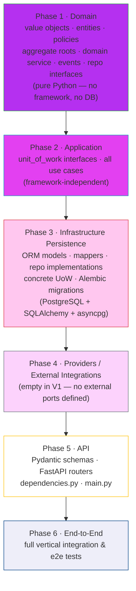

# Build Order

All planning artifacts (steps 00–14) are complete. This file is the executable coding sequence for AI agents and developers. Follow the phases in order. Do not start a later phase until all files and tests from the current phase are complete and passing.

---

## Build Phase Sequence



---

## Phase 1 — Domain

Build the core business model. No framework dependencies. All code is pure Python. Tests require no database or HTTP server.

### Files to create

```
app/domain/aggregates/league/value_objects.py
app/domain/aggregates/league/entities.py
app/domain/aggregates/league/policies.py
app/domain/aggregates/league/aggregate_root.py
app/domain/aggregates/league/repository.py
app/domain/aggregates/match/value_objects.py
app/domain/aggregates/match/aggregate_root.py
app/domain/aggregates/match/repository.py
app/domain/services/standings_calculator.py
app/domain/events.py
```

**Creation order within Phase 1:**
1. `league/value_objects.py` — `LeagueId`, `PlayerId`, `TeamId`, `HostToken`, `PlayerNickname` (no internal dependencies)
2. `match/value_objects.py` — `MatchId`, `SetScore` (no internal dependencies)
3. `league/entities.py` — `Player`, `Team` (depends on `league/value_objects.py`)
4. `league/policies.py` — `NicknameUniquenessPolicy`, `OneTeamPerPlayerPolicy` (depends on `league/entities.py`)
5. `league/aggregate_root.py` — `League` (depends on entities, value objects, policies)
6. `match/aggregate_root.py` — `Match` (depends on `match/value_objects.py`)
7. `domain/services/standings_calculator.py` — `StandingsCalculator` (depends on League entities and Match aggregate)
8. `domain/events.py` — event data classes only: `LeagueCreated`, `PlayersAndTeamRegistered`, `PlayerNicknameEdited`, `TeamDeleted`; no event bus wiring
9. `league/repository.py` — abstract `LeagueRepository` interface (depends on aggregate root and value objects)
10. `match/repository.py` — abstract `MatchRepository` interface (depends on aggregate root and value objects)

### Tests to write

**`tests/domain/test_league_value_objects.py`**
- `PlayerNickname` stores value lowercased
- `PlayerNickname` raises on empty string
- `PlayerNickname` equality is case-insensitive

**`tests/domain/test_match_value_objects.py`**
- `SetScore` accepts valid non-negative integer strings
- `SetScore` raises `InvalidSetScoreError` on non-integer input
- `SetScore` raises `InvalidSetScoreError` on negative integer input
- `SetScore.winner_side()` returns correct side (team1, team2, or draw)

**`tests/domain/test_league_aggregate.py`**
- `League.create` returns aggregate with empty roster and populated `host_token` and `league_id`
- `League.create` raises on blank title
- `register_players_and_team` registers two new players and a new team
- `register_players_and_team` is idempotent when both players and team already exist
- `register_players_and_team` registers one new player when the other already exists and they share no existing team
- `register_players_and_team` raises `TeamConflictError` when either player already belongs to a different team
- `register_players_and_team` raises `SamePlayerWithinSingleTeamError` when both nicknames normalize to the same value
- `edit_player_nickname` updates the nickname on the correct player
- `edit_player_nickname` raises `PlayerNotFoundError` when player ID does not exist
- `edit_player_nickname` raises `NicknameAlreadyInUseError` when new nickname is taken by a different player
- `delete_team` removes the team from the team list; player records remain
- `delete_team` raises `TeamNotFoundError` when team ID does not exist in the league

**`tests/domain/test_match_aggregate.py`**
- `Match.create` returns aggregate with correct team IDs and score
- `Match.create` raises `SameTeamOnBothSidesError` when `team1_id == team2_id`
- `Match.edit_score` updates the set score on the aggregate
- `Match.edit_score` raises `InvalidSetScoreError` on invalid score input

**`tests/domain/test_standings_calculator.py`**
- Single match: winning team has 1 win, losing team has 1 loss, ranks are 1 and 2
- Multiple matches: win counts aggregate correctly across matches
- Tied teams share the same rank; next team receives rank = (position), not (tied_rank + 1) — e.g. two teams at rank 1 → next team is rank 3
- Draw match (equal scores): neither team receives a win or loss; both remain in standings with 0 wins
- Empty match list: all teams returned with 0 wins, 0 losses, all at rank 1

---

## Phase 2 — Application

Build the application orchestration layer. No framework dependencies. Tests use mocked repository and UoW interfaces — no database required.

### Files to create

```
app/application/unit_of_work/base.py
app/application/unit_of_work/submit_match_result_uow.py
app/application/use_cases/create_league_use_case.py
app/application/use_cases/submit_match_result_use_case.py
app/application/use_cases/get_standings_use_case.py
app/application/use_cases/get_match_history_use_case.py
app/application/use_cases/get_league_roster_use_case.py
app/application/use_cases/edit_player_nickname_use_case.py
app/application/use_cases/delete_team_use_case.py
app/application/use_cases/edit_match_score_use_case.py
app/application/use_cases/delete_match_use_case.py
```

### Tests to write

**`tests/application/test_create_league_use_case.py`**
- Happy path: `LeagueRepository.save` called once; `league_id` and `host_token` returned
- Raises `LeagueTitleAlreadyExistsError` when `get_by_normalized_title` returns an existing league
- Title is normalized to lowercase before uniqueness check

**`tests/application/test_submit_match_result_use_case.py`**
- Happy path with all new players: league save and match save both called within UoW; `match_id` returned
- Happy path with all existing players on known teams: same flow; no new player/team entities created
- Raises `LeagueNotFoundError` when `get_by_id_with_lock` returns `None`
- Raises `SamePlayerWithinSingleTeamError` when team1 has duplicate nicknames (before aggregate is loaded)
- Raises `SamePlayerOnBothTeamsError` when same nickname appears on both teams (before aggregate is loaded)
- Raises `InvalidSetScoreError` when score is non-integer (before aggregate is loaded)
- Raises `TeamConflictError` when a player is already on a different team (via aggregate)
- Raises `SameTeamOnBothSidesError` when both teams resolve to the same existing team (via `Match.create`)
- UoW is rolled back on any domain error; no partial commit occurs

**`tests/application/test_get_standings_use_case.py`**
- Happy path: `StandingsCalculator.compute` called with correct arguments; returns standings list
- Raises `LeagueNotFoundError` when league does not exist

**`tests/application/test_get_match_history_use_case.py`**
- Happy path: returns match records with nicknames resolved from league; sorted by `created_at` descending
- Raises `LeagueNotFoundError` when league does not exist

**`tests/application/test_get_league_roster_use_case.py`**
- Happy path: returns player list and team list from loaded League aggregate
- Raises `LeagueNotFoundError` when league does not exist

**`tests/application/test_edit_player_nickname_use_case.py`**
- Happy path: `league.edit_player_nickname` called; `LeagueRepository.save` called; updated nickname returned
- Raises `LeagueNotFoundError` when league does not exist
- Raises `UnauthorizedError` when `host_token` does not match
- Raises `PlayerNotFoundError` when player ID not in league
- Raises `NicknameAlreadyInUseError` when new nickname is taken

**`tests/application/test_delete_team_use_case.py`**
- Happy path: `MatchRepository.has_matches_for_team` returns False; `league.delete_team` called; `LeagueRepository.save` called
- Raises `LeagueNotFoundError` when league does not exist
- Raises `UnauthorizedError` when `host_token` does not match
- Raises `TeamNotFoundError` when team ID not in league
- Raises `TeamHasMatchesError` when `has_matches_for_team` returns True

**`tests/application/test_edit_match_score_use_case.py`**
- Happy path: `match.edit_score` called; `MatchRepository.save` called; updated score returned
- Raises `LeagueNotFoundError` when league does not exist
- Raises `UnauthorizedError` when `host_token` does not match
- Raises `InvalidSetScoreError` on invalid score input
- Raises `MatchNotFoundError` when match ID not found in that league

**`tests/application/test_delete_match_use_case.py`**
- Happy path: `MatchRepository.delete` called with correct `match_id` and `league_id`
- Raises `LeagueNotFoundError` when league does not exist
- Raises `UnauthorizedError` when `host_token` does not match
- Raises `MatchNotFoundError` when match ID not found in that league

---

## Phase 3 — Infrastructure Persistence

Implement database access. Tests require a real PostgreSQL instance (use a local Docker container or test database). Domain and application code must not be modified during this phase.

### Files to create

```
app/infrastructure/config/database.py
app/infrastructure/persistence/models/orm_models.py
app/infrastructure/persistence/mappers/league_mapper.py
app/infrastructure/persistence/mappers/player_mapper.py
app/infrastructure/persistence/mappers/team_mapper.py
app/infrastructure/persistence/mappers/match_mapper.py
app/infrastructure/persistence/repositories/league_repository.py
app/infrastructure/persistence/repositories/match_repository.py
app/infrastructure/persistence/unit_of_work/submit_match_result_uow.py
alembic/env.py
alembic/versions/<timestamp>_initial_schema.py
```

**Creation order within Phase 3:**
1. `infrastructure/config/database.py` — engine and `AsyncSession` factory (no domain dependency)
2. `infrastructure/persistence/models/orm_models.py` — SQLAlchemy ORM models for `leagues`, `players`, `teams`, `matches`; all columns, FK constraints, and unique indexes from `12_persistence_strategy.md`
3. Mapper files — `league_mapper.py`, `player_mapper.py`, `team_mapper.py`, `match_mapper.py`; each mapper reconstructs typed value objects from ORM rows and converts domain objects to ORM rows
4. `league_repository.py` — concrete `LeagueRepository`; `save` upserts league row + all player/team rows + hard-deletes rows in `pending_deleted_team_ids`
5. `match_repository.py` — concrete `MatchRepository`; `delete` is a hard `DELETE`
6. `infrastructure/persistence/unit_of_work/submit_match_result_uow.py` — wires both repositories to one shared `AsyncSession`
7. Alembic `env.py` configured for async SQLAlchemy; initial migration generating the 4 tables

### Tests to write

**`tests/integration/test_league_repository.py`** (requires test DB)
- `save` then `get_by_id` roundtrip: League with players and teams is reloaded with all fields intact
- `get_by_normalized_title` returns the league for a matching lowercased title; returns `None` for a non-existent title
- `get_by_id_with_lock` loads the League aggregate (lock behavior verified by confirming the SELECT ... FOR UPDATE SQL is issued)
- `save` after `delete_team`: deleted team row is removed from the `teams` table; player rows remain
- `get_by_id` returns `None` for a non-existent `league_id`

**`tests/integration/test_match_repository.py`** (requires test DB)
- `save` then `get_by_id` roundtrip: Match is reloaded with correct team IDs and `SetScore`
- `get_all_by_league` returns all matches for the league in no guaranteed order (use case layer sorts)
- `has_matches_for_team` returns `True` when at least one match references the team; `False` otherwise
- `delete` removes the match row; subsequent `get_by_id` returns `None`
- `get_by_id` with wrong `league_id` returns `None` (cross-league access guard)

**`tests/integration/test_submit_match_result_uow.py`** (requires test DB)
- Both `league.save` and `match.save` within the UoW commit atomically when `commit()` is called
- Neither save is persisted when an exception is raised before `commit()` (rollback on `__aexit__`)

---

## Phase 4 — Providers / External Integrations

No external ports are defined in V1. This phase is intentionally empty.

If a future version introduces a notification service, an audit log sink, or any external integration, add an abstract port to `domain/ports/` or `application/ports/`, a concrete implementation to `infrastructure/providers/`, and wire it in `dependencies.py`.

---

## Phase 5 — API

Build the HTTP interface. Tests use FastAPI `TestClient` (or `AsyncClient`) with concrete infrastructure wired via `dependencies.py`. Requires a running test database.

### Files to create

```
app/api/schemas/league_schemas.py
app/api/schemas/admin_schemas.py
app/api/routers/league_router.py
app/api/routers/admin_router.py
app/dependencies.py
app/main.py
```

**`league_schemas.py`** — request and response schemas for all 6 player-facing endpoints:
- `CreateLeagueRequest`, `CreateLeagueResponse`
- `LeagueListItemSchema`, `SearchLeaguesResponse` (GET `/leagues` search)
- `SubmitMatchResultRequest`, `SubmitMatchResultResponse`
- `GetStandingsResponse`, `StandingsEntrySchema`
- `GetMatchHistoryResponse`, `MatchHistoryRecordSchema`
- `GetLeagueRosterResponse`, `PlayerEntrySchema`, `TeamEntrySchema`

**`admin_schemas.py`** — request and response schemas for all 4 admin endpoints:
- `EditPlayerNicknameRequest`, `EditPlayerNicknameResponse`
- `EditMatchScoreRequest`, `EditMatchScoreResponse`
- (DELETE endpoints use no request body and return 204 No Content)

**`league_router.py`** — 6 player-facing routes; each route calls exactly one use case:
- `POST /leagues` → `CreateLeagueUseCase`
- `GET /leagues` → `SearchLeaguesByTitlePrefixUseCase`
- `POST /leagues/{league_id}/matches` → `SubmitMatchResultUseCase`
- `GET /leagues/{league_id}/standings` → `GetStandingsUseCase`
- `GET /leagues/{league_id}/matches` → `GetMatchHistoryUseCase`
- `GET /leagues/{league_id}/roster` → `GetLeagueRosterUseCase`

**`admin_router.py`** — 4 admin routes; all require `X-Host-Token` header (extracted and passed into use case command — host token verification happens inside the use case via the domain aggregate, not in the router):
- `PATCH /admin/leagues/{league_id}/players/{player_id}` → `EditPlayerNicknameUseCase`
- `DELETE /admin/leagues/{league_id}/teams/{team_id}` → `DeleteTeamUseCase`
- `PATCH /admin/leagues/{league_id}/matches/{match_id}` → `EditMatchScoreUseCase`
- `DELETE /admin/leagues/{league_id}/matches/{match_id}` → `DeleteMatchUseCase`

**`dependencies.py`** — composition root:
- Binds `LeagueRepository` abstract interface → `SqlAlchemyLeagueRepository` concrete implementation
- Binds `MatchRepository` abstract interface → `SqlAlchemyMatchRepository` concrete implementation
- Provides `AsyncSession` factory via FastAPI dependency injection
- Constructs all use case instances with their concrete dependencies injected

**`main.py`** — FastAPI app creation; registers `league_router` and `admin_router`; registers exception handlers mapping domain errors to HTTP status codes per `13_api_contracts.md`

### Tests to write

**`tests/api/test_league_router.py`** (uses TestClient + test DB)
- `POST /leagues` happy path: 201 response with `league_id` and `host_token`
- `POST /leagues` with duplicate title: 409 with `LeagueTitleAlreadyExistsError`
- `POST /leagues` with blank title: 422 validation error
- `GET /leagues?title_prefix=...` happy path: 200 with `leagues` array of `{ league_id, title }`
- `GET /leagues?title_prefix=...` with no matches: 200 with empty `leagues` array
- `GET /leagues` missing `title_prefix` or blank after trim: 422
- `GET /leagues?title_prefix=...&limit=200`: limit clamped to cap (100); use case receives at most 100
- `POST /leagues/{league_id}/matches` happy path with new players: 201 with `match_id`
- `POST /leagues/{league_id}/matches` with unknown `league_id`: 404
- `POST /leagues/{league_id}/matches` with same player on both teams: 422 `SamePlayerOnBothTeamsError`
- `POST /leagues/{league_id}/matches` with non-integer score: 422 `InvalidSetScoreError`
- `POST /leagues/{league_id}/matches` with player already on a different team: 409 `TeamConflictError`
- `GET /leagues/{league_id}/standings` happy path: 200 with ranked standings list
- `GET /leagues/{league_id}/standings` with unknown `league_id`: 404
- `GET /leagues/{league_id}/matches` happy path: 200 with match list sorted by `created_at` descending
- `GET /leagues/{league_id}/matches` with unknown `league_id`: 404
- `GET /leagues/{league_id}/roster` happy path: 200 with player and team lists
- `GET /leagues/{league_id}/roster` with unknown `league_id`: 404

**`tests/api/test_admin_router.py`** (uses TestClient + test DB)
- `PATCH /admin/.../players/{player_id}` happy path: 200 with updated nickname
- `PATCH /admin/.../players/{player_id}` missing `X-Host-Token` header: 401
- `PATCH /admin/.../players/{player_id}` wrong token: 401
- `PATCH /admin/.../players/{player_id}` unknown player: 404
- `PATCH /admin/.../players/{player_id}` nickname already in use: 409
- `PATCH /admin/.../players/{player_id}` blank new nickname: 422
- `DELETE /admin/.../teams/{team_id}` happy path: 204 No Content
- `DELETE /admin/.../teams/{team_id}` wrong token: 401
- `DELETE /admin/.../teams/{team_id}` unknown team: 404
- `DELETE /admin/.../teams/{team_id}` team has associated matches: 409 `TeamHasMatchesError`
- `PATCH /admin/.../matches/{match_id}` happy path: 200 with updated scores
- `PATCH /admin/.../matches/{match_id}` wrong token: 401
- `PATCH /admin/.../matches/{match_id}` invalid score: 422
- `PATCH /admin/.../matches/{match_id}` unknown match: 404
- `DELETE /admin/.../matches/{match_id}` happy path: 204 No Content
- `DELETE /admin/.../matches/{match_id}` wrong token: 401
- `DELETE /admin/.../matches/{match_id}` unknown match: 404

---

## Phase 6 — End-to-End / Integration

Full vertical flows through all layers. Tests use the running application with a real database. Verify observable outcomes, not internal state.

### Files to create

```
tests/e2e/test_full_match_flow.py
tests/e2e/test_admin_delete_flow.py
tests/e2e/test_error_paths.py
```

### Tests to write

**`tests/e2e/test_full_match_flow.py`**
- Create league → submit first match with 4 new players → verify standings show 1 win / 1 loss → submit second match with same teams → verify standings updated correctly
- Create league → submit match → edit winning player's nickname → get standings → verify updated nickname appears in standings response
- Create league → submit match → get match history → verify player nicknames, scores, and `created_at` ordering are correct

**`tests/e2e/test_admin_delete_flow.py`**
- Create league → submit match → delete match → verify match no longer appears in match history and standings show 0 wins/losses for all teams
- Create league → submit match → attempt to delete team with associated match → verify 409 `TeamHasMatchesError` → delete match first → delete team → verify team no longer appears in roster

**`tests/e2e/test_error_paths.py`**
- Submit match where one player is already on a different team: verify 409 `TeamConflictError` is returned and no new player, team, or match record is persisted (atomicity check)
- Submit match where both teams resolve to the same existing team: verify 409 `SameTeamOnBothSidesError`; no match record created
- Create two leagues with the same title (case-insensitive): verify second creation returns 409 `LeagueTitleAlreadyExistsError`
- Submit match with non-integer score: verify 422 `InvalidSetScoreError`; no state change persisted
