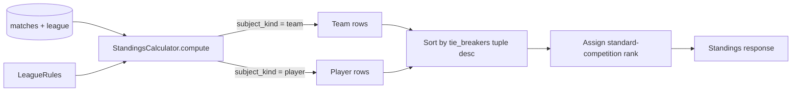

# Configurable league ranking

## Purpose

Leagues differ in *what they want to rank* (teams or individual players) and *how they want to break ties* (matches won, game differential, win percentage, ...). Today, [`StandingsCalculator`](06_domain_services.md) hard-codes "rank teams by wins descending, no tiebreaker" — this works for the simplest leagues but rules out common real-world rankings such as "wins, then game differential". This document adds a second dimension to [`LeagueRules`](16_league_rules_and_match_policies.md): a per-league **ranking subject** (team vs. player) and an **ordered tie-breaker list**.

**Scope in this implementation (v2 of LeagueRules):**

- Add `ranking_subject: "team" | "player"` and `tie_breakers: list[Metric]` fields to `LeagueRules`.
- Allowed metrics: `matches_won`, `match_diff`, `games_won`, `games_lost`, `games_diff`, `win_pct`. "Games" means the integer per-side score already stored on `SetScore` (see §[Metric definitions](#metric-definitions)).
- Make the standings response polymorphic on `subject_kind` (a `"team"` row or a `"player"` row).
- Reuse the existing `GET /leagues/{id}/standings` and `GET /leagues/{id}/standings/by-player` endpoints — no new routes.
- `one_team_per_player` is **locked to `true`** in v2: `LeagueRules.from_dict` rejects any other value. Configurable OTPP arrives in v3, which is also when the `(ranking_subject, one_team_per_player)` cross-rule first becomes meaningful — see [Forward-compatibility note](#forward-compatibility-note-planned-for-v3).

**Out of scope until specified:**

- Multi-set or per-game scoring (today a match has a single `SetScore` with one integer per side; this stays).
- "Head-to-head" tie-breakers, which require a sub-tournament view of the data and a stable ordering across cycles.
- Mid-league rule edits (rules remain immutable after creation, consistent with [16](16_league_rules_and_match_policies.md)).
- Mutable rules / a host PATCH endpoint for ranking config.
- Dense rank ("1, 1, 2") as a configurable option — standard-competition rank ("1, 1, 3") stays hard-coded.

**Mutability:** As with the rest of `LeagueRules`, ranking is **fixed at league creation**. No host API edits ranking after the league exists.

---

## Concepts

### Ranking subject

Each league chooses *what kind of row* its standings table will list:

| Subject | Row identifier | Display | Stats credited from |
|---|---|---|---|
| `team` | `team_id` | both partner nicknames | matches won/lost by that team |
| `player` | `player_id` | one nickname | matches won/lost by every team this player belongs to |

Under v2, every league has `one_team_per_player == true` (the field is locked at validation time), so "every team this player belongs to" is effectively "the player's one team". This makes player-subject rankings under v2 mathematically equivalent to team-subject rankings, just rendered with one row per player. See [Worked example: equivalence under OTPP=true](#worked-example-equivalence-under-otpptrue) for why this is intentional.

### Tie-breakers

Ranking is configured as an **ordered, non-empty list** of metric names. The first element is the primary metric; subsequent elements break ties between rows whose preceding metrics are all equal.

Example: `tie_breakers = ["matches_won", "games_diff", "games_won"]` means:

1. Sort rows descending by `matches_won`.
2. Among rows tied on `matches_won`, sort descending by `games_diff`.
3. Among rows still tied, sort descending by `games_won`.
4. Rows tied on the entire tuple share the same rank; standard-competition next-rank logic applies (see §[Tie-rank logic](#tie-rank-logic)).

### Metric definitions

For a subject row (a team or a player), let `M` be the set of matches involving that subject:

| Metric | Definition | Notes |
|---|---|---|
| `matches_won` | count of matches in `M` won by the subject | draws are not wins (see [06](06_domain_services.md)) |
| `matches_lost` | count of matches in `M` lost by the subject | draws are not losses |
| `match_diff` | `matches_won - matches_lost` | not exposed as a top-level metric, but reused for `win_pct` denominator |
| `games_won` | sum of the subject's per-match `int(team_score)` | the integer already stored on `SetScore`; v2 makes no schema change |
| `games_lost` | sum of the *opponent's* per-match `int(team_score)` | symmetric to `games_won` |
| `games_diff` | `games_won - games_lost` | can be negative |
| `win_pct` | `matches_won / matches_played`, with `0 / 0 = 0.0` | float; sorted descending; ties at `0.0` for unplayed subjects |

`matches_played = matches_won + matches_lost + draws`. Draws are counted in `matches_played` but not in `matches_won` or `matches_lost`, matching the v1 contract in [06](06_domain_services.md).

### Tie-rank logic

Identical to v1. After sorting by the metric tuple descending, the rank of a row at 1-indexed position `p` is:

- `1` if `p == 1`
- the same as the previous row's rank if its full metric tuple equals the previous row's tuple
- `p` otherwise

This is "standard competition ranking": ties leave gaps after them (1, 1, 3). Dense ranking is **not** offered as a configuration option in v2.

### `one_team_per_player` locked to `true` (v2)

In v2, `LeagueRules.from_dict` rejects any rules object whose `one_team_per_player` is not `true`. There is **no `(ranking_subject, one_team_per_player)` cross-rule** in v2 — the constraint is unnecessary because OTPP is forced to `true` for every league, which trivially satisfies any pairing with `ranking_subject`. Allowing OTPP=false is meaningful (a player accumulating stats across multiple partners) but cannot ship safely until the read paths that assume one-team-per-player — most notably `GetStandingsByPlayerUseCase`'s `next(...)` lookup — are revised. v3 unlocks `one_team_per_player = false` and is also where the cross-rule first appears; see [Forward-compatibility note](#forward-compatibility-note-planned-for-v3).

---

## LeagueRules v2 schema

```json
{
  "version": 2,
  "match_pair_idempotency": "once_per_league",
  "one_team_per_player": true,
  "ranking_subject": "team",
  "tie_breakers": ["matches_won", "games_diff"]
}
```

| Field | Type | Allowed values | Default for new leagues |
|---|---|---|---|
| `version` | int | `2` (v2 strict); `1` is upgraded transparently on read | `2` |
| `match_pair_idempotency` | str | `"none"`, `"once_per_league"` | `"once_per_league"` (unchanged from v1) |
| `one_team_per_player` | bool | `true` only in v2 (any other value is rejected); `false` becomes selectable in v3 | `true` (unchanged from v1) |
| `ranking_subject` | str | `"team"`, `"player"` | `"team"` |
| `tie_breakers` | list[str] | non-empty; each entry one of `matches_won`, `match_diff`, `games_won`, `games_lost`, `games_diff`, `win_pct`; no duplicates | `["matches_won"]` |

### Defaults rationale

The defaults reproduce v1 behavior exactly: a `(team, [matches_won])` league sorts identically to today. This means existing leagues backfilled to v2 (see §[Migration plan](#migration-plan-v1--v2)) produce byte-identical standings to before the migration.

### Validation rules

`LeagueRules.from_dict` strictly validates v2 inputs:

1. `version` must be `1` or `2`. `version: 1` is silently upgraded by injecting the v2 defaults.
2. `match_pair_idempotency` validation is unchanged from v1.
3. `one_team_per_player` must be `true`. Any other value (including `false`) raises `InvalidLeagueRulesError` (mapped to HTTP 422). This applies to both v1 and v2 inputs — v1 payloads with `one_team_per_player = false` are rejected on read rather than silently upgraded.
4. `ranking_subject` must be `"team"` or `"player"`.
5. `tie_breakers` must be a list, non-empty, with each entry in the allowed metric set, and contain no duplicate entries.

There is no `(ranking_subject, one_team_per_player)` cross-rule in v2; rule 3 makes such a rule redundant. v3 introduces the cross-rule when OTPP=false becomes selectable — see [Forward-compatibility note](#forward-compatibility-note-planned-for-v3).

---

## Standings response shape (polymorphic)

The same two endpoints, `GET /leagues/{id}/standings` and `GET /leagues/{id}/standings/by-player`, are reused. The response carries the league's ordered ranking metrics at the top level, and each row carries a `subject_kind` discriminator:

```json
{
  "standings": [
    {
      "subject_kind": "team",
      "rank": 1,
      "team_id": "...",
      "player1_nickname": "alice",
      "player2_nickname": "bob",
      "matches_played": 4,
      "wins": 3,
      "losses": 1,
      "games_won": 18,
      "games_lost": 9,
      "games_diff": 9,
      "win_pct": 0.75
    }
  ],
  "tie_breakers": ["matches_won", "games_diff"]
}
```

The top-level `tie_breakers` field is a verbatim copy of `LeagueRules.tie_breakers`. It exists so clients can label the displayed metric column to match the league's primary tie-breaker — a league configured with `tie_breakers=["games_won", ...]` is rendered with a "Games won" column rather than the previously hard-coded "Games ±". Every row in the response always carries every metric (`matches_won` is `wins`, plus `games_won`, `games_lost`, `games_diff`, `win_pct`), so the choice is purely presentational; no row data is added or removed when tie-breakers change.

For player-subject leagues, each row instead has:

```json
{
  "subject_kind": "player",
  "rank": 1,
  "player_id": "...",
  "nickname": "alice",
  "matches_played": 4,
  "wins": 3,
  "losses": 1,
  "games_won": 18,
  "games_lost": 9,
  "games_diff": 9,
  "win_pct": 0.75
}
```

### Field-presence contract

| Field | When `subject_kind == "team"` | When `subject_kind == "player"` |
|---|---|---|
| `subject_kind`, `rank` | required | required |
| `team_id`, `player1_nickname`, `player2_nickname` | required | absent |
| `player_id`, `nickname` | absent | required |
| `matches_played`, `wins`, `losses`, `games_won`, `games_lost`, `games_diff`, `win_pct` | required | required |

Clients must read `subject_kind` first and branch their renderer on it. Old clients reading only `team_id` / `player1_nickname` / `player2_nickname` / `wins` / `losses` will silently break for player-subject leagues. The frontend rollout (Slice 2.6) ships in lockstep with the backend rollout (Slices 2.1-2.4).

---

## Calculation flow



`StandingsCalculator.compute(matches, teams, players, rules)` is pure and stateless. It:

1. Builds a list of subject rows (one per team, or one per player), each carrying every metric in the allowed set, computed from `matches`.
2. Sorts the rows by `tuple(row.metric_value(m) for m in rules.tie_breakers)` descending.
3. Walks the sorted list assigning standard-competition ranks (ties share the previous rank; the next non-tied row gets its 1-indexed position).

No DB calls, no HTTP, no side effects. The use case (`GetStandingsUseCase`) is responsible for loading `matches`, `teams`, and `players` via repositories before invoking this service.

---

## Worked example: equivalence under OTPP=true

Three teams, three matches:

| Team | Members |
|---|---|
| A | Alice, Bob |
| B | Charlie, Diana |
| C | Eve, Frank |

Matches: `A 6-3 B`, `A 6-2 C`, `B 6-4 C`.

**Subject = `team`, `tie_breakers = ["matches_won", "games_diff"]`:**

| Rank | Team | Wins | Losses | Games for | Games against | Diff |
|---|---|---|---|---|---|---|
| 1 | A (alice, bob) | 2 | 0 | 12 | 5 | +7 |
| 2 | B (charlie, diana) | 1 | 1 | 9 | 10 | -1 |
| 3 | C (eve, frank) | 0 | 2 | 6 | 12 | -6 |

**Subject = `player`, `tie_breakers = ["matches_won", "games_diff"]`, `one_team_per_player = true`:**

| Rank | Player | Wins | Losses | Games for | Games against | Diff |
|---|---|---|---|---|---|---|
| 1 | alice | 2 | 0 | 12 | 5 | +7 |
| 1 | bob   | 2 | 0 | 12 | 5 | +7 |
| 3 | charlie | 1 | 1 | 9 | 10 | -1 |
| 3 | diana   | 1 | 1 | 9 | 10 | -1 |
| 5 | eve   | 0 | 2 | 6 | 12 | -6 |
| 5 | frank | 0 | 2 | 6 | 12 | -6 |

Every metric tuple is identical between teammates, because they always play together when `one_team_per_player = true`. The two leaderboards convey the *same information*, just in different presentations. This redundancy is intentional in v2: it lets the player-ranking code path be exercised on real data before the multi-team-per-player feature ships, without requiring synthetic test data only.

---

## Migration plan (v1 -> v2)

A new alembic revision (`003_*`) backfills every row with `rules->>'version' = '1'` to a v2 shape with the v2 defaults:

```sql
UPDATE leagues
SET rules = rules || '{"version": 2, "ranking_subject": "team", "tie_breakers": ["matches_won"]}'::jsonb
WHERE (rules->>'version')::int = 1;
```

No DDL; the `leagues.rules` column stays JSONB and unconstrained at the database level. The migration is idempotent (running it twice leaves v2 rows untouched) and reversible (the downgrade strips the two new keys and resets `version` to `1`).

The frontend's create-league form sends `version: 2` for new leagues; old API clients that POST `version: 1` continue to work because `LeagueRules.from_dict` upgrades v1 inputs transparently.

---

## Forward-compatibility note (planned for v3)

**Superseded.** V3 has shipped. See [18_configurable_ranking_v3.md](18_configurable_ranking_v3.md) for the v3 spec, the `(player, OTPP=true)` cross-rule, and the alembic 004 auto-migration.

---

## Persistence

See [12_persistence_strategy.md](12_persistence_strategy.md) for the `leagues.rules` JSONB column. v2 reuses the column unchanged; only its in-flight content changes shape.

---

## API and errors

See [13_api_contracts.md](13_api_contracts.md) for the v2 `Create League` request body and the polymorphic standings response. New error mapping:

| Domain Error | HTTP Status |
|---|---|
| `InvalidLeagueRulesError` (existing — now also raised for invalid v2 ranking config or invalid v2 cross-rule) | 422 |

---

## Related documents

- [16_league_rules_and_match_policies.md](16_league_rules_and_match_policies.md) — overall LeagueRules policy framework. v2 extends this.
- [06_domain_services.md](06_domain_services.md) — `StandingsCalculator` algorithm notes.
- [05_aggregate_designs/league.md](05_aggregate_designs/league.md) — League aggregate root and the `LeagueRules` value object.
- [13_api_contracts.md](13_api_contracts.md) — endpoint contracts (Create League, Get Standings, Get Standings By Player).
- [03_business_invariants.md](03_business_invariants.md) — invariants table; ranking adds no new invariant.
