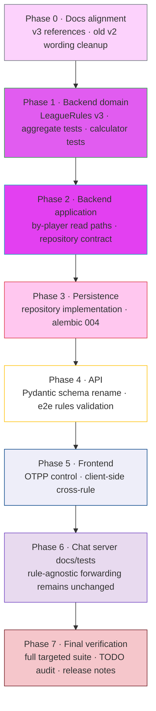

# V3 Build Order

This is the executable coding sequence for AI agents and developers implementing [18_configurable_ranking_v3.md](18_configurable_ranking_v3.md). Follow the phases in order. Do not start a later phase until the current phase's files, tests, and verification gate are complete.

This document is intentionally separate from [18_configurable_ranking_v3.md](18_configurable_ranking_v3.md): doc 18 defines the product and technical specification; this document defines how to migrate the codebase to v3 safely.

---

## Pre-flight checklist

Before editing code:

1. Read the v3 spec: [18_configurable_ranking_v3.md](18_configurable_ranking_v3.md).
2. Read the v2 spec: [17_configurable_ranking.md](17_configurable_ranking.md), especially the "Forward-compatibility note (planned for v3)" section.
3. Search for every `TODO(v3-ranking-tightening)` marker and keep that list open while implementing. V3 is not complete until every marker is resolved or deliberately replaced with a post-v3 note.
4. Confirm whether unrelated local changes exist. Do not revert user changes.
5. Confirm the alembic head is currently `003` before adding migration `004`.

Useful read-only discovery commands:

```bash
rg "TODO\\(v3-ranking-tightening\\)|one_team_per_player|ranking_subject|LeagueRulesV2Request" backend_main frontend chat_to_intent_server
ls backend_main/alembic/versions
```

---

## Build Phase Sequence



---

## Phase 0 — Docs Alignment

Align the existing design docs so AI agents and humans read one coherent v3 story before code changes begin.

### Files to edit

```
backend_main/Design_Doc/TLMB_Design_doc/03_business_invariants.md
backend_main/Design_Doc/TLMB_Design_doc/05_aggregate_designs/league.md
backend_main/Design_Doc/TLMB_Design_doc/06_domain_services.md
backend_main/Design_Doc/TLMB_Design_doc/13_api_contracts.md
backend_main/Design_Doc/TLMB_Design_doc/16_league_rules_and_match_policies.md
backend_main/Design_Doc/TLMB_Design_doc/17_configurable_ranking.md
```

### Required edits

1. `17_configurable_ranking.md`
   - Replace the "Forward-compatibility note (planned for v3)" section with a short pointer to [18_configurable_ranking_v3.md](18_configurable_ranking_v3.md).
   - Keep v2 behavior intact everywhere else; doc 17 remains the v2 production spec.

2. `16_league_rules_and_match_policies.md`
   - Change "current is 2" to "current is 3" where appropriate.
   - Replace "v2 locks `one_team_per_player` to `true`" with the v3 rule matrix.
   - Move "Multiple teams per player" out of future-only language.

3. `13_api_contracts.md`
   - Update the create-league example rules body to `version: 3`.
   - Replace "OTPP=false is rejected in v2" with "the `(player, OTPP=true)` cross-rule is rejected in v3".
   - Note that `GET /standings/by-player` can return multiple rows under `(team, OTPP=false)`.

4. `06_domain_services.md`
   - Rewrite the `ranking_subject == "player"` note so it describes OTPP=false aggregation across all teams a player belongs to.

5. `05_aggregate_designs/league.md`
   - Drop v2-locked wording in the League aggregate invariant and `LeagueRules` value-object sections.

6. `03_business_invariants.md`
   - Keep the invariant conditional: when OTPP is true, one team per player applies.
   - Update "future" references to "v3".

### Verification gate

- Read the edited docs once end-to-end.
- Run a search and confirm no stale statement says OTPP=false is rejected in the current version.

```bash
rg "v2 locks|OTPP=false.*rejected|current is `2`|current is 2" backend_main/Design_Doc/TLMB_Design_doc
```

---

## Phase 1 — Backend Domain

Implement the v3 value-object validation and prove the core domain model supports multiple teams per player.

### Files to edit

```
backend_main/app/domain/aggregates/league/league_rules.py
backend_main/app/domain/services/standings_calculator.py
backend_main/tests/domain/test_league_rules.py
backend_main/tests/domain/test_league_aggregate.py
backend_main/tests/domain/test_standings_calculator.py
```

### Required edits

1. `league_rules.py`
   - Accept versions `1`, `2`, and `3`.
   - Remove the v2 strict check that requires `one_team_per_player is True`.
   - Keep the type check requiring `one_team_per_player` to be a boolean.
   - Add the v3 cross-rule: reject `ranking_subject == "player"` when `one_team_per_player is True`.
   - Always return a `LeagueRules` object with `version=3`.
   - Update `default_for_new_league()` to return `version=3`.
   - Remove or replace the `TODO(v3-ranking-tightening)` marker.

2. `standings_calculator.py`
   - Keep the existing `_compute_for_players` algorithm.
   - Replace the `TODO(v3-ranking-tightening)` comment with a v3 note explaining that player rows aggregate across every team the player belongs to.
   - Keep the same-player-on-both-sides guard as defense-in-depth only.

### Tests to write or flip

`tests/domain/test_league_rules.py`:

- Flip `test_from_dict_v1_input_with_otpp_false_is_rejected` so v1 + OTPP=false upgrades successfully to v3.
- Flip `test_from_dict_rejects_otpp_false_with_team_subject` so `(team, OTPP=false)` succeeds.
- Flip `test_from_dict_rejects_otpp_false_with_player_subject` so `(player, OTPP=false)` succeeds.
- Flip `test_from_dict_accepts_player_subject_with_otpp_true` so `(player, OTPP=true)` raises `InvalidLeagueRulesError`.
- Add `test_from_dict_v2_input_upgrades_to_v3`.
- Add `test_default_for_new_league_is_v3`.

`tests/domain/test_league_aggregate.py`:

- Add a test that `register_players_and_team` allows a player to join a second team when `one_team_per_player=False`.
- Keep or add a regression test that the same operation raises `TeamConflictError` when `one_team_per_player=True`.

`tests/domain/test_standings_calculator.py`:

- Add the worked example from doc 18: rotating partners under `(player, OTPP=false)` produce distinct player metric tuples.

### Verification gate

Run domain tests only before moving on:

```bash
cd backend_main
pytest tests/domain/test_league_rules.py tests/domain/test_league_aggregate.py tests/domain/test_standings_calculator.py
```

---

## Phase 2 — Backend Application

Update read paths that assumed a player had one team.

### Files to edit

```
backend_main/app/domain/aggregates/match/repository.py
backend_main/app/application/use_cases/get_standings_by_player_use_case.py
backend_main/app/application/use_cases/get_match_history_by_player_use_case.py
backend_main/tests/application/test_get_standings_by_player_use_case.py
backend_main/tests/application/test_get_match_history_by_player_use_case.py
```

### Required edits

1. `get_standings_by_player_use_case.py`
   - For `ranking_subject == "player"`, keep the existing player-row filtering behavior.
   - For `ranking_subject == "team"`, replace the `next(...)` team lookup with all teams containing the player.
   - Return every matching team row from the computed standings.
   - Preserve the empty-result behavior when the player exists but has no teams.
   - Remove or replace the `TODO(v3-ranking-tightening)` marker.

2. `get_match_history_by_player_use_case.py`
   - Replace the single-team `next(...)` lookup with all teams containing the player.
   - Return the union of matches across those teams, deduped by `match_id`, sorted by `created_at` descending.
   - Prefer adding a repository method instead of calling `get_all_by_team` repeatedly.

3. `match/repository.py`
   - Add an abstract method for the by-player/multiple-team read:
     `get_all_by_player(league_id: LeagueId, team_ids: list[TeamId]) -> list[Match]`.
   - The method does not need `player_id` if the use case already resolved `team_ids`.

### Tests to write

`tests/application/test_get_standings_by_player_use_case.py`:

- Existing OTPP=true tests stay green.
- Add `(team, OTPP=false)` where the player belongs to two teams and the response has two rows.
- Add `(player, OTPP=false)` where the response has one player row.

`tests/application/test_get_match_history_by_player_use_case.py`:

- Add OTPP=false with one player on two teams and matches for both teams.
- Assert duplicate matches are not returned twice if both team IDs somehow match one persisted match.

### Verification gate

```bash
cd backend_main
pytest tests/application/test_get_standings_by_player_use_case.py tests/application/test_get_match_history_by_player_use_case.py
```

---

## Phase 3 — Persistence and Migration

Implement the repository method and add alembic migration 004.

### Files to edit or create

```
backend_main/app/infrastructure/persistence/repositories/match_repository.py
backend_main/alembic/versions/004_leagues_rules_v3.py
backend_main/tests/integration/test_migration_004_leagues_rules_v3.py
```

### Required edits

1. `match_repository.py`
   - Implement `get_all_by_player` from the repository interface.
   - Query matches where `league_id` matches and either `team1_id` or `team2_id` is in the supplied team ID list.
   - Return an empty list immediately when `team_ids` is empty.
   - Sort consistently with existing match-history behavior, preferably by `created_at` descending if the repository already owns ordering for similar methods.

2. `004_leagues_rules_v3.py`
   - Set `revision = "004"` and `down_revision = "003"`.
   - Upgrade:
     - Rewrite `(player, OTPP=true)` rows to `(team, OTPP=true)` while setting `version=3`.
     - Bump all remaining v1/v2 rows to `version=3`.
   - Downgrade:
     - Set `version=2` for v3 rows.
     - Do not restore rewritten `ranking_subject`; document this as irreversible in the module docstring.
   - No DDL.

### Migration SQL shape

Use SQLAlchemy text or equivalent alembic execution. The core logic should match:

```sql
UPDATE leagues
SET rules = rules || jsonb_build_object('version', 3, 'ranking_subject', 'team')
WHERE (rules->>'version')::int IN (1, 2)
  AND (rules->>'ranking_subject') = 'player'
  AND (rules->>'one_team_per_player')::bool = true;

UPDATE leagues
SET rules = rules || jsonb_build_object('version', 3)
WHERE (rules->>'version')::int IN (1, 2);
```

### Tests to write

`tests/integration/test_migration_004_leagues_rules_v3.py`:

- Seed `(team, OTPP=true, version=2)`.
- Seed `(player, OTPP=true, version=2)`.
- Seed `(team, OTPP=true, version=2, tie_breakers=["games_won", "games_diff"])`.
- Run upgrade.
- Assert all rows have `version=3`.
- Assert `(player, OTPP=true)` became `(team, OTPP=true)`.
- Assert custom `tie_breakers` are preserved verbatim.
- Run upgrade a second time and assert idempotency.
- Run downgrade and assert all rows have `version=2`; assert rewritten rows remain `ranking_subject="team"`.

### Verification gate

```bash
cd backend_main
pytest tests/integration/test_migration_004_leagues_rules_v3.py
```

If repository integration tests exist for `match_repository.py`, add or run the relevant test file too.

---

## Phase 4 — Backend API

Expose v3 rules at the HTTP boundary while keeping v1/v2 request compatibility.

### Files to edit

```
backend_main/app/api/schemas/league_schemas.py
backend_main/app/api/routers/league_router.py
backend_main/tests/e2e/test_league_api.py
```

### Required edits

1. `league_schemas.py`
   - Rename `LeagueRulesV2Request` to `LeagueRulesV3Request`.
   - Change `version: Literal[1, 2]` to `version: Literal[1, 2, 3]`.
   - Keep `one_team_per_player: bool = True`.
   - Update the class docstring so it describes the v3 cross-rule instead of the v2 OTPP lock.

2. `league_router.py`
   - Update any import or type reference to the renamed schema.
   - No behavior changes should be required; keep passing `rules.model_dump()` into the use case.

### Tests to write or flip

`tests/e2e/test_league_api.py`:

- Flip `test_create_league_with_otpp_false_returns_422` so OTPP=false succeeds when `ranking_subject="team"`.
- Add `test_create_league_with_player_subject_and_otpp_true_returns_422`.
- Add `test_create_league_with_player_subject_and_otpp_false_succeeds`.
- Add a smoke test proving v2 rules input is still accepted and upgraded to v3.

### Verification gate

```bash
cd backend_main
pytest tests/e2e/test_league_api.py
```

---

## Phase 5 — Frontend

Add the create-league OTPP control and mirror the v3 cross-rule client-side.

### Files to edit

```
frontend/frontend_vanilla/create-league/index.html
frontend/frontend_vanilla/js/create-league.js
frontend/frontend_vanilla/js/i18n.js
frontend/frontend_vanilla/js/user-facing-errors.js
```

### Required edits

1. `create-league/index.html`
   - Add a `one_team_per_player` select inside `details.create-league-advanced`.
   - Place it between `match_pair_idempotency` and `ranking_subject`.
   - Default to `true`.

2. `js/create-league.js`
   - Send `version: 3`.
   - Read `one_team_per_player` from the new select instead of hard-coding `true`.
   - Add a change handler that enforces:
     - `ranking_subject="player"` forces `one_team_per_player=false`.
     - `one_team_per_player=true` forces `ranking_subject="team"`.
   - Keep server validation as the source of truth.
   - Remove or replace the `TODO(v3-ranking-tightening)` marker.

3. `js/i18n.js`
   - Add English and Korean keys:
     - `createLeague.labelOneTeamPerPlayer`
     - `createLeague.optionOTPPTrue`
     - `createLeague.optionOTPPFalse`
     - `createLeague.crossRuleHint`

4. `js/user-facing-errors.js`
   - Optional but recommended: map the v3 cross-rule error text to a friendly user-facing message.

### Verification gate

Manual browser verification is required:

1. Open `/create-league/`.
2. Open "Advanced: custom rules".
3. Confirm OTPP defaults to true and ranking subject defaults to team.
4. Select ranking subject = player; confirm OTPP changes to false and cannot submit an invalid combo.
5. Select OTPP = true; confirm ranking subject changes back to team.
6. Submit a default league and confirm the payload uses `version: 3`.
7. Submit a `(player, OTPP=false)` league and confirm it succeeds.

If frontend lint/test tooling exists, run it after manual edits.

---

## Phase 6 — Chat-to-Intent Server

The chat server is expected to remain behaviorally rule-agnostic. This phase is mostly documentation and regression tests.

### Files to edit

```
chat_to_intent_server/design_doc/configurable_ranking_v2.md
chat_to_intent_server/design_doc/configurable_ranking_v3.md
chat_to_intent_server/chat_to_intent_server_fastapi/design_doc/02_read_only_backend_endpoints.md
chat_to_intent_server/chat_to_intent_server_fastapi/tests/e2e/test_read_intents.py
```

### Required edits

1. Create or rename `configurable_ranking_v3.md`.
   - State that v3 is shipped.
   - Confirm handlers still forward `standings` and `tie_breakers` verbatim.
   - Note that `standings/by-player` may contain multiple rows under `(team, OTPP=false)`.

2. `02_read_only_backend_endpoints.md`
   - Update the `GET /leagues/{league_id}/standings/by-player` section with the multiple-row possibility.

3. `test_read_intents.py`
   - If any test assumes exactly one row for by-player standings, broaden it to allow one or more rows.

### Files that should not need code changes

```
chat_to_intent_server/chat_to_intent_server_fastapi/app/intents/handlers/get_standings_handler.py
chat_to_intent_server/chat_to_intent_server_fastapi/app/intents/handlers/get_standings_by_player_handler.py
chat_to_intent_server/chat_to_intent_server_fastapi/app/application/intent_identification/intent_registry.py
```

These handlers already forward the backend body without parsing row fields.

### Verification gate

```bash
cd chat_to_intent_server/chat_to_intent_server_fastapi
pytest tests/e2e/test_read_intents.py
```

---

## Phase 7 — Final Verification and Cleanup

Do not skip this phase. It catches stale v2 assumptions and half-migrated TODO markers.

### Required checks

1. Confirm no `TODO(v3-ranking-tightening)` markers remain unless intentionally replaced with a new post-v3 note.

```bash
rg "TODO\\(v3-ranking-tightening\\)" backend_main frontend chat_to_intent_server
```

2. Confirm no current-version docs still say OTPP=false is rejected.

```bash
rg "OTPP=false.*rejected|one_team_per_player.*must be true|v2 locks" backend_main frontend chat_to_intent_server
```

Review matches manually; doc 17 may still mention v2 behavior because it remains the v2 spec.

3. Run targeted backend suites.

```bash
cd backend_main
pytest tests/domain/test_league_rules.py \
       tests/domain/test_league_aggregate.py \
       tests/domain/test_standings_calculator.py \
       tests/application/test_get_standings_by_player_use_case.py \
       tests/application/test_get_match_history_by_player_use_case.py \
       tests/integration/test_migration_004_leagues_rules_v3.py \
       tests/e2e/test_league_api.py
```

4. Run chat read-intent tests.

```bash
cd chat_to_intent_server/chat_to_intent_server_fastapi
pytest tests/e2e/test_read_intents.py
```

5. Perform frontend manual QA from Phase 5.

6. Draft release notes before merge:
   - V3 allows players to belong to multiple teams when a league is created with `one_team_per_player=false`.
   - Player rankings now require `one_team_per_player=false`.
   - Existing v2 leagues with `(ranking_subject="player", one_team_per_player=true)` are migrated to `(ranking_subject="team", one_team_per_player=true)`.
   - Custom `tie_breakers` are preserved.

7. Update Memory Bank files if present in the workspace. At minimum, update `activeContext.md` and `progress.md` after implementation. If no Memory Bank exists, note that in the final implementation summary.

---

## Final done criteria

V3 is complete only when all of the following are true:

- `LeagueRules.default_for_new_league().version == 3`.
- `LeagueRules.from_dict` accepts v1, v2, and v3 inputs and emits v3 objects.
- `(team, OTPP=true)`, `(team, OTPP=false)`, and `(player, OTPP=false)` are legal.
- `(player, OTPP=true)` is rejected with `InvalidLeagueRulesError`.
- `GET /standings/by-player` returns multiple team rows when a player has multiple teams in a team-subject OTPP=false league.
- `GET /matches/by-player` returns the union of matches across all of a player's teams.
- Alembic 004 rewrites existing `(player, OTPP=true)` rows to `(team, OTPP=true)` and preserves `tie_breakers`.
- Frontend create-league sends `version: 3` and cannot submit the invalid cross-rule combo through normal UI interactions.
- Chat-to-intent handlers still pass standings through verbatim.
- All targeted tests in Phase 7 pass.
- No unresolved `TODO(v3-ranking-tightening)` markers remain.

