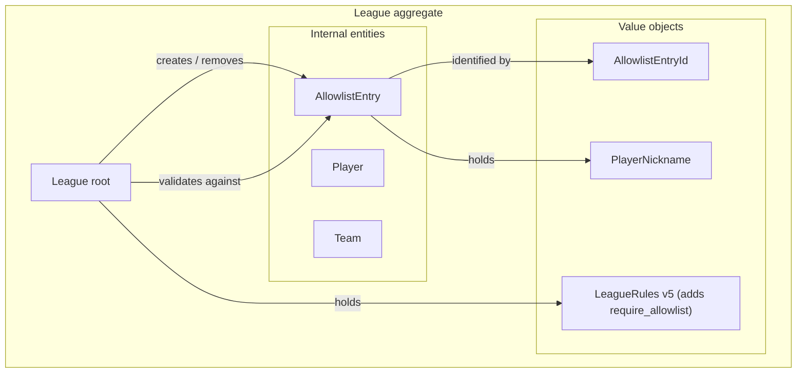

# Allowlist (League rules v5)

## Purpose

The `allowlist` is a host-managed list of player nicknames that are
**allowed to participate** in a given league. It is distinct from the
**roster** (`league.players` / `league.teams`, which records players who have
already played) and from **match participants** (the four nicknames on a
specific recorded match):

| Concept | Meaning | Owner |
|---|---|---|
| `allowlist` | Pre-declared, host-curated allowlist of nicknames who *may* participate. | League aggregate (this doc). |
| `players` (roster) | Players who have already been implicitly registered through a match submission. | League aggregate (existing). |
| `match_participants` | The four nicknames recorded on a single `Match`. | Match aggregate (existing). |

Source guide: [allowlist_ai_agent_guide.md](../../../allowlist_ai_agent_guide.md).

## Scope of this iteration

This doc specifies the **backend** feature only. Two thin context docs at the
repo root capture the follow-on work:

- `allowlist_chat_intents_context.md` (Chat-to-Intent Server)
- `allowlist_frontend_context.md` (vanilla-JS frontend)

In-scope (this iteration):

- New domain entity `AllowlistEntry` carried inside the `League` aggregate.
- Three new use cases (`AddAllowlistEntries`, `RemoveAllowlistEntry`,
  `GetAllowlist`) and three new HTTP endpoints.
- A new opt-in `LeagueRules` field `require_allowlist: bool`
  (default `false`) gating match-submission rejection.
- `LeagueRules` schema bump to **v5** plus alembic migration `006`.

Out of scope:

- No automatic backfill of existing `players` rows into the `allowlist`
  (would conflate "joined" with "allowed").
- No mutation API for `LeagueRules.require_allowlist` after league
  creation — rules remain immutable per
  [16_league_rules_and_match_policies.md](16_league_rules_and_match_policies.md).
- No changes to the chat-to-intent server or frontend in this iteration.

## Domain model

### Aggregate placement

The `allowlist` lives **inside the existing `League` aggregate**, alongside
`players` and `teams`. The allowlist check is per-league, runs in the same
transaction as match submission, and is gated by the host token — exactly the
same consistency boundary used by the existing roster invariants.



### `AllowlistEntry` entity

- Identity: `AllowlistEntryId` (UUID; new value object mirroring `PlayerId`).
- Fields: `allowlist_entry_id`, `nickname` (reuses the existing
  `PlayerNickname` value object — case-insensitive, stripped, lowercased).
- Lifecycle: created by `League.add_allowlist_entries`, removed by
  `League.remove_allowlist_entry`. **Never mutated in place.** A nickname
  change is a remove-then-add.

### Why a separate entity instead of folding into `Player`

- Allowlist membership is **prospective**; a `Player` row implies past
  participation.
- Allowed nicknames may never play and should not pollute roster / standings
  reads.
- Removing a nickname from the allowlist must not delete a `Player`
  record (which is FK'd by `Team` and `Match`).

### `League` aggregate methods (added in this iteration)

```python
def add_allowlist_entries(self, nicknames: list[str]) -> list[AllowlistEntry]:
    """Atomic batch add. Raises AllowlistNicknameAlreadyExistsError if any
    input nickname (after normalization) duplicates an existing allowlist
    nickname or another nickname inside the same batch. On error, no entries
    are added."""

def remove_allowlist_entry(self, allowlist_entry_id: str) -> None:
    """Raises AllowlistEntryNotFoundError if the id is not in the league.
    Removed ids are appended to `pending_deleted_allowlist_entry_ids` so the
    repository can DELETE the row on save."""

def validate_match_participants_allowed(self, nicknames: Iterable[str]) -> None:
    """No-op when self.rules.require_allowlist is False. When True,
    delegates the diff to AllowlistPolicy and raises NotInAllowlistError
    with .missing_nicknames listing every input nickname not present in the
    allowlist."""
```

`pending_deleted_allowlist_entry_ids` mirrors the existing
`pending_deleted_team_ids` pattern (see
[05_aggregate_designs/league.md](05_aggregate_designs/league.md)).

### `AllowlistPolicy`

The diff computation lives in a dedicated policy
(`domain/aggregates/league/policies.py`) rather than inline on the aggregate
method, mirroring `NicknameUniquenessPolicy` and `OneTeamPerPlayerPolicy`:

```python
class AllowlistPolicy:
    def find_missing_nicknames(
        self,
        candidates: Iterable[PlayerNickname],
        allowlist: list[AllowlistEntry],
    ) -> list[str]:
        ...
```

**Two intentional separations** future iterations should preserve:

1. **The rule-flag gate (`if self.rules.require_allowlist: return`)
   stays on the aggregate method, NOT inside the policy.** Each call site
   that consults the policy decides whether and how to gate. This is the same
   pattern as `OneTeamPerPlayerPolicy`, which is wrapped by
   `if enforce_one_team:` inside `register_players_and_team`. When
   `edit_player_nickname` (the named next caller) starts consulting the
   policy, it gets to choose its own gate semantics — e.g. only enforce the
   rule when the *new* nickname is being changed to something not already
   present as a roster `Player`.
2. **The exception (`NotInAllowlistError(...)`) is raised by the
   aggregate method, not by the policy.** Different call sites may want
   different error messages while sharing the same `missing_nicknames`
   payload shape (the chat agent and frontend depend on that contract).

The policy is preemptively extracted at single-call-site state because
`edit_player_nickname` is a committed next iteration. See
`backend_main/harness_notes/01_when_to_extract_a_policy.md` for the
decision rule.

### Invariants

- **Nickname uniqueness within the allowlist (case-insensitive).** Two
  entries with the same normalized nickname cannot coexist.
- **Allowlist is independent of the roster.** A nickname may be on the
  `allowlist` without being in `players`, and vice versa. (The latter is
  possible for any league created before the host populates the list, or
  for any league with `require_allowlist=false`.)
- **`require_allowlist` is consulted only at match submission.** Add /
  remove operations on the allowlist are always allowed regardless of the
  flag; the flag only changes whether `SubmitMatchResultUseCase` calls
  `validate_match_participants_allowed`.

## `LeagueRules` v5

v5 adds one field to v4 (and renames the v4 `require_eligible_players` key
to `require_allowlist`):

| Field | Type | Default | Meaning |
|---|---|---|---|
| `require_allowlist` | `bool` | `false` | When `true`, `SubmitMatchResultUseCase` rejects any submission whose four nicknames include one not present in the `allowlist`. When `false`, the allowlist is informational only (the chat agent may still consult it for name resolution; backend never blocks). |

All other v3/v4 fields are unchanged. The v3 cross-rule
(`(player, OTPP=true)` is rejected) is preserved verbatim.

`LeagueRules.from_dict` accepts inputs of `version` 1, 2, 3, 4, or 5. For
inputs with `version < 5` the `require_allowlist` key is defaulted to
`false` (mirroring how v1 inputs default `ranking_subject` and
`tie_breakers`). For inputs with `version == 4` the legacy
`require_eligible_players` key is read first if present, then mapped to
`require_allowlist`. The returned object always has `version=5`.

`LeagueRules.default_for_new_league()` returns
`require_allowlist=false` so a newly created league with no `rules`
body in the request behaves identically to today.

## Persistence

### New table `allowlist_entries`

```sql
CREATE TABLE allowlist_entries (
    allowlist_entry_id  UUID PRIMARY KEY,
    league_id           UUID NOT NULL
        REFERENCES leagues(league_id) ON DELETE CASCADE,
    nickname_normalized TEXT NOT NULL,
    created_at          TIMESTAMPTZ NOT NULL DEFAULT now(),
    updated_at          TIMESTAMPTZ NOT NULL DEFAULT now(),
    UNIQUE (league_id, nickname_normalized)
);
CREATE INDEX ix_allowlist_entries_league_id ON allowlist_entries(league_id);
```

Schema mirrors `players`: same FK/cascade semantics, same case-insensitive
uniqueness shape. There is **no** FK from `allowlist_entries` to `players`;
the two are decoupled by design.

### `leagues.rules` JSONB

No DDL change — the `require_allowlist` key is added to every existing v4
row's JSONB (taking over the value previously held by
`require_eligible_players`) and the `version` is bumped to `5`.

### Alembic 006

Single migration that does table+column+index+constraint renames *and*
the JSONB key + version rewrite (one logical unit):

```python
revision = "006"
down_revision = "005"

def upgrade() -> None:
    # 1. Rename the table + column + index + constraints.
    op.rename_table("eligible_players", "allowlist_entries")
    op.alter_column(
        "allowlist_entries",
        "eligible_player_id",
        new_column_name="allowlist_entry_id",
    )
    op.execute(
        "ALTER INDEX ix_eligible_players_league_id "
        "RENAME TO ix_allowlist_entries_league_id"
    )
    op.execute(
        "ALTER TABLE allowlist_entries "
        "RENAME CONSTRAINT uq_eligible_players_league_nickname "
        "TO uq_allowlist_entries_league_nickname"
    )
    op.execute(
        "ALTER TABLE allowlist_entries "
        "RENAME CONSTRAINT eligible_players_pkey "
        "TO allowlist_entries_pkey"
    )

    # 2. Bump every v4 leagues.rules row to v5 with require_allowlist.
    op.execute(
        "UPDATE leagues "
        "SET rules = (rules - 'require_eligible_players') "
        "       || jsonb_build_object("
        "              'version', 5, "
        "              'require_allowlist', "
        "              COALESCE((rules->>'require_eligible_players')::bool, false)"
        "          ) "
        "WHERE (rules->>'version')::int = 4"
    )

def downgrade() -> None:
    # Reverse the JSONB rewrite.
    op.execute(
        "UPDATE leagues "
        "SET rules = (rules - 'require_allowlist') "
        "       || jsonb_build_object("
        "              'version', 4, "
        "              'require_eligible_players', "
        "              COALESCE((rules->>'require_allowlist')::bool, false)"
        "          ) "
        "WHERE (rules->>'version')::int = 5"
    )

    # Reverse the table/column/index/constraint renames.
    op.execute(
        "ALTER TABLE allowlist_entries "
        "RENAME CONSTRAINT allowlist_entries_pkey "
        "TO eligible_players_pkey"
    )
    op.execute(
        "ALTER TABLE allowlist_entries "
        "RENAME CONSTRAINT uq_allowlist_entries_league_nickname "
        "TO uq_eligible_players_league_nickname"
    )
    op.execute(
        "ALTER INDEX ix_allowlist_entries_league_id "
        "RENAME TO ix_eligible_players_league_id"
    )
    op.alter_column(
        "allowlist_entries",
        "allowlist_entry_id",
        new_column_name="eligible_player_id",
    )
    op.rename_table("allowlist_entries", "eligible_players")
```

The forward bump is idempotent because of the `WHERE` clause.

## Application layer

### New use cases

| Use case | Writes? | UoW? | Auth |
|---|---|---|---|
| `AddAllowlistEntriesUseCase` | yes | no | `X-Host-Token` |
| `RemoveAllowlistEntryUseCase` | yes | no | `X-Host-Token` |
| `GetAllowlistUseCase` | no | no | `league_id` only |

All three follow the same shape as the existing roster use cases (e.g.
[`EditPlayerNicknameUseCase`](../../../app/application/use_cases/edit_player_nickname_use_case.py)
for writes, [`GetLeagueRosterUseCase`](../../../app/application/use_cases/get_league_roster_use_case.py)
for reads). Writes use `get_by_id_with_lock`; reads use `get_by_id`.

### Modified use case: `CreateLeagueUseCase`

`CreateLeagueUseCase` accepts an optional bootstrap list so a host can seed
the allowlist **in the same transaction** as the league row itself — a
common workflow when a host turns the new `require_allowlist` flag on at
creation time and already knows who is invited.

```python
@dataclass
class CreateLeagueCommand:
    title: str
    description: str | None
    rules: dict[str, Any] | None = None
    allowlist: list[str] = field(default_factory=list)  # NEW
```

Use-case shape (new line only):

```python
league = League.create(command.title, command.description, host_token, rules=rules_vo)

if command.allowlist:                                          # NEW
    league.add_allowlist_entries(command.allowlist)            # NEW

await self._league_repo.save(league)
```

Single-transaction guarantee: the FastAPI request scope owns the
`AsyncSession`. Both the new `LeagueORM` row and every `AllowlistEntryORM`
row are added to that session by one `repo.save(league)` call, and the
session commits at request completion. Either both reach the database or
neither does. There is no second admin call, so the host token returned
to the client is **already** backed by a populated allowlist.

Validation / error shape (delegated entirely to existing layers — nothing
new in the use case):

- Empty list → no-op (`if command.allowlist:` short-circuits;
  byte-identical to the pre-iteration behavior).
- Blank-string entries → rejected at the API layer by
  `CreateLeagueRequest.allowlist_nicknames_must_be_non_blank` (422).
- In-batch duplicate (after normalization) → `League.add_allowlist_entries`
  raises `AllowlistNicknameAlreadyExistsError` **before** `save` is
  called, so the league row is never persisted (409). Verified by the
  `test_duplicate_seeded_allowlist_entry_rejects_whole_creation`
  integration test.

**Independence from `require_allowlist`.** The bootstrap list may be
present even when the flag is `false`; the allowlist is populated but
the rule isn't enforced. This is intentional symmetry with the post-create
`POST /admin/leagues/{league_id}/allowlist` flow, which is also gated only
by the host token, not by the flag.

### Modified use case: `SubmitMatchResultUseCase`

A single new line, just after `get_by_id_with_lock`:

```python
league = await uow.league_repo.get_by_id_with_lock(league_id)
if league is None:
    raise LeagueNotFoundError(...)
league.validate_match_participants_allowed([t1_n1, t1_n2, t2_n1, t2_n2])  # NEW
_, team1 = league.register_players_and_team(t1_n1, t1_n2)
...
```

When `require_allowlist=false` (every existing league after the
migration) this is a no-op and behavior is byte-identical to today.

## API

### New endpoints

| Method | Path | Auth | Use case |
|---|---|---|---|
| `GET` | `/leagues/{league_id}/allowlist` | league_id | `GetAllowlistUseCase` |
| `POST` | `/admin/leagues/{league_id}/allowlist` | league_id + `X-Host-Token` | `AddAllowlistEntriesUseCase` |
| `DELETE` | `/admin/leagues/{league_id}/allowlist/{allowlist_entry_id}` | league_id + `X-Host-Token` | `RemoveAllowlistEntryUseCase` |

### Modified endpoint: `POST /leagues`

`CreateLeagueRequest` (see [13_api_contracts.md](13_api_contracts.md))
gains an optional `allowlist: list[str]` field with default `[]`:

```json
{
  "title": "Summer Doubles 2026",
  "description": "Invite-only club tournament",
  "rules": {
    "version": 5,
    "match_pair_idempotency": "once_per_league",
    "one_team_per_player": true,
    "ranking_subject": "team",
    "tie_breakers": ["matches_won"],
    "require_allowlist": true
  },
  "allowlist": ["Alex", "Daniel", "Jason"]
}
```

Behavior summary:

- Default `[]`: identical to the pre-iteration behavior (no allowlist
  rows created, no migration churn).
- Non-empty list: persisted in the same transaction as the league row.
- Validation: each entry must be a non-blank string (422 from pydantic);
  in-batch duplicates after `PlayerNickname` normalization → 409
  `AllowlistNicknameAlreadyExistsError` (league row not created).

### Request / response shapes

`GET /leagues/{league_id}/allowlist` → `200`

```json
{
  "allowlist": [
    { "allowlist_entry_id": "uuid", "nickname": "alex" }
  ]
}
```

`POST /admin/leagues/{league_id}/allowlist` → `201`

```json
// Request
{ "nicknames": ["Alex", "Daniel", "Jason"] }

// Response
{
  "allowlist": [
    { "allowlist_entry_id": "uuid", "nickname": "alex" },
    { "allowlist_entry_id": "uuid", "nickname": "daniel" },
    { "allowlist_entry_id": "uuid", "nickname": "jason" }
  ]
}
```

The bulk-batch shape matches the natural "host pre-populates the list"
workflow and is atomic — any duplicate (vs existing entries or within the
batch) rejects the entire request with 409. Single-add is just a one-element
list.

`DELETE /admin/leagues/{league_id}/allowlist/{allowlist_entry_id}` → `204`

### New error → HTTP status mapping

| Domain error | HTTP status | Notes |
|---|---|---|
| `AllowlistEntryNotFoundError` | 404 | Unknown `allowlist_entry_id` for this league. |
| `AllowlistNicknameAlreadyExistsError` | 409 | At least one nickname in the bulk POST duplicates another (existing or in-batch). |
| `NotInAllowlistError` | 422 | Submitted match contains nicknames not in the allowlist (only when `require_allowlist=true`). Body includes `missing_nicknames: ["..."]` so clients can render the list verbatim. |

Existing mappings are unchanged. See
[13_api_contracts.md](13_api_contracts.md) for the full table.

`NotInAllowlistError` JSON body:

```json
{
  "error": "NotInAllowlistError",
  "detail": "...",
  "missing_nicknames": ["michael", "ryan"]
}
```

The `missing_nicknames` field is contractual — it's the integration point
for the future chat-server clarification flow described in
`allowlist_chat_intents_context.md`.

## Build order

1. **Domain.** Add `AllowlistEntryId`, `AllowlistEntry`, `League`
   methods, `LeagueRules` v5 with `require_allowlist`, three new
   exception classes.
2. **Application.** Three new use cases; modify
   `SubmitMatchResultUseCase` to call `validate_match_participants_allowed`;
   extend `CreateLeagueUseCase` with the optional `allowlist`
   bootstrap list.
3. **Infrastructure.** `AllowlistEntryORM`, mapper, `LeagueORM` relationship,
   repository read+save changes. The repository's existing `save(league)`
   already iterates `league.allowlist` and inserts any new entries via the
   same session — no additional infrastructure work is needed for inline
   seeding.
4. **Migration.** Alembic 006 (table/column/constraint renames + JSONB
   v4→v5 rewrite).
5. **API.** Pydantic schemas (including the optional `allowlist`
   field on `CreateLeagueRequest` with non-blank entry validation),
   routers (admin + league), `dependencies.py` wiring, exception handlers
   in `main.py`.
6. **Tests.** Unit (domain + application + API), integration (migration +
   repository + atomic create-with-seed), e2e (full host-managed flow +
   rule-on rejection + rule-off no-op).

## Related documents

- [allowlist_ai_agent_guide.md](../../../allowlist_ai_agent_guide.md) — product brief that motivated this feature.
- [16_league_rules_and_match_policies.md](16_league_rules_and_match_policies.md) — `LeagueRules` versioning pattern; `require_allowlist` slots into the same JSONB schema and is added under the same "rules immutable after creation" contract.
- [05_aggregate_designs/league.md](05_aggregate_designs/league.md) — League aggregate contract; updated in parallel with this doc to add the `AllowlistEntry` entity.
- [13_api_contracts.md](13_api_contracts.md) — endpoint catalog; updated in parallel with this doc to add the three new endpoints.
- `allowlist_chat_intents_context.md` (repo root) — proposed chat-intent surface for a follow-up iteration.
- `allowlist_frontend_context.md` (repo root) — proposed UI surface for a follow-up iteration.
