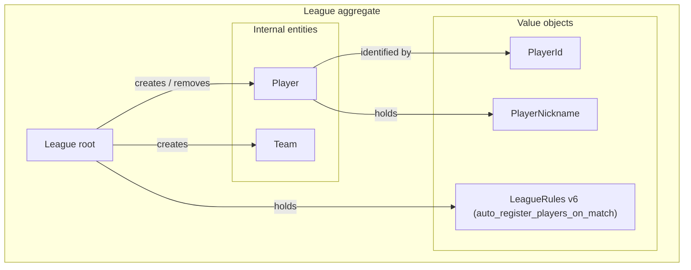

# Roster pre-registration (League rules v6)

## Purpose

Hosts can pre-register player nicknames on a league **before** any match
is recorded, and can hard-delete pre-registered nicknames that have not
yet been involved in any team or match. The optional
`LeagueRules.auto_register_players_on_match` flag (default `True`)
controls whether new nicknames may also appear for the first time on a
match submission, or whether only roster members may play.

This doc supersedes the v5 `20_allowlist.md`. The v6 refactor retired
the `AllowlistEntry` entity, the `allowlist_entries` side table, the
three allowlist intents, the host allowlist panel, the
`require_allowlist` rule, and `AllowlistPolicy`. Pre-registration is
now a first-class operation that writes `Player` rows directly.

| Concept | Meaning | Owner |
|---|---|---|
| `players` (roster) | Every nickname registered on the league — either pre-registered via `add_players`, or auto-registered on first confirmed match submission. | League aggregate (this doc). |
| `match_participants` | The four nicknames recorded on a single `Match`. | Match aggregate (existing). |

## Scope of this iteration

In-scope:

- Aggregate methods `League.add_players`, `League.remove_player`,
  `League.validate_match_participants_on_roster`.
- Stateless predicate `RosterMembershipPolicy.find_missing_nicknames`.
- Two new use cases (`AddPlayersUseCase`,
  `RemovePlayerFromRosterUseCase`) and two new admin HTTP endpoints.
- New `LeagueRules` field `auto_register_players_on_match: bool` (default
  `True`) gating match-submission rejection — replaces v5's
  `require_allowlist` and **inverts the boolean** so that defaults
  preserve today's open-league UX.
- `LeagueRules` schema bump to **v6** plus alembic migration `007` that
  drops `allowlist_entries` and rewrites the JSONB v5→v6.
- New domain errors `RosterMembershipRequiredError`,
  `PlayerHasParticipationError`.

Out of scope:

- Mutation API for `LeagueRules.auto_register_players_on_match` after
  league creation — rules remain immutable per
  [16_league_rules_and_match_policies.md](16_league_rules_and_match_policies.md).
- Soft-delete of players. Removal is hard-delete (`DELETE players`),
  gated by `teams_count == 0 AND matches_count == 0`.

## Domain model

### Aggregate placement

The roster lives **inside the existing `League` aggregate**, alongside
`teams`. There is no separate side table — the v5 `allowlist_entries`
table is dropped by alembic `007`.



### `League` aggregate methods

```python
def add_players(self, nicknames: list[str]) -> list[Player]:
    """Atomic batch add. Raises NicknameAlreadyInUseError if any input
    nickname (after normalization) duplicates an existing roster nickname
    or another nickname inside the same batch. On error, no players are
    added.

    Each input nickname creates a fresh Player row with a generated
    PlayerId. The repository's existing save(league) loop picks them up
    in the same transaction."""

def remove_player(self, player_id: str) -> None:
    """Hard-delete iff the player has zero teams and zero matches.
    Raises PlayerNotFoundError if the id is not in the league. Raises
    PlayerHasParticipationError(teams_count, matches_count) if the
    player belongs to any team or appears in any match — the host must
    delete the team or match first. Removed ids are appended to
    pending_deleted_player_ids so the repository can DELETE the row on
    save."""

def validate_match_participants_on_roster(self, nicknames: Iterable[str]) -> None:
    """No-op when self.rules.auto_register_players_on_match is True
    (the default). When False, delegates the diff to
    RosterMembershipPolicy and raises RosterMembershipRequiredError
    with .missing_nicknames listing every input nickname not present
    in the roster."""
```

`pending_deleted_player_ids` mirrors the existing
`pending_deleted_team_ids` pattern (see
[05_aggregate_designs/league.md](05_aggregate_designs/league.md)).

### `RosterMembershipPolicy`

The diff computation lives in a dedicated policy
(`domain/aggregates/league/policies.py`) rather than inline on the
aggregate method, mirroring `NicknameUniquenessPolicy` and
`OneTeamPerPlayerPolicy`:

```python
class RosterMembershipPolicy:
    def find_missing_nicknames(
        self,
        candidates: Iterable[PlayerNickname],
        players: list[Player],
    ) -> list[str]:
        ...
```

**Two intentional separations** future iterations should preserve:

1. **The rule-flag gate
   (`if self.rules.auto_register_players_on_match: return`) stays on the
   aggregate method, NOT inside the policy.** Each call site that
   consults the policy decides whether and how to gate. This is the
   same pattern as `OneTeamPerPlayerPolicy`. When `edit_player_nickname`
   (the committed next caller) starts consulting the policy, it gets to
   choose its own gate semantics — e.g. only enforce when the *new*
   nickname is being changed to something not already on the roster.
2. **The exception (`RosterMembershipRequiredError(...)`) is raised by
   the aggregate method, not by the policy.** Different call sites may
   want different error messages while sharing the same
   `missing_nicknames` payload shape.

See [`harness_notes/01_when_to_extract_a_policy.md`](../../../harness_notes/01_when_to_extract_a_policy.md)
for the extraction decision rule. The policy itself is unchanged from
v5; only the name (`AllowlistPolicy` → `RosterMembershipPolicy`) and
the data shape (the second argument now binds to `self.players`, not a
separate allowlist list) moved.

### Invariants

- **Nickname uniqueness within the roster (case-insensitive).** Two
  players with the same normalized nickname cannot coexist on the same
  league.
- **`add_players` creates fresh `Player` rows.** No link-to-existing
  semantics are needed because the roster IS the player list — every
  nickname is either already in `self.players` (→ duplicate error) or
  about to be appended.
- **`remove_player` is reversible only via a fresh `add_players` call.**
  The Player row, its UUID, and its match history are all gone. This is
  the intentional hard-delete semantics — soft-delete or tombstones
  would require a second concept that the v6 refactor explicitly avoids.
- **`auto_register_players_on_match` is consulted only at match
  submission.** `add_players` / `remove_player` always run regardless
  of the flag; the flag only changes whether
  `SubmitMatchResultUseCase` calls
  `validate_match_participants_on_roster`.

## `LeagueRules` v6

v6 replaces v5's `require_allowlist` with the inverted-default
`auto_register_players_on_match`:

| Field | Type | Default | Meaning |
|---|---|---|---|
| `auto_register_players_on_match` | `bool` | `true` | When `true`, `SubmitMatchResultUseCase` accepts any submission and auto-registers any new nicknames via `register_players_and_team`. When `false`, the use case rejects submissions whose four nicknames include one not present in `self.players`. |

All other v3/v4/v5 fields are unchanged. The v3 cross-rule
(`(player, OTPP=true)` is rejected) is preserved verbatim.

### Default flip rationale

v5 chose `require_allowlist=false` as the default so the allowlist
feature was opt-in and existing leagues kept their open-registration
UX. The v6 rename inverts the boolean (so `True` now means "stays
open") which keeps the default semantics byte-identical while
expressing the rule more directly: "the league auto-registers new
players on match" is something a host can reason about; the v5 reverse
phrasing required mentally flipping the flag.

The v5→v6 alembic migration inverts the persisted JSONB boolean so
existing leagues land on the same effective behavior:

| v5 `require_allowlist` | v6 `auto_register_players_on_match` |
|---|---|
| `false` (open league) | `true` |
| `true` (closed league) | `false` |

### `from_dict` upgrade chain

`LeagueRules.from_dict` accepts inputs of `version` 1, 2, 3, 4, 5, or 6:

- v6 input: passed through unchanged.
- v5 input: legacy `require_allowlist` key is inverted into
  `auto_register_players_on_match`.
- v4 input: legacy `require_eligible_players` key is inverted (v4 had
  the same closed-league semantics as v5).
- v1–v3 input: defaulted to `auto_register_players_on_match=true`
  (mirrors the v5 default-defaults-to-open behavior).

The returned object always has `version=6`.

## Persistence

### Dropped table `allowlist_entries`

Alembic `007` drops the v5 `allowlist_entries` table and its
`ix_allowlist_entries_league_id` index. There is no replacement; the
`players` table fully serves the roster.

### `leagues.rules` JSONB

No DDL change — alembic `007` rewrites every existing v5 row's JSONB to
v6, dropping `require_allowlist` and adding
`auto_register_players_on_match` with the inverted boolean.

### Alembic 007

```python
revision = "007"
down_revision = "006"

def upgrade() -> None:
    op.drop_index("ix_allowlist_entries_league_id", table_name="allowlist_entries")
    op.drop_table("allowlist_entries")

    op.execute(
        "UPDATE leagues "
        "SET rules = (rules - 'require_allowlist') "
        "       || jsonb_build_object("
        "              'version', 6, "
        "              'auto_register_players_on_match', "
        "              NOT COALESCE((rules->>'require_allowlist')::bool, false)"
        "          ) "
        "WHERE (rules->>'version')::int = 5"
    )

def downgrade() -> None:
    op.execute(
        "UPDATE leagues "
        "SET rules = (rules - 'auto_register_players_on_match') "
        "       || jsonb_build_object("
        "              'version', 5, "
        "              'require_allowlist', "
        "              NOT COALESCE((rules->>'auto_register_players_on_match')::bool, true)"
        "          ) "
        "WHERE (rules->>'version')::int = 6"
    )
    # Recreate allowlist_entries empty; pre-v5 leagues that have added
    # roster players via v6 lose nothing because the side table never
    # tracked them.
    ...
```

The downgrade can recreate `allowlist_entries` empty and restore the
JSONB v5 key, but the table is **not** repopulated. Pre-registered
players added via the v6 path remain on the roster.

### Repository load: per-player participation count

`SqlAlchemyLeagueRepository` now surfaces `Player.match_count` (and
implicitly, `teams_count` via the existing `teams` collection) on every
aggregate load so `League.remove_player` can enforce its
zero-participation guard. The count is computed by a small grouped
query the repository runs in the same load batch (`SELECT player_id,
COUNT(match_id) ... GROUP BY player_id`) and attached as a transient
field on the `Player` domain entity.

## Application layer

### New use cases

| Use case | Writes? | UoW? | Auth |
|---|---|---|---|
| `AddPlayersUseCase` | yes | no | `X-Host-Token` |
| `RemovePlayerFromRosterUseCase` | yes | no | `X-Host-Token` |

Both follow the same shape as the existing roster use cases. Writes use
`get_by_id_with_lock`; the read path is the existing
`GetLeagueRosterUseCase` (no new read use case is required because
pre-registered players already surface in `players`).

### Modified use case: `CreateLeagueUseCase`

`CreateLeagueUseCase` accepts an optional bootstrap list so a host can
seed the roster **in the same transaction** as the league row itself
— useful when a host turns `auto_register_players_on_match=false` on at
creation time and already knows who is invited.

```python
@dataclass
class CreateLeagueCommand:
    title: str
    description: str | None
    rules: dict[str, Any] | None = None
    initial_players: list[str] = field(default_factory=list)  # renamed from allowlist
```

```python
league = League.create(command.title, command.description, host_token, rules=rules_vo)

if command.initial_players:
    league.add_players(command.initial_players)

await self._league_repo.save(league)
```

Single-transaction guarantee unchanged from v5: every new `PlayerORM`
row created by `add_players` is added to the same session as
`LeagueORM` and the session commits at request completion. Either all
rows reach the database or none do.

Validation / error shape:

- Empty list → no-op.
- Blank-string entries → rejected at the API layer (422).
- In-batch duplicate (after normalization) →
  `NicknameAlreadyInUseError` (409, league row not created).

### Modified use case: `SubmitMatchResultUseCase`

A single rename of the gate call:

```python
league = await uow.league_repo.get_by_id_with_lock(league_id)
if league is None:
    raise LeagueNotFoundError(...)
league.validate_match_participants_on_roster([t1_n1, t1_n2, t2_n1, t2_n2])
_, team1 = league.register_players_and_team(t1_n1, t1_n2)
...
```

When `auto_register_players_on_match=true` (the default for every
post-007 league) this is a no-op and behavior is byte-identical to
today's open-league flow. When `false`, `register_players_and_team` is
never reached for a missing nickname; the use case raises
`RosterMembershipRequiredError` with `missing_nicknames`.

## API

### New endpoints

| Method | Path | Auth | Use case |
|---|---|---|---|
| `POST` | `/admin/leagues/{league_id}/players` | `league_id` + `X-Host-Token` | `AddPlayersUseCase` |
| `DELETE` | `/admin/leagues/{league_id}/players/{player_id}` | `league_id` + `X-Host-Token` | `RemovePlayerFromRosterUseCase` |

The existing `GET /leagues/{league_id}/roster` already returns the full
roster (including pre-registered, zero-match players) — no new read
endpoint is required.

### Modified endpoint: `POST /leagues`

`CreateLeagueRequest` (see [13_api_contracts.md](13_api_contracts.md))
swaps the v5 optional `allowlist: list[str]` field for `initial_players:
list[str]` with default `[]`:

```json
{
  "title": "Summer Doubles 2026",
  "description": "Invite-only club tournament",
  "league_timezone": "America/Los_Angeles",
  "rules": {
    "version": 7,
    "match_pair_idempotency": "once_per_league",
    "one_team_per_player": true,
    "ranking_subject": "team",
    "tie_breakers": ["matches_won"],
    "auto_register_players_on_match": false
  },
  "initial_players": ["Alex", "Daniel", "Jason"]
}
```

Behavior summary:

- Default `[]`: identical to today's create flow (no `Player` rows
  created).
- Non-empty list: persisted in the same transaction as the league row;
  one `Player` row per input nickname.
- Validation: each entry must be a non-blank string (422 from pydantic);
  in-batch duplicates after `PlayerNickname` normalization → 409
  `NicknameAlreadyInUseError` (league row not created).

### Request / response shapes

`POST /admin/leagues/{league_id}/players` → `201`

```json
// Request
{ "nicknames": ["Alex", "Daniel", "Jason"] }

// Response
{
  "players": [
    { "player_id": "uuid", "nickname": "alex" },
    { "player_id": "uuid", "nickname": "daniel" },
    { "player_id": "uuid", "nickname": "jason" }
  ]
}
```

The batch is atomic — any duplicate (vs existing roster or within the
batch) rejects the entire request with 409. Single-add is just a
one-element list.

`DELETE /admin/leagues/{league_id}/players/{player_id}` → `204` on
success, `409` on `PlayerHasParticipationError`.

### Error → HTTP status mapping

| Domain error | HTTP status | Notes |
|---|---|---|
| `NicknameAlreadyInUseError` | 409 | At least one nickname in the POST duplicates another (existing roster or in-batch). |
| `PlayerHasParticipationError` | 409 | DELETE rejected because the target player is on a team or in a match. Body includes `teams_count`, `matches_count`. |
| `PlayerNotFoundError` | 404 | DELETE target id is not on this league's roster. |
| `RosterMembershipRequiredError` | 422 | Submitted match contains nicknames not on the roster (only when `auto_register_players_on_match=false`). Body includes `missing_nicknames: ["..."]` so clients can render the list verbatim. |

`RosterMembershipRequiredError` JSON body:

```json
{
  "error": "RosterMembershipRequiredError",
  "detail": "...",
  "missing_nicknames": ["michael", "ryan"]
}
```

The `missing_nicknames` field is contractual — the frontend reads it
directly from the structured body, never by parsing `detail`.

`PlayerHasParticipationError` JSON body:

```json
{
  "error": "PlayerHasParticipationError",
  "detail": "...",
  "teams_count": 1,
  "matches_count": 3
}
```

## Build order

1. **Domain.** Drop `AllowlistEntry`, `AllowlistEntryId`,
   `AllowlistPolicy`, and the three allowlist errors. Add
   `add_players`, `remove_player`,
   `validate_match_participants_on_roster`,
   `RosterMembershipPolicy`, `RosterMembershipRequiredError`,
   `PlayerHasParticipationError`. Add `Player.match_count` (transient
   field). Bump `LeagueRules` to v6 with `auto_register_players_on_match`
   and the v5→v6 inversion in `from_dict`.
2. **Application.** Add `AddPlayersUseCase` and
   `RemovePlayerFromRosterUseCase`; rename
   `CreateLeagueCommand.allowlist` → `initial_players`; rename the
   match-submit gate call to `validate_match_participants_on_roster`.
3. **API.** Delete the three allowlist endpoints; add the two new
   `players` endpoints; swap `CreateLeagueRequest.allowlist` →
   `initial_players`; rewrite the exception handlers in `main.py`.
4. **Infrastructure.** Drop `AllowlistEntryORM` and the allowlist
   mapper; rewrite the repository to surface per-player participation
   counts on load.
5. **Migration.** Alembic `007` (drop `allowlist_entries`, rewrite
   JSONB v5 → v6 with inverted boolean).
6. **Tests.** Domain (`add_players`, `remove_player`,
   `validate_match_participants_on_roster`,
   `RosterMembershipPolicy`); application (the two new use cases plus
   the rename in `CreateLeagueUseCase` and
   `SubmitMatchResultUseCase`); API (`TestAddPlayers`,
   `TestRemovePlayerFromRoster`,
   `TestRosterMembershipRequiredOnSubmit`); integration (alembic 007
   upgrade idempotency + downgrade; repo participation-count
   round-trip; create-with-bootstrap atomicity); e2e
   (`tests/e2e/test_admin_api.py` — full host-managed flow,
   remove-if-unused, remove-blocked-by-team, strict-roster match
   rejection).

## Related documents

- [05_aggregate_designs/league.md](05_aggregate_designs/league.md) — League aggregate contract; updated in parallel with this doc to drop `AllowlistEntry` and add the roster pre-registration methods.
- [16_league_rules_and_match_policies.md](16_league_rules_and_match_policies.md) — `LeagueRules` versioning pattern; `auto_register_players_on_match` slots into the same JSONB schema under the same "rules immutable after creation" contract.
- [13_api_contracts.md](13_api_contracts.md) — endpoint catalog; updated in parallel with this doc.
- [`harness_notes/01_when_to_extract_a_policy.md`](../../../harness_notes/01_when_to_extract_a_policy.md) — decision rule that justified extracting `RosterMembershipPolicy` (née `AllowlistPolicy`).
