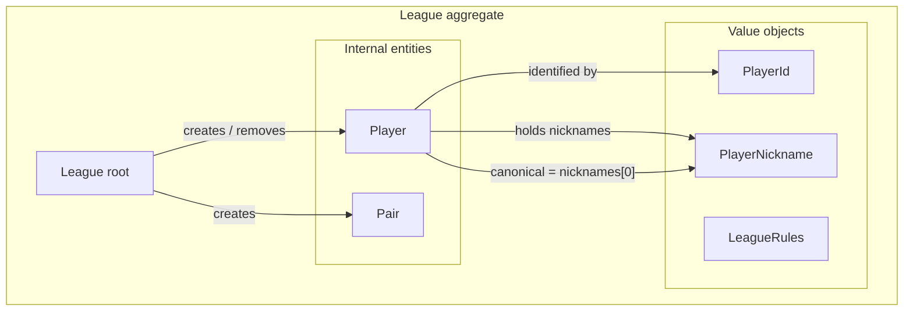

# Player aliases

## Purpose

A single roster `Player` can be referred to by **multiple nicknames**
(aliases) in addition to a single canonical nickname. All
nickname-based lookups inside the league — match submission, roster
search, the two `by-player` read endpoints, and roster-collision
detection on add — match against the **union of every alias** on
every player. Display surfaces continue to render the canonical
nickname only, except for the roster panel which shows aliases as
metadata.

This doc supersedes nothing. It extends the v6 roster work
([20_roster_pre_registration.md](20_roster_pre_registration.md)) by
generalising "the player has one nickname" to "the player has one
canonical nickname plus zero or more aliases".

| Concept | Meaning | Owner |
|---|---|---|
| Canonical nickname | The single human-display name for a `Player`. Exactly one per player. Used in every table and label. | `League` aggregate (this doc). |
| Alias | An additional nickname that resolves to the same `PlayerId`. Zero or more per player. Surfaced in the roster panel only. | `League` aggregate (this doc). |
| `Player.nicknames` | Domain collection: `list[PlayerNickname]`, non-empty, index 0 = canonical. | `League` aggregate. |
| `player_aliases` | Persistence table. Rows are unique within a league; one row per (player, alias). Exactly one row per player has `is_canonical=true`. | Persistence layer. |

`PlayerId` remains the only identity. Match history, pairs, standings,
and chat-server URL templates all continue to key off `PlayerId`.

## Scope of this iteration

In-scope:

- `Player.nicknames: list[PlayerNickname]` replaces the single
  `Player.nickname` field. `nicknames[0]` is the canonical; the rest
  are aliases (insertion-ordered by `created_at`, ties broken by
  `alias_normalized` ASC).
- New aggregate methods `League.add_alias_to_player`,
  `League.remove_alias_from_player`. The existing
  `League.edit_player_nickname` is generalised to "set canonical"
  (rename canonical, or promote an existing alias).
- `NicknameUniquenessPolicy` and `RosterMembershipPolicy` updated to
  match against the alias union. `OnePairPerPlayerPolicy` is
  unchanged (works on `PlayerId`).
- Two new admin HTTP endpoints
  (`POST /admin/leagues/{lid}/players/{pid}/aliases` and
  `DELETE /admin/leagues/{lid}/players/{pid}/aliases/{alias}`).
- `GET /leagues/{lid}/roster` adds an additive
  `aliases: list[str]` field per player (extras only — does not
  include the canonical).
- Alembic migration `012` creates `player_aliases`, backfills one
  canonical row per existing `players` row, and drops
  `players.nickname_normalized` together with the
  `uq_players_league_nickname` constraint.
- New domain errors `LastNicknameError` (cannot remove the only
  nickname) and `CannotRemoveCanonicalNicknameError` (must promote
  a different alias first).
- One subtle correctness fix: the pre-aggregate
  same-player-on-both-pairs string check in
  `SubmitMatchResultUseCase` is moved into the aggregate (after
  alias resolution) so two aliases of the same player on opposing
  pairs are detected.
- Frontend: roster / Get-Players panel renders
  `canonical (alias1, alias2)` when aliases are present; the search
  input filters against the alias union; `@`-mention autocomplete
  matches against the alias union but always inserts the canonical.
  No other panel changes.

Out of scope:

- Chat-to-intent server alias-aware name resolution. The chat server
  is read-only and already resolves names via
  `GET /leagues/{lid}/roster`; once that read surfaces `aliases`,
  intent handlers can pick it up incrementally without a contract
  change. Tracked as a follow-up.
- Bulk alias import from CSV.
- Per-alias metadata (e.g. "preferred for tournaments only").
  Aliases are equal in resolution power.
- Soft-delete / tombstones for aliases. Removal is hard-delete on
  `player_aliases`.

## Domain model

### Aggregate placement

Aliases live **inside the existing `League` aggregate** as a
collection on each `Player`. There is no new aggregate and no side
entity — aliases are a property of the `Player` child entity, in the
same way `nickname` is today.



### `Player` entity

`Player.nickname: PlayerNickname` becomes
`Player.nicknames: list[PlayerNickname]` with the invariants:

- Always non-empty after construction (`__post_init__` guards).
- `nicknames[0]` is the canonical. Display surfaces read this.
- Aliases beyond index 0 are unordered semantically; the repository
  loads them in `created_at ASC, alias_normalized ASC` order so
  display is stable across reloads.

```python
@dataclass
class Player:
    player_id: PlayerId
    nicknames: list[PlayerNickname]
    rating: float | None = None
    match_count: int = 0

    def __post_init__(self) -> None:
        if not self.nicknames:
            raise ValueError("Player must have at least one nickname")

    @property
    def canonical_nickname(self) -> PlayerNickname:
        return self.nicknames[0]

    @property
    def aliases(self) -> list[PlayerNickname]:
        return self.nicknames[1:]

    def has_nickname(self, candidate: PlayerNickname) -> bool:
        return any(n == candidate for n in self.nicknames)
```

### `League` aggregate methods

The four existing nickname call sites all route through
`_find_player_by_nickname`. The single-line change there is the
chokepoint that makes every existing path alias-aware:

```python
def _find_player_by_nickname(self, nickname: PlayerNickname) -> Player | None:
    for p in self.players:
        if p.has_nickname(nickname):
            return p
    return None
```

New aggregate methods:

```python
def add_alias_to_player(self, player_id: str, alias: str) -> Player:
    """Append a new alias to the player. Raises PlayerNotFoundError
    if the id is not on the roster. Raises NicknameAlreadyInUseError
    if the alias collides with any nickname (canonical or alias) of
    any player in the league, including this one."""

def remove_alias_from_player(self, player_id: str, alias: str) -> Player:
    """Remove a non-canonical alias. Raises PlayerNotFoundError if
    the id is not on the roster. Raises
    CannotRemoveCanonicalNicknameError if the requested alias is the
    canonical (caller must promote a different alias first via
    edit_player_nickname). Raises ValueError if the alias is not on
    the player's list."""
```

Modified aggregate method:

```python
def edit_player_nickname(self, player_id: str, new_nickname: str) -> Player:
    """Set the canonical nickname.

    Three cases:
    1. new_nickname is already this player's canonical → no-op.
    2. new_nickname is one of this player's aliases → promote it
       (swap with index 0).
    3. new_nickname is a fresh string → check uniqueness across the
       league (NicknameUniquenessPolicy), replace nicknames[0] in
       place. The previous canonical is discarded — it does NOT
       become an alias automatically. (If the host wants to keep it,
       they add it as an alias first, then rename.)

    Raises PlayerNotFoundError, NicknameAlreadyInUseError as before."""
```

`add_players` and `register_players_and_pair` are unchanged at the
call site, but the `Player` they build now starts with
`nicknames=[PlayerNickname(input)]`. New players begin life with
zero aliases.

### Policy changes

**`NicknameUniquenessPolicy`** — the single comparison
`p.nickname == proposed` becomes a union match:

```python
class NicknameUniquenessPolicy:
    def is_nickname_available(
        self,
        proposed: PlayerNickname,
        players: list[Player],
        exclude_player_id: PlayerId | None = None,
    ) -> bool:
        for player in players:
            if exclude_player_id is not None and player.player_id == exclude_player_id:
                continue
            if player.has_nickname(proposed):
                return False
        return True
```

**`RosterMembershipPolicy`** — the roster set becomes a flat union:

```python
roster_set = {n.value for player in players for n in player.nicknames}
```

**`OnePairPerPlayerPolicy`** — unchanged. Operates on `PlayerId`,
never touches nicknames.

### New domain errors

```python
class LastNicknameError(DomainError):
    """Cannot leave a Player with zero nicknames. Today only raised
    by remove_alias_from_player when the player has exactly one
    nickname (i.e. the canonical). Belt-and-suspenders — the
    canonical-removal guard catches this case first, but the
    invariant is worth its own error type for callers that build
    custom flows."""

class CannotRemoveCanonicalNicknameError(DomainError):
    """remove_alias_from_player rejected because the requested alias
    is the canonical. The caller must promote a different alias to
    canonical (via edit_player_nickname) before removing the
    previous canonical name."""
```

### Same-player-on-both-pairs correctness fix

Today, `SubmitMatchResultUseCase` performs the
`SamePlayerOnBothPairsError` check by string-set intersection on the
four submitted nicknames before the aggregate is loaded. With
aliases this is unsound: "alice and bob vs ali and dan", where `ali`
is an alias of `alice`, would be silently accepted.

The fix is to move the check into the aggregate, after alias
resolution. After `register_players_and_pair` resolves both pairs,
compare the resulting `PlayerId` sets:

```python
pair1_pids = {pair1.player_id_1, pair1.player_id_2}
pair2_pids = {pair2.player_id_1, pair2.player_id_2}
if pair1_pids & pair2_pids:
    raise SamePlayerOnBothPairsError(...)
```

The pre-aggregate string-set check stays as a fast-path early exit
for the trivially-identical case (`t1_n1 == t2_n1` etc.), but the
authoritative check is post-resolution.

### Invariants (additions to v6)

- **Every Player has at least one nickname.** Enforced by
  `Player.__post_init__` and by `LastNicknameError` /
  `CannotRemoveCanonicalNicknameError`.
- **No two players in the same league share any nickname (canonical
  or alias).** Enforced both at the DB level
  (`UNIQUE (league_id, alias_normalized)` on `player_aliases`) and
  at the domain level (`NicknameUniquenessPolicy`).
- **Exactly one canonical nickname per player.** Enforced by the
  partial unique index `WHERE is_canonical` on `player_aliases`.
- **`Player.canonical_nickname` is immutable except via
  `edit_player_nickname`.** No code path mutates `nicknames[0]`
  directly.

## Persistence

### New table `player_aliases`

```sql
CREATE TABLE player_aliases (
    player_id        UUID NOT NULL REFERENCES players(player_id) ON DELETE CASCADE,
    league_id        UUID NOT NULL,
    alias_normalized TEXT NOT NULL,
    is_canonical     BOOLEAN NOT NULL DEFAULT FALSE,
    created_at       TIMESTAMPTZ NOT NULL DEFAULT now(),
    PRIMARY KEY (player_id, alias_normalized),
    UNIQUE (league_id, alias_normalized)
);

CREATE UNIQUE INDEX uq_player_aliases_canonical
    ON player_aliases (player_id) WHERE is_canonical;

CREATE INDEX ix_player_aliases_league_alias
    ON player_aliases (league_id, alias_normalized);
```

The `(league_id, alias_normalized)` UNIQUE is the load-bearing
constraint. It enforces "no name collides with any other name —
canonical or alias — anywhere in the league" in a single index. No
app-level cross-table check is needed, and no race between concurrent
admin requests.

The partial unique index `WHERE is_canonical` enforces "exactly one
canonical per player" at the DB level. Any code path that promotes a
new canonical must first demote the old one in the same transaction
(or use a deferred constraint). The `edit_player_nickname` use case
performs this as a `SET is_canonical = (alias_normalized = :new)`
update — atomic.

### Dropped column and constraint on `players`

Alembic `012` removes the `players.nickname_normalized` column and
its `uq_players_league_nickname` UNIQUE constraint. After the
migration, the `players` table is name-free; it carries identity
(`player_id`, `league_id`), metadata (`rating`), and timestamps.

### Alembic 012

```python
revision = "012"
down_revision = "011"

def upgrade() -> None:
    op.create_table(
        "player_aliases",
        sa.Column("player_id", postgresql.UUID(as_uuid=True), nullable=False),
        sa.Column("league_id", postgresql.UUID(as_uuid=True), nullable=False),
        sa.Column("alias_normalized", sa.String(), nullable=False),
        sa.Column("is_canonical", sa.Boolean(), nullable=False, server_default=sa.false()),
        sa.Column("created_at", sa.DateTime(timezone=True), server_default=sa.func.now(), nullable=False),
        sa.ForeignKeyConstraint(["player_id"], ["players.player_id"], ondelete="CASCADE"),
        sa.PrimaryKeyConstraint("player_id", "alias_normalized"),
        sa.UniqueConstraint("league_id", "alias_normalized", name="uq_player_aliases_league_alias"),
    )
    op.create_index(
        "uq_player_aliases_canonical",
        "player_aliases",
        ["player_id"],
        unique=True,
        postgresql_where=sa.text("is_canonical"),
    )
    op.create_index(
        "ix_player_aliases_league_alias",
        "player_aliases",
        ["league_id", "alias_normalized"],
    )

    op.execute(
        "INSERT INTO player_aliases (player_id, league_id, alias_normalized, is_canonical) "
        "SELECT player_id, league_id, nickname_normalized, true FROM players"
    )

    op.drop_constraint("uq_players_league_nickname", "players", type_="unique")
    op.drop_column("players", "nickname_normalized")


def downgrade() -> None:
    op.add_column(
        "players",
        sa.Column("nickname_normalized", sa.String(), nullable=True),
    )
    op.execute(
        "UPDATE players p "
        "SET nickname_normalized = pa.alias_normalized "
        "FROM player_aliases pa "
        "WHERE pa.player_id = p.player_id AND pa.is_canonical"
    )
    op.alter_column("players", "nickname_normalized", nullable=False)
    op.create_unique_constraint(
        "uq_players_league_nickname",
        "players",
        ["league_id", "nickname_normalized"],
    )
    op.drop_index("ix_player_aliases_league_alias", table_name="player_aliases")
    op.drop_index("uq_player_aliases_canonical", table_name="player_aliases")
    op.drop_table("player_aliases")
```

The downgrade restores the canonical name to `players` and drops
`player_aliases`. **Any non-canonical aliases added since the upgrade
are lost on downgrade** — this is the same forward-only character as
the v6 allowlist drop (alembic `007`). The migration's docstring
should call this out.

### ORM and mapper

`PlayerORM` loses `nickname_normalized`; gains a relationship:

```python
class PlayerORM(Base):
    __tablename__ = "players"
    __table_args__ = (Index("ix_players_league_id", "league_id"),)
    player_id: Mapped[uuid.UUID] = mapped_column(UUID(as_uuid=True), primary_key=True)
    league_id: Mapped[uuid.UUID] = mapped_column(...)
    rating: Mapped[float | None] = mapped_column(Float, nullable=True)
    created_at: Mapped[datetime] = mapped_column(...)
    updated_at: Mapped[datetime] = mapped_column(...)

    aliases: Mapped[list[PlayerAliasORM]] = relationship(
        "PlayerAliasORM",
        back_populates="player",
        cascade="all, delete-orphan",
        order_by="(PlayerAliasORM.is_canonical.desc(), PlayerAliasORM.created_at.asc(), PlayerAliasORM.alias_normalized.asc())",
    )


class PlayerAliasORM(Base):
    __tablename__ = "player_aliases"
    player_id: Mapped[uuid.UUID] = mapped_column(UUID(as_uuid=True), ForeignKey("players.player_id", ondelete="CASCADE"), primary_key=True)
    league_id: Mapped[uuid.UUID] = mapped_column(UUID(as_uuid=True), nullable=False)
    alias_normalized: Mapped[str] = mapped_column(String, primary_key=True)
    is_canonical: Mapped[bool] = mapped_column(Boolean, nullable=False, server_default=expression.false())
    created_at: Mapped[datetime] = mapped_column(...)

    player: Mapped[PlayerORM] = relationship("PlayerORM", back_populates="aliases")
```

`player_to_domain` builds the domain `Player` from the ordered alias
list (canonical first):

```python
def player_to_domain(orm: PlayerORM) -> Player:
    return Player(
        player_id=PlayerId(value=orm.player_id),
        nicknames=[PlayerNickname(a.alias_normalized) for a in orm.aliases],
        rating=orm.rating,
    )
```

`player_to_orm` and the repository's `save(league)` path apply alias
deltas. The `League` aggregate accumulates pending alias adds /
removes / canonical-changes on a per-player basis (mirrors the
existing `pending_deleted_pair_ids` / `pending_deleted_player_ids`
patterns) so the repository can translate them to INSERT / DELETE /
UPDATE statements without diffing the full alias collection.

## Application layer

### New use cases

| Use case | Writes? | UoW? | Auth |
|---|---|---|---|
| `AddAliasToPlayerUseCase` | yes | no | `X-Host-Token` |
| `RemoveAliasFromPlayerUseCase` | yes | no | `X-Host-Token` |

Both load the league via `get_by_id_with_lock`, call the corresponding
aggregate method, and `save`. Same shape as `EditPlayerNicknameUseCase`.

### Modified use cases

`EditPlayerNicknameUseCase` — body unchanged. The aggregate method
now handles the three-case logic (no-op / promote alias / replace
canonical) internally; the use case still just calls
`league.edit_player_nickname(player_id, new_nickname)`.

`SubmitMatchResultUseCase` — drop the pre-aggregate
same-player-on-both-pairs string check; the aggregate now performs
the authoritative check post-resolution (see "Same-player-on-both-pairs
correctness fix" above). The pre-aggregate fast-path for trivially
identical strings stays.

`GetMatchHistoryByPlayerUseCase` and `GetStandingsByPlayerUseCase` —
swap the exact-match scan for `p.has_nickname(normalized_name)`. No
other change.

`GetLeagueRosterUseCase` — populate the new
`PlayerEntry.aliases: list[str]` from `p.aliases` (i.e.
`p.nicknames[1:]`). Canonical is unchanged at
`p.canonical_nickname.value`.

## API

### New endpoints

| Method | Path | Auth | Use case |
|---|---|---|---|
| `POST` | `/admin/leagues/{league_id}/players/{player_id}/aliases` | `league_id` + `X-Host-Token` | `AddAliasToPlayerUseCase` |
| `DELETE` | `/admin/leagues/{league_id}/players/{player_id}/aliases/{alias}` | `league_id` + `X-Host-Token` | `RemoveAliasFromPlayerUseCase` |

`POST /admin/leagues/{lid}/players/{pid}/aliases`:

```json
// Request
{ "alias": "ali" }

// 201 Response
{
  "player_id": "uuid",
  "nickname": "alice",
  "aliases": ["ali", "al"]
}
```

`DELETE /admin/leagues/{lid}/players/{pid}/aliases/{alias}` → `204` on
success, `422` if the alias is the canonical
(`CannotRemoveCanonicalNicknameError`), `404` if the player or alias
is unknown.

### Modified endpoint: `GET /leagues/{league_id}/roster`

Additive field on every `PlayerEntry`:

```json
{
  "player_id": "uuid",
  "nickname": "alice",
  "aliases": ["al", "ali"],
  "rating": null,
  "pairs_count": 0,
  "matches_count": 0
}
```

`aliases` is **extras only** — does not include the canonical. Empty
array (not omitted) when the player has no aliases.

### Unchanged endpoints (alias-aware automatically)

- `POST /leagues/{lid}/matches` — submission with any alias resolves
  to the existing `Player`. No new player created.
- `GET /leagues/{lid}/matches/by-player?player_name=...` — accepts
  any alias.
- `GET /leagues/{lid}/standings/by-player?player_name=...` — accepts
  any alias.
- `POST /admin/leagues/{lid}/players` — collision check now rejects
  the request if the new nickname matches anyone's alias.
- `PATCH /admin/leagues/{lid}/players/{pid}` — `new_nickname` may
  promote an existing alias to canonical (in addition to the existing
  rename-canonical semantics).

### Error → HTTP status mapping (additions)

| Domain error | HTTP status | Notes |
|---|---|---|
| `NicknameAlreadyInUseError` | 409 | Now also raised when an alias-add or rename collides with another player's alias. |
| `CannotRemoveCanonicalNicknameError` | 422 | DELETE alias attempted on the canonical name. Body includes `player_id` and `canonical_nickname`. |
| `LastNicknameError` | 422 | Defensive — should not be reachable from the public API today, but worth a typed status mapping for future call sites. |

## Frontend

The display rule is **roster panel only**. Every other surface
continues to render canonical nicknames.

| Surface | Renders aliases? | Resolves aliases? |
|---|---|---|
| Get Players panel (`renderPlayersPanelBody`) | **Yes** — `formatPlayerLabel(entry)` returns `"alice (al, ali)"` when aliases is non-empty. Search filter matches against canonical ∪ aliases. | n/a |
| Host roster panel (`GET_ROSTER`) | **Yes** — same renderer. | n/a |
| Match history rows | No — canonical only. | n/a |
| Standings rows | No — canonical only. | n/a |
| Pair rows | No — canonical only. | n/a |
| Match submission form (`@`-mention autocomplete) | No — autocomplete row label is canonical. | **Yes** — autocomplete matches against the alias union but inserts the canonical into the form. The submit POST resolves any alias on the backend regardless. |

`formatPlayerLabel(entry)` is a single helper in `js/chat.js`:

```js
function formatPlayerLabel(entry) {
  var nick = (entry && entry.nickname) || "";
  var aliases = (entry && entry.aliases) || [];
  if (!aliases.length) return nick;
  return nick + " (" + aliases.join(", ") + ")";
}
```

i18n: parens and commas are pure punctuation; no new
`TLCHAT_I18N` keys are required for `formatPlayerLabel`. New keys
**are** required for the alias-management affordances on the roster
panel (Add Alias button, Remove Alias confirm, error toast for
"alias already taken", etc.) — both `en` and `ko`, per
[`.cursor/rules/frontend-vanilla-conventions.mdc`](../../../.cursor/rules/frontend-vanilla-conventions.mdc).

## Build order

1. **Domain.** Update `Player` to `nicknames: list[PlayerNickname]`.
   Add `has_nickname`, `canonical_nickname`, `aliases` properties.
   Update `_find_player_by_nickname`. Update
   `NicknameUniquenessPolicy` and `RosterMembershipPolicy`. Add
   `add_alias_to_player`, `remove_alias_from_player`. Generalise
   `edit_player_nickname` (no-op / promote / replace). Add
   `LastNicknameError`, `CannotRemoveCanonicalNicknameError`. Move
   the same-player-on-both-pairs check into the aggregate.
2. **Application.** Add `AddAliasToPlayerUseCase`,
   `RemoveAliasFromPlayerUseCase`. Adjust
   `GetMatchHistoryByPlayerUseCase` and
   `GetStandingsByPlayerUseCase` (one-line scan change). Adjust
   `GetLeagueRosterUseCase` to populate `aliases`. Drop the
   pre-aggregate same-player check from
   `SubmitMatchResultUseCase`.
3. **API.** Add `PlayerEntrySchema.aliases: list[str]`. Add the two
   new admin endpoints + their request/response schemas. Wire
   `LastNicknameError` and `CannotRemoveCanonicalNicknameError` in
   `main.py`'s exception handlers (422).
4. **Infrastructure.** Add `PlayerAliasORM`. Update `PlayerORM` to
   drop `nickname_normalized` and add the `aliases` relationship.
   Update `player_to_domain` and the league mapper. Add pending
   alias-delta tracking on the `League` aggregate so
   `SqlAlchemyLeagueRepository.save` can apply INSERTs / DELETEs /
   UPDATEs without full collection diffing.
5. **Migration.** Alembic `012` (create `player_aliases`, backfill
   canonical, drop `players.nickname_normalized` and the old UNIQUE).
6. **Tests.**
   - Domain: `tests/domain/test_league_aggregate.py` —
     `add_alias`, `remove_alias`, promote-alias-via-edit, alias
     collision across players, last-nickname guard,
     same-player-via-aliases on both pairs.
     `tests/domain/test_policies.py` — `NicknameUniquenessPolicy`
     and `RosterMembershipPolicy` against alias unions.
   - Application: round-trip tests for the two new use cases.
   - API (`tests/e2e/test_admin_api.py`): full alias lifecycle
     (add → search-by-alias → remove), add-conflict-with-alias 409,
     remove-canonical 422.
   - Integration: alembic `012` upgrade + downgrade idempotency;
     repo alias delta save round-trip.
7. **Frontend.** `formatPlayerLabel` helper. Roster-panel renderer
   gains alias display. Search input filters against alias union.
   Add-alias / remove-alias affordances on the roster panel
   (admin-gated mirroring the existing add/remove player buttons).
   `@`-mention autocomplete matches against alias union; inserts
   canonical. New `chat.*` i18n entries (EN+KO).

## Test plan: "what must be true after this ships"

- ✅ Submitting a match with `["alice", "bob", "ali", "dan"]` where
  `ali` is an alias of `alice` raises 422
  `SamePlayerOnBothPairsError`.
- ✅ Submitting a match with `["ali", "bob", "charlie", "dan"]`
  where `ali` is an alias of `alice` succeeds and registers the
  match against `alice`'s `PlayerId`. `alice.match_count` increases
  by 1.
- ✅ Searching `GET /matches/by-player?player_name=ali` returns
  alice's match history.
- ✅ Searching `GET /standings/by-player?player_name=ali` returns
  alice's standing entry.
- ✅ `POST /admin/leagues/{lid}/players` with body
  `{"nicknames": ["ali"]}` against a league where alice already has
  alias `ali` returns 409 `NicknameAlreadyInUseError`.
- ✅ `POST .../players/{alice_id}/aliases` with body
  `{"alias": "alex"}` against a league where bob already has alias
  `alex` returns 409 `NicknameAlreadyInUseError`.
- ✅ `DELETE .../players/{alice_id}/aliases/alice` (the canonical)
  returns 422 `CannotRemoveCanonicalNicknameError`.
- ✅ `PATCH .../players/{alice_id}` with body
  `{"new_nickname": "ali"}` where `ali` is already an alias of
  alice **promotes** `ali` to canonical and demotes the previous
  canonical to a regular alias is **NOT** the chosen semantics; the
  spec is "replace canonical, drop the old canonical name entirely".
  Test that the previous canonical is no longer resolvable after
  the rename. (Hosts who want to keep both must add the new name as
  an alias first, then rename.)
- ✅ `GET /leagues/{lid}/roster` includes `aliases: []` for
  every legacy player (post-migration) and `aliases: [...]` for
  players who have aliases.
- ✅ Frontend roster panel renders `alice (al, ali)`. Search input
  for `ali` shows alice's row.
- ✅ Frontend match-history table renders `alice & bob vs ...` —
  no parens, no aliases.

## Related documents

- [05_aggregate_designs/league.md](05_aggregate_designs/league.md) — League aggregate contract; updated in parallel with this doc to add `nicknames` collection and the alias methods.
- [16_league_rules_and_match_policies.md](16_league_rules_and_match_policies.md) — `LeagueRules` is unchanged by this work; aliases are not a per-league rule.
- [13_api_contracts.md](13_api_contracts.md) — endpoint catalog; updated in parallel.
- [20_roster_pre_registration.md](20_roster_pre_registration.md) — the v6 roster work this doc generalises.
- [`harness_notes/01_when_to_extract_a_policy.md`](../../../harness_notes/01_when_to_extract_a_policy.md) — the `NicknameUniquenessPolicy` and `RosterMembershipPolicy` adjustments are predicate-shape changes (not new policies); both keep their existing extraction status.
