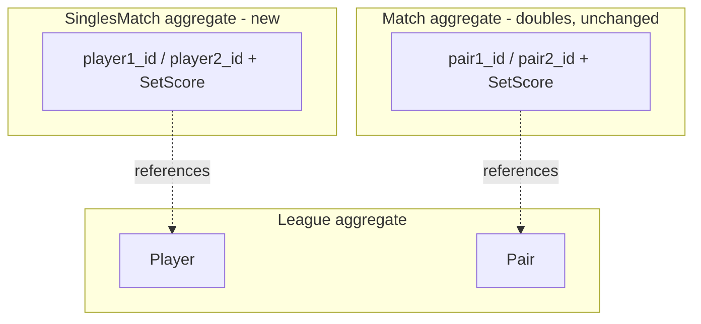

# Singles matches

## Purpose

Add a **singles** match format (one player vs. one player) alongside the
existing **doubles** format (pair vs. pair). When submitting a match the
client first chooses singles or doubles; singles submission collects two
player nicknames instead of two pairs of nicknames.

Standings can then be viewed three ways: **doubles only**, **singles
only**, or **both** combined into a single player-level ranking. All
three rankings are computed server-side and reuse the existing
`StandingsCalculator` semantics (configurable `tie_breakers`,
`ranking_subject`). The frontend renders; it does not rank.

This doc owns the singles feature end to end. It builds on, and does not
modify, the doubles `Match` aggregate documented in
[05_aggregate_designs/match.md](05_aggregate_designs/match.md).

| Concept | Meaning | Owner |
|---|---|---|
| `matches` (doubles) | Existing pair-vs-pair results. Unchanged. | `Match` aggregate. |
| `singles_matches` | New player-vs-player results. | `SinglesMatch` aggregate (this doc). |
| Combined standings | Player-level ranking unioning doubles + singles outcomes. | A read-side use case reusing `StandingsCalculator`. |

## Decision summary

- **Storage & writes: a separate `SinglesMatch` aggregate + `singles_matches`
  table** (the "Option B" shape). The doubles `Match`, the `matches`
  table, the match mapper, and all doubles use cases / endpoints are
  **untouched**.
- **Standings stay in the backend.** Ranking is configurable domain
  logic with two consumers (the frontend and the read-only chat server
  via the `GET_STANDINGS` intent), so it is single-sourced in
  `StandingsCalculator`.
- **The "both" view is a server-side combined player-standings read
  path** that feeds both match sources into the existing calculator.
  The frontend renders the returned ranked list; it performs no
  aggregation or re-ranking.

## Why this shape (rejected alternatives)

A singles match references two **players** directly, not pairs. The
following alternatives were considered and rejected:

1. **Reuse `matches`/`pairs` by modelling a singles player as a
   one-player "pair".** Rejected: `Pair` is invariantly two distinct
   players (`03_business_invariants.md`), with both `player_id_1` and
   `player_id_2` `NOT NULL`. A degenerate pair poisons `Pair`,
   `NicknameUniquenessPolicy`, `OnePairPerPlayerPolicy`, and the
   player-resolution path in `StandingsCalculator`.
2. **Generalize `Match` to a polymorphic two-sided aggregate with a
   `format` discriminator** ("Option A": nullable pair/player columns +
   a CHECK constraint, plus a `Competitor` value object). Viable, and
   attractive *if* the backend must union singles + doubles into one
   ranking. But it forces an `ALTER`/backfill/CHECK migration on
   `matches` and migrates every existing `match.pair1_id` reader, for a
   payoff that disappears once the union lives in a dedicated read
   path. Rejected in favor of the cleaner create-table-only Option B.
3. **Move standings calculation to the frontend** (client fetches raw
   matches and ranks). Rejected: ranking is per-league configurable
   domain logic with subtle semantics (e.g. `games_lost` is negated for
   a uniform descending sort; equal metric tuple → equal rank). It has
   two consumers, so moving it client-side would either break the chat
   server's standings intents or force a second Python reimplementation
   there. It also pushes large ID-bearing match payloads plus the full
   roster to every client. The canonical algorithm stays server-side,
   single-sourced.

## Scope of this iteration

In-scope:

- New aggregate `SinglesMatch` (`app/domain/aggregates/singles_match/`)
  referencing two `PlayerId`s and a `SetScore`.
- New `singles_matches` table + ORM model, mapper, and repository
  implementation.
- New alembic migration that **creates** `singles_matches` (no change to
  `matches`).
- New `League` aggregate method `register_single_player(nickname)` —
  registers a roster `Player` without creating a `Pair`.
- Write use case `SubmitSinglesMatchResultUseCase` (+ its Unit of Work).
- Read path: singles player standings, and a **combined** player
  standings that unions doubles + singles via `StandingsCalculator`.
- API: player/admin submit, edit, and delete parity for singles matches;
  `scope` (`doubles` | `singles` | `both`) selectors on standings and
  match-history reads.
- `leagues.latest_match_date_single` plus roster
  `latest_activity_date = max(latest_match_date, latest_match_date_single)`.
- Frontend: a singles/doubles submit toggle and a standings scope
  toggle; history scope controls; format-aware edit/delete actions.

Out of scope (call out explicitly, decide later):

- Singles idempotency rule (an "unordered player pair" analogue of
  `pair_matchup_idempotency`). Default: none in v1.
- Multi-set scoring (already out of scope for doubles, see
  [16_league_rules_and_match_policies.md](16_league_rules_and_match_policies.md)).
- A new LLM/chat write intent. `SUBMIT_MATCH_RESULT` remains
  doubles-only in this release; the frontend posts singles directly to
  the backend after a local format choice.

## Domain model

### Aggregate placement

`SinglesMatch` is its own aggregate root, parallel to `Match`, with a
distinct consistency boundary. It references the League's `Player`
entities by opaque `PlayerId` only (mirroring how `Match` references
`Pair` by `PairId`).



### `SinglesMatch` root

- Identity: `SinglesMatchId` (UUID).
- Fields: `league_id`, `player1_id`, `player2_id`, `set_score`,
  `created_at` (infra-managed, as for `Match`).
- Reuses the existing `SetScore` value object (two non-negative integer
  scores; `winner_side()` returns `"pair1"`/`"pair2"`, read as
  "side1"/"side2").

Invariants enforced by the root:

- The two players are distinct: `player1_id != player2_id` (raises a new
  `SamePlayerOnBothSidesError` on `create`).
- Set score is structurally valid (enforced by `SetScore` construction,
  on `create` and `edit_score`).

Public behaviors:

- `create(league_id, player1_id, player2_id, set_score) -> SinglesMatch`
- `edit_score(new_set_score) -> None`

### `League` addition

`register_single_player(nickname) -> Player`: find-or-register a roster
`Player` from a nickname **without** creating a `Pair`.
`register_players_and_pair` always builds a pair, so it cannot be reused
for singles; `validate_match_participants_on_roster` already accepts an
arbitrary nickname list and is reused as-is (it honors
`auto_register_players_on_match`).

## Persistence

New table `singles_matches`:

| Column | Type | Notes |
|---|---|---|
| `match_id` | UUID PK | |
| `league_id` | UUID NOT NULL | FK → `leagues.league_id` |
| `player1_id` | UUID NOT NULL | FK → `players.player_id` |
| `player2_id` | UUID NOT NULL | FK → `players.player_id` |
| `player1_score` | TEXT NOT NULL | |
| `player2_score` | TEXT NOT NULL | |
| `created_at` | TIMESTAMPTZ | server default `now()` |
| `updated_at` | TIMESTAMPTZ | on update |

Indexes: `(league_id, created_at)`, `player1_id`, `player2_id`
(mirroring the `matches` indexes).

Migration: a new alembic revision after `013_rename_teams_to_pairs_rules_v8`
that creates `singles_matches` + indexes and adds
`leagues.latest_match_date_single`. No `ALTER TABLE matches`, no
backfill, no CHECK constraint.

New `singles_match_mapper.py` (domain ↔ ORM) and a
`SinglesMatchRepository` implementation, parallel to the match mapper /
repository. Add a `singles_matches` relationship on `LeagueORM`.

## Application layer

### Write — `SubmitSinglesMatchResultUseCase`

Command: `{ league_id, player1_nickname, player2_nickname,
player1_score, player2_score }`.

Steps (a simplified mirror of `SubmitMatchResultUseCase`, with no pair
registration or `validate_pairs_do_not_share_players`):

1. Normalize nicknames; reject the same nickname on both sides.
2. Open the singles UoW; load + lock the league.
3. `league.validate_match_participants_on_roster([n1, n2])`.
4. `p1 = league.register_single_player(n1)`;
   `p2 = league.register_single_player(n2)`.
5. *(Optional, if a singles idempotency rule is adopted)* check
   `singles_match_repo.exists_match_for_player_matchup(...)`.
6. `SinglesMatch.create(league_id, p1.player_id, p2.player_id, set_score)`.
7. Save league + singles match; update
   `league.note_singles_match_recorded_at(created_at)`; commit.

New `SubmitSinglesMatchResultUnitOfWork` bundling `league_repo` +
`singles_match_repo` (parallel to `SubmitMatchResultUnitOfWork`).
`EditSinglesMatchScoreUseCase` and `DeleteSinglesMatchUseCase` mirror
the doubles trust model: player routes are time-window gated; admin
routes require `X-Host-Token` and bypass the windows. Delete recomputes
`latest_match_date_single` from the remaining singles matches.

### Read — standings

Three views, all server-side:

| View | Subject | Source rows |
|---|---|---|
| Doubles | pair (default) or player | `matches` |
| Singles | player only | `singles_matches` |
| Both | player only | `matches` (credited to each pair member) + `singles_matches` (credited directly) |

`StandingsCalculator` stays the single source of ranking truth. Its
`_Aggregate` counters (`matches_played`, `wins`, `losses`, `draws`,
`games_won`, `games_lost`) are additive, and derived metrics
(`games_diff`, `win_pct`) plus tie-breaker sorting and rank-with-ties are
computed once over the merged per-player aggregates. Concretely:

- **Singles** standings: a player-only computation over
  `singles_matches`.
- **Both**: a combined read use case loads both `matches` and
  `singles_matches`, credits each into the same per-player aggregate
  (doubles via pair membership, singles directly), and applies the
  league's `tie_breakers` once.
- **Pair** standings ignore singles entirely (the pair board never sees
  `singles_matches`), satisfying "pair level does not worry about
  singles."

"Both" is necessarily a **player-level** board: a pair row and a player
row are different identities and cannot be merged into one ranked list.
So `scope ∈ {singles, both}` implies `subject = player`.

## API

- `POST /leagues/{league_id}/singles-matches` — submit a singles result.
  Request `{ player1_nickname, player2_nickname, player1_score,
  player2_score }`; response reuses the match-submit response shape
  (`match_id`, `created_at`).
- `PATCH /leagues/{league_id}/singles-matches/{match_id}` and
  `DELETE /leagues/{league_id}/singles-matches/{match_id}` — player
  edit/delete within the configured windows.
- `PATCH /admin/leagues/{league_id}/singles-matches/{match_id}` and
  `DELETE /admin/leagues/{league_id}/singles-matches/{match_id}` —
  host-token gated admin edit/delete.
- Standings stays the **same endpoint** (`GET /leagues/{id}/standings`
  and `/standings/by-player`) with the **same response schema** — no new
  standings route. It gains **one more query parameter** alongside the
  existing `subject`:

  | Param | Values | Notes |
  |---|---|---|
  | `subject` | `pair` \| `player` \| *(omitted)* | exists today; omitted = league's configured `ranking_subject` |
  | `scope` | `doubles` \| `singles` \| `both` | **new**; default `doubles` to preserve current behavior |

  **Constraint: pair standings can only come with doubles.** The valid
  `(subject, scope)` combinations are:

  | | `doubles` | `singles` | `both` |
  |---|---|---|---|
  | `pair` | ✅ | ❌ 422 | ❌ 422 |
  | `player` | ✅ | ✅ | ✅ |

  Subject resolution + validation happen at the use-case boundary:

  ```
  if scope in {singles, both}:
      if subject == "pair": -> 422   # pair standings require doubles
      effective_subject = "player"   # forced
  else:  # doubles
      effective_subject = subject or league.rules.ranking_subject
  ```

  The branch then loads the right source(s) — `match_repo` for
  `doubles`, `singles_match_repo` for `singles`, both for `both` — and
  delegates to the single `StandingsCalculator`. `GetStandingsUseCase`
  therefore gains a `singles_match_repo` dependency and a `scope` field
  on `GetStandingsQuery`; the response schema is unchanged. `/by-player`
  is always player-level, so it takes `scope` but never `subject=pair`.
- Match history also gains `scope=doubles|singles|both` on
  `/matches` and `/matches/by-player`. `scope=both` returns one
  newest-first timeline with `match_format: "doubles" | "singles"`.
- Roster keeps `latest_match_date` as the doubles latest date and adds
  `latest_match_date_single` plus computed `latest_activity_date`.

Error → HTTP mapping follows the existing table in the
`backend-ddd-layering` rule (e.g. same-player → 422, league not found →
404).

## Frontend

- Submit UI: a singles/doubles toggle. Doubles shows the existing
  two-pairs form; singles shows two single-player inputs.
- Standings UI: **two selectors**, presented in order so the second is
  always constrained by the first (the existing Pairs|Players chooser
  becomes step 1):
  1. **Subject** — `Pairs` vs `Players` (the existing
     `.standings-subject-chooser`).
  2. **Scope** — `Doubles` / `Singles` / `Both`, with availability
     driven by the subject choice:
     - **`Pairs` selected** → scope shows **Doubles enabled, Singles
       disabled, Both disabled** (pair standings only exist for
       doubles). Scope is effectively pinned to `Doubles`.
     - **`Players` selected** → scope shows **all three enabled**
       (`Doubles`, `Singles`, `Both`).

  This subject-first ordering makes the "pair ⇒ doubles only" constraint
  visible in the UI and guarantees the client never sends an invalid
  `(pair, singles)` / `(pair, both)` combination (which the API would
  reject with `422`). Disabled options should carry a short i18n helper
  note explaining why. The panel then renders whichever ranked list the
  backend returns.
- `fetchLeagueStandings` (`js/chat/api.js`) gains a `scope` query
  param alongside the existing `subject`; `/by-player` passes `scope`
  but is always player-level.
- The frontend performs **no** aggregation or re-ranking. All new
  user-visible strings (subject/scope labels and the disabled-option
  note) get both EN and KO entries per the
  `frontend-vanilla-conventions` rule.

## Chat server

No new write intent in this release. The read-only docs mention backend
`scope`, but existing `GET_STANDINGS` / `GET_MATCH_HISTORY` handlers
continue to seed default doubles panels. Frontend scope controls refetch
the backend directly. A future iteration may add a
singles-submission intent (a WRITE intent producing a prefilled payload
the frontend submits).

## Open decisions

1. **Singles idempotency** — adopt an unordered-player-pair rule, or none
   (v1 default: none).
2. **`latest_match_date`** — resolved: keep this as doubles-only; add
   `latest_match_date_single` and `latest_activity_date`.
3. **Per-match vs per-league format** — offering a "both" board implies a
   league can hold both kinds, i.e. format is per-match.
4. **Standings surface** — *resolved*: a `scope` query parameter on the
   existing `/standings` (and `/standings/by-player`) endpoint, not a
   dedicated route. See the API section.
5. **Edit/delete parity** — resolved: full CRUD for singles in v1.
6. **Merge key** — combined standings key on `player_id` (nicknames can
   change).

## Touch points

| Layer | File(s) | Change |
|---|---|---|
| Domain | `aggregates/singles_match/{value_objects,aggregate_root,repository}.py` | new aggregate + port |
| Domain | `exceptions.py` | `+ SamePlayerOnBothSidesError` |
| Domain | `aggregates/league/aggregate_root.py` | `+ register_single_player` |
| Domain svc | `services/standings_calculator.py` | singles + combined player aggregation (reuse, no new ranking logic) |
| Infra | `persistence/models/orm_models.py` | `+ SinglesMatchORM`, `LeagueORM.singles_matches` |
| Infra | `alembic/versions/014_add_singles_matches.py` | new table + `latest_match_date_single` |
| Infra | `persistence/mappers/singles_match_mapper.py` + repo impl | new |
| App | `use_cases/submit_singles_match_result_use_case.py` + UoW | new |
| App | combined / singles standings use case(s) | new (reuse calculator) |
| App | edit/delete singles use cases | new |
| API | `routers/league_router.py`, `routers/admin_router.py`, schemas | singles submit/edit/delete, scope on standings/history |
| Frontend | submit, standings, history panels, `js/i18n/{en,ko}.js` | format + scope controls, render only |
| Docs | this file; cross-link from `00_system_scope.md`, `04_candidate_aggregates.md`, `13_api_contracts.md` | reflect singles |

## What this approach deliberately avoids

- No polymorphic `Match`, nullable columns, or CHECK constraint
  (Option A's structural cost) and no migration of existing
  `match.pair1_id` readers.
- No ranking logic duplicated in the browser or in the chat server.
- No large raw-match + roster payloads pushed to clients for standings.
