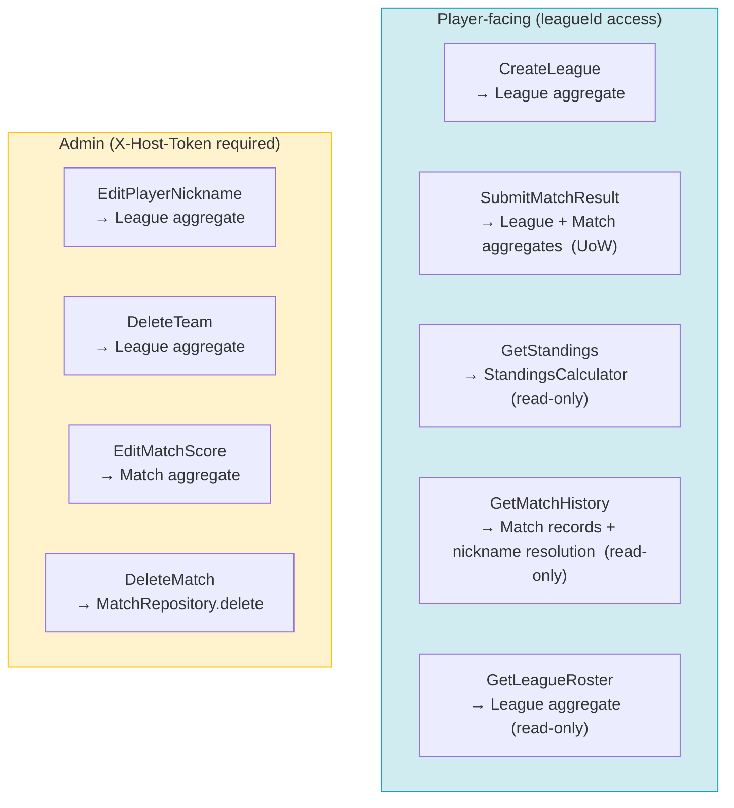

# Application Use Cases

## Use Case Map

---

## Use Case: CreateLeagueUseCase

- Business action: Create League
- Inputs: CreateLeagueCommand(title: str, description: str | None)
- Output: CreateLeagueResult(league_id: str, host_token: str)
- State-changing or calculation-only?: State-changing
- Unit of Work needed?: No — single repository save
- Aggregate(s) loaded: none (new aggregate created)
- Aggregate(s) loaded through which repository?: N/A
- Domain service used?: No
- Repository calls: LeagueRepository.get_by_normalized_title (uniqueness pre-check), LeagueRepository.save
- Port calls: none
- Persistence required?: Yes
- Transaction notes: single save; inherently atomic
- Steps:
  1. Normalize title to lowercase
  2. Call LeagueRepository.get_by_normalized_title(normalized_title) — raise LeagueTitleAlreadyExistsError if a league already exists with that normalized title
  3. Generate host_token as str(uuid.uuid4())
  4. Call League.create(title, description, host_token) — constructs new aggregate with empty roster
  5. Save via LeagueRepository.save(league)
  6. Return league_id and host_token
- Domain rules enforced where: League.create (title must be non-empty); title uniqueness pre-check at application layer via repository
- Errors: LeagueTitleAlreadyExistsError, ValidationError (blank title)

---

## Use Case: SubmitMatchResultUseCase

- Business action: Submit Match Result (includes implicit player/team registration for any new nicknames)
- Inputs: SubmitMatchResultCommand(league_id: str, team1_nicknames: tuple[str, str], team2_nicknames: tuple[str, str], team1_score: str, team2_score: str)
- Output: SubmitMatchResultResult(match_id: str)
- State-changing or calculation-only?: State-changing
- Unit of Work needed?: Yes — SubmitMatchResultUnitOfWork (LeagueRepository + MatchRepository must be atomic)
- Aggregate(s) loaded: League
- Aggregate(s) loaded through which repository?: LeagueRepository
- Domain service used?: No
- Repository calls: LeagueRepository.get_by_id, LeagueRepository.save, MatchRepository.save
- Port calls: none
- Persistence required?: Yes
- Transaction notes: LeagueRepository.save and MatchRepository.save must commit together; rollback on any domain error or DB failure
- Steps:
  1. Normalize all four nicknames to lowercase
  2. Verify team1_nicknames[0] ≠ team1_nicknames[1] (normalized) — raise SamePlayerWithinSingleTeamError if equal (a player cannot be paired with themselves on team1)
  3. Verify team2_nicknames[0] ≠ team2_nicknames[1] (normalized) — raise SamePlayerWithinSingleTeamError if equal (a player cannot be paired with themselves on team2)
  4. Verify no nickname appears in both team1_nicknames and team2_nicknames — raise SamePlayerOnBothTeamsError if any overlap detected
  5. Construct SetScore(team1_score, team2_score) value object — raise InvalidSetScoreError if either score fails non-negative integer validation
  6. Enter SubmitMatchResultUnitOfWork
  7. Load League via LeagueRepository.get_by_id_with_lock(league_id) — raise LeagueNotFoundError if missing
  8. Call league.register_players_and_team(team1_nicknames[0], team1_nicknames[1]) → team1 — raises TeamConflictError if either player already belongs to a different team
  9. Call league.register_players_and_team(team2_nicknames[0], team2_nicknames[1]) → team2 — raises TeamConflictError if either player already belongs to a different team
  10. Call Match.create(league_id, team1.team_id, team2.team_id, set_score) — raises SameTeamOnBothSidesError if team1_id == team2_id
  11. LeagueRepository.save(league) — persists any newly registered players and teams
  12. MatchRepository.save(match) — persists the new match record
  13. Commit UoW
  14. Return match_id
- Domain rules enforced where:
  - Application layer: within-team distinct-player check (steps 2–3), cross-team distinct-player check (step 4) — all structural validations before any aggregate is loaded
  - SetScore constructor: non-negative integer validation (step 5)
  - League.register_players_and_team: nickname uniqueness within league, one-team-per-player
  - Match.create: team1_id ≠ team2_id
- Errors: LeagueNotFoundError, SamePlayerWithinSingleTeamError, SamePlayerOnBothTeamsError, InvalidSetScoreError, TeamConflictError, SameTeamOnBothSidesError

---

## Use Case: GetStandingsUseCase

- Business action: View Standings
- Inputs: GetStandingsQuery(league_id: str)
- Output: list[StandingsEntry(team_id, player1_nickname, player2_nickname, wins, losses, rank)]
- State-changing or calculation-only?: Calculation-only
- Unit of Work needed?: No
- Aggregate(s) loaded: League (for teams and players), all Match records for the league
- Aggregate(s) loaded through which repository?: LeagueRepository, MatchRepository
- Domain service used?: Yes — StandingsCalculator
- Repository calls: LeagueRepository.get_by_id, MatchRepository.get_all_by_league
- Port calls: none
- Persistence required?: No
- Transaction notes: read-only; no write lock needed
- Steps:
  1. Load League via LeagueRepository.get_by_id(league_id) — raise LeagueNotFoundError if missing
  2. Load all matches via MatchRepository.get_all_by_league(league_id)
  3. Call StandingsCalculator.compute(matches, league.teams, league.players) → list[StandingsEntry]
  4. Return standings list
- Domain rules enforced where: StandingsCalculator (ranking and draw-handling logic)
- Errors: LeagueNotFoundError

---

## Use Case: GetMatchHistoryUseCase

- Business action: View Match History
- Inputs: GetMatchHistoryQuery(league_id: str)
- Output: list[MatchHistoryRecord(match_id, team1_player_nicknames, team2_player_nicknames, team1_score, team2_score, created_at)] sorted by created_at descending
- State-changing or calculation-only?: Calculation-only
- Unit of Work needed?: No
- Aggregate(s) loaded: League (for team-to-player nickname resolution), all Match records for the league
- Aggregate(s) loaded through which repository?: LeagueRepository, MatchRepository
- Domain service used?: No
- Repository calls: LeagueRepository.get_by_id, MatchRepository.get_all_by_league
- Port calls: none
- Persistence required?: No
- Transaction notes: read-only
- Steps:
  1. Load League via LeagueRepository.get_by_id(league_id) — raise LeagueNotFoundError if missing
  2. Load all matches via MatchRepository.get_all_by_league(league_id)
  3. For each match, resolve team1_id and team2_id to player nicknames using league.teams and league.players
  4. Return MatchHistoryRecord list sorted by created_at descending
- Domain rules enforced where: none — pure projection
- Errors: LeagueNotFoundError
- Notes: Match stores only team_id references; player nicknames are resolved at read time from the current League state. Admin nickname edits retroactively affect historical display — this is an accepted trade-off in V1.

---

## Use Case: GetLeagueRosterUseCase

- Business action: View League Roster
- Inputs: GetLeagueRosterQuery(league_id: str)
- Output: RosterView(players: list[PlayerEntry(player_id, nickname)], teams: list[TeamEntry(team_id, player1_nickname, player2_nickname)])
- State-changing or calculation-only?: Calculation-only
- Unit of Work needed?: No
- Aggregate(s) loaded: League
- Aggregate(s) loaded through which repository?: LeagueRepository
- Domain service used?: No
- Repository calls: LeagueRepository.get_by_id
- Port calls: none
- Persistence required?: No
- Transaction notes: read-only
- Steps:
  1. Load League via LeagueRepository.get_by_id(league_id) — raise LeagueNotFoundError if missing
  2. Return player list and team list from loaded aggregate
- Domain rules enforced where: none — pure projection
- Errors: LeagueNotFoundError

---

## Use Case: EditPlayerNicknameUseCase (Admin)

- Business action: Edit Player Nickname
- Inputs: EditPlayerNicknameCommand(host_token: str, league_id: str, player_id: str, new_nickname: str)
- Output: UpdatedPlayerResult(player_id, new_nickname)
- State-changing or calculation-only?: State-changing
- Unit of Work needed?: No — single repository save
- Aggregate(s) loaded: League
- Aggregate(s) loaded through which repository?: LeagueRepository
- Domain service used?: No
- Repository calls: LeagueRepository.get_by_id, LeagueRepository.save
- Port calls: none
- Persistence required?: Yes
- Transaction notes: single save; inherently atomic
- Steps:
  1. Load League via LeagueRepository.get_by_id_with_lock(league_id) — raise LeagueNotFoundError if missing
  2. Verify host_token matches league.host_token.value — raise UnauthorizedError if not
  3. Call league.edit_player_nickname(player_id, new_nickname) — enforces nickname uniqueness and player existence
  4. LeagueRepository.save(league)
  5. Return updated player info
- Domain rules enforced where: League.edit_player_nickname (nickname uniqueness within league, player existence)
- Errors: LeagueNotFoundError, UnauthorizedError, PlayerNotFoundError, NicknameAlreadyInUseError

---

## Use Case: DeleteTeamUseCase (Admin)

- Business action: Delete Team
- Inputs: DeleteTeamCommand(host_token: str, league_id: str, team_id: str)
- Output: confirmation (team deleted)
- State-changing or calculation-only?: State-changing
- Unit of Work needed?: No — only LeagueRepository is written to; MatchRepository is read-only (precondition check)
- Aggregate(s) loaded: League
- Aggregate(s) loaded through which repository?: LeagueRepository
- Domain service used?: No
- Repository calls: LeagueRepository.get_by_id, MatchRepository.has_matches_for_team, LeagueRepository.save
- Port calls: none
- Persistence required?: Yes
- Transaction notes: single save to LeagueRepository; DB foreign key constraint on the matches table acts as a final safety net for any concurrent match insert
- Steps:
  1. Load League via LeagueRepository.get_by_id_with_lock(league_id) — raise LeagueNotFoundError if missing
  2. Verify host_token matches league.host_token.value — raise UnauthorizedError if not
  3. Verify team_id exists in league.teams — raise TeamNotFoundError if missing
  4. Call MatchRepository.has_matches_for_team(team_id, league_id) — raise TeamHasMatchesError if True (host must delete associated matches first)
  5. Call league.delete_team(team_id) — removes team from roster and records pending deletion
  6. LeagueRepository.save(league) — persists the team deletion
- Domain rules enforced where: Application layer (precondition check in step 4); League.delete_team (team identity check)
- Errors: LeagueNotFoundError, UnauthorizedError, TeamNotFoundError, TeamHasMatchesError

---

## Use Case: EditMatchScoreUseCase (Admin)

- Business action: Edit Match Score
- Inputs: EditMatchScoreCommand(host_token: str, league_id: str, match_id: str, team1_score: str, team2_score: str)
- Output: UpdatedMatchResult(match_id, team1_score, team2_score)
- State-changing or calculation-only?: State-changing
- Unit of Work needed?: No — single repository save
- Aggregate(s) loaded: League (for hostToken verification), Match
- Aggregate(s) loaded through which repository?: LeagueRepository, MatchRepository
- Domain service used?: No
- Repository calls: LeagueRepository.get_by_id, MatchRepository.get_by_id, MatchRepository.save
- Port calls: none
- Persistence required?: Yes
- Transaction notes: single save to MatchRepository; League is loaded read-only for auth check
- Steps:
  1. Load League via LeagueRepository.get_by_id(league_id) — raise LeagueNotFoundError if missing
  2. Verify host_token matches league.host_token.value — raise UnauthorizedError if not
  3. Construct SetScore(team1_score, team2_score) value object — raise InvalidSetScoreError if invalid
  4. Load Match via MatchRepository.get_by_id(match_id, league_id) — raise MatchNotFoundError if missing
  5. Call match.edit_score(new_set_score)
  6. MatchRepository.save(match)
  7. Return updated match info
- Domain rules enforced where: SetScore constructor (non-negative integer validation); Match.edit_score
- Errors: LeagueNotFoundError, UnauthorizedError, InvalidSetScoreError, MatchNotFoundError

---

## Use Case: DeleteMatchUseCase (Admin)

- Business action: Delete Match
- Inputs: DeleteMatchCommand(host_token: str, league_id: str, match_id: str)
- Output: confirmation (match deleted)
- State-changing or calculation-only?: State-changing
- Unit of Work needed?: No — single repository delete
- Aggregate(s) loaded: League (for hostToken verification), Match (for existence check)
- Aggregate(s) loaded through which repository?: LeagueRepository, MatchRepository
- Domain service used?: No
- Repository calls: LeagueRepository.get_by_id, MatchRepository.get_by_id, MatchRepository.delete
- Port calls: none
- Persistence required?: Yes
- Transaction notes: single hard delete on MatchRepository; League loaded read-only for auth check
- Steps:
  1. Load League via LeagueRepository.get_by_id(league_id) — raise LeagueNotFoundError if missing
  2. Verify host_token matches league.host_token.value — raise UnauthorizedError if not
  3. Load Match via MatchRepository.get_by_id(match_id, league_id) — raise MatchNotFoundError if missing
  4. MatchRepository.delete(match_id, league_id) — hard delete; no domain method needed (deletion has no domain invariants beyond existence check)
- Domain rules enforced where: Application layer (existence and auth checks); no domain-level delete method on Match aggregate
- Errors: LeagueNotFoundError, UnauthorizedError, MatchNotFoundError

